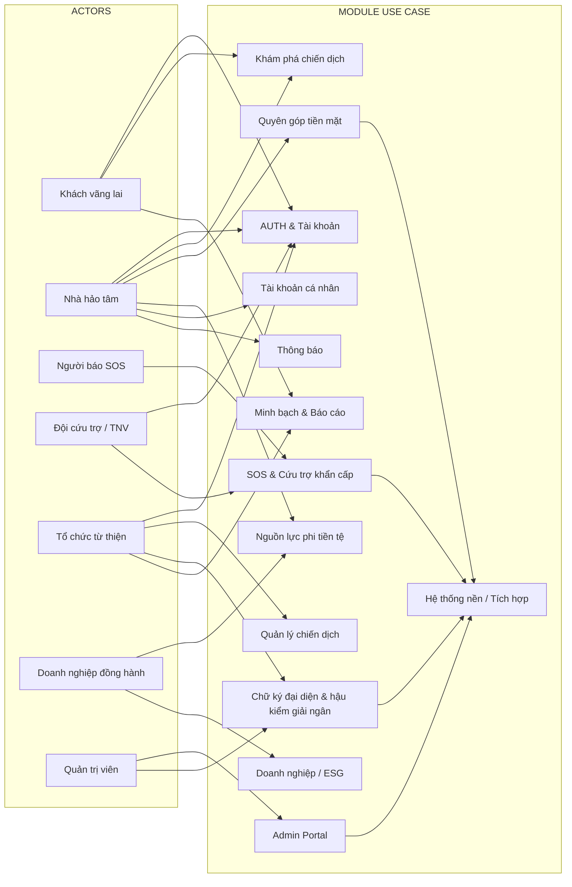
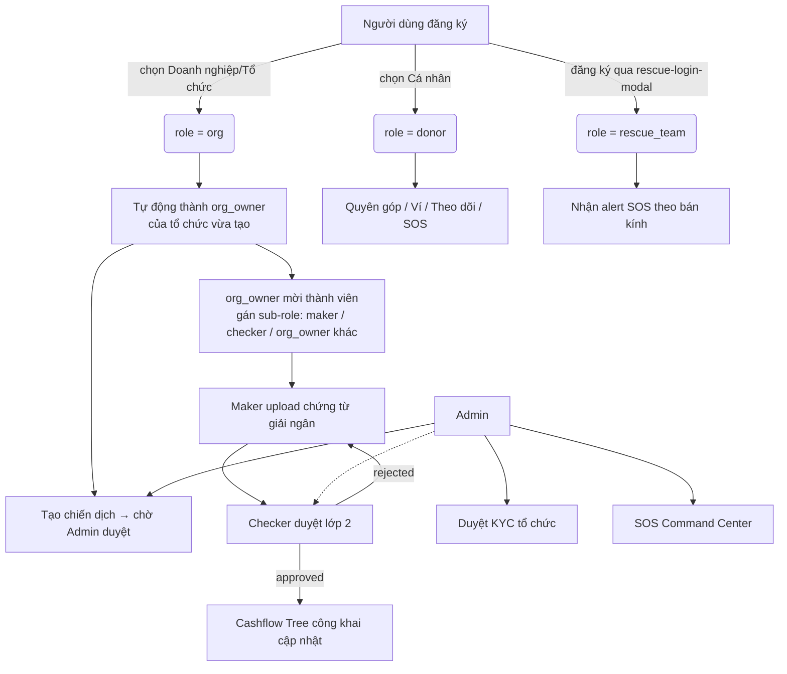
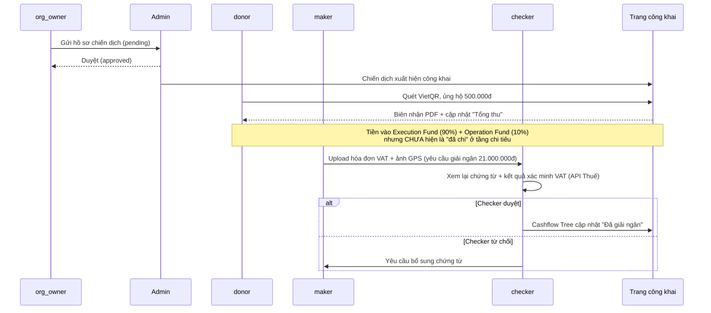

# THIỆN NGUYỆN — TỔNG HỢP TOÀN BỘ TÀI LIỆU KỸ THUẬT & NGHIỆP VỤ

> File này tổng hợp các tài liệu kỹ thuật/nghiệp vụ trong thư mục `docs/`, giữ các phân tích cũ để truy vết và đặt quyết định Tech Lead hiện hành làm nguồn ưu tiên khi có mâu thuẫn.

## Mục lục

1. [PHẦN I — Tech Spec & Deployment Guide](#phan-i) *(từ `ThienNguyen_TechSpec_v2.md`)*
2. [PHẦN II — Đặc tả Use Case (bản A)](#phan-ii) *(từ `ThienNguyen_UseCase_Spec.md`)*
3. [PHẦN III — Đặc tả Use Case (bản B)](#phan-iii) *(từ `ThienNguyen_UseCase_Specification.md`)*
4. [PHẦN IV — Phân tích Business Logic mô hình 3 role](#phan-iv) *(từ `ThienNguyen_Business_Logic_3_Roles.md`)*
5. [PHẦN V — Luồng vận hành RBAC mô hình 4+3 role](#phan-v) *(từ `ThienNguyen_RBAC_Flow.md`)*
6. [PHẦN VI — Câu hỏi xác nhận với Admin](#phan-vi) *(từ `ThienNguyen_RBAC_CauHoi_XacNhan_Admin.md`)*
7. [PHẦN VII — Mô tả hoạt động chi tiết 5 luồng chính](#phan-vii) *(từ `ThienNguyen_ActivityFlow_5Luong.md`)*
8. [PHẦN VIII — Danh sách chức năng theo Actor](#phan-viii) *(từ `ThienNguyen_ChucNang_TheoActor.md`)*

---

## ✅ Quyết định Tech Lead hiện hành — ghi đè các phân tích role cũ

Ngày 18/09/2026, Tech Lead đã chốt định hướng MVP như sau:

1. Tổ chức dùng một tài khoản người đại diện pháp luật; không triển khai `org_owner`, `maker`, `checker` hoặc luồng mời thành viên trong MVP.
2. Giải ngân không dùng Maker–Checker hai lớp. Người đại diện pháp luật upload chứng từ, ký/approval; hệ thống/Admin hậu kiểm và quản lý campaign.
3. eKYC tổ chức được đơn giản hóa thành upload giấy phép hoạt động để Admin xem xét.
4. Cứu trợ là luồng riêng do Admin quản lý. Role kỹ thuật `rescue_team` không được đăng ký công khai; Admin có thể kích hoạt từ hồ sơ đã duyệt hoặc tạo lời mời trực tiếp qua email sau khi xác minh.
5. Đăng ký công khai chỉ có `donor` và `org`; `admin` và `rescue_team` không được tự tạo từ auth công khai.

Các phần phía dưới có nhắc Maker–Checker, sub-role nội bộ hoặc đăng ký đội cứu trợ công khai được giữ lại để truy vết lịch sử phân tích, nhưng **không còn là yêu cầu hiện hành**. Khi có mâu thuẫn, mục này và `ThienNguyen_Role_ChucNang_XacNhan_TechLead.md` được ưu tiên.

Phần Use Case II/III vẫn bao phủ cùng phạm vi với cách đặt mã khác nhau; cần hợp nhất mã use case ở một đợt biên tập riêng.

---

<a id="phan-i"></a>
# ══════════════════════════════════════
# PHẦN I — TECH SPEC & DEPLOYMENT GUIDE
# ══════════════════════════════════════

# THIỆN NGUYỆN

**Nền tảng Thiện Nguyện Minh Bạch Đầu Tiên Tại Việt Nam**
thiennguyen.com.vn

## Technical Specification & Deployment Command Guide

| | |
|---|---|
| **Phiên bản** | v2.0 — Prototype Ready (Sept 2026) |
| **Tổ chức** | VEA Group — VEA Communication / BookingKOLs |
| **Phạm vi** | Single-page HTML prototype → production migration guide |
| **Prototype file** | `thiennguyen_v2.html` (292KB, self-contained) |
| **Frontend stack** | Vanilla HTML/CSS/JS + Leaflet.js (CDN) |
| **Target stack** | Next.js 14 + TypeScript + Tailwind CSS + Supabase |
| **Tác giả** | Paul — CEO VEA Group + Claude (Anthropic) |
| **Ngày xuất** | September 2026 |

---

## 1. TỔNG QUAN HỆ THỐNG

### 1.1 Sứ Mệnh

Thiện Nguyện không phải là một tổ chức từ thiện. Đây là nền tảng công nghệ giúp bất kỳ tổ chức từ thiện nào cũng có thể vận hành minh bạch, và giúp bất kỳ nhà hảo tâm nào cũng có thể kiểm chứng đồng tiền của mình biến thành hiện thực.

**Vấn đề cốt lõi:** Việt Nam có hàng chục nghìn chiến dịch từ thiện mỗi năm, nhưng người dùng không có công cụ để biết tiền đi đâu sau khi chuyển. Khủng hoảng niềm tin xảy ra không phải vì thiếu người tốt, mà vì thiếu công cụ minh bạch.

### 1.2 Số Liệu Prototype

| Chỉ số | Giá trị |
|---|---|
| **Pages** | 13 trang đầy đủ chức năng |
| **HTML size** | 292KB self-contained (Leaflet CDN) |
| **JS functions** | 53 functions, 10 modals, 0 external dependencies (trừ Leaflet + OSM) |
| **CSS variables** | 30+ design tokens, Times New Roman toàn bộ |
| **Map** | Leaflet.js 1.9.4 + OpenStreetMap tiles |
| **Divs balanced** | 1390/1390 — zero HTML errors |
| **JS check** | `node --check` PASS |

### 1.3 13 Trang Hệ Thống

| ID | Tên | Mô tả |
|---|---|---|
| `pg-home` | Trang chủ | Hero grid, stats network, partner strip, campaign sections |
| `pg-campaigns` | Khám phá | Search + 63 tỉnh thành filter + 7 category + sort, cc-grid cards |
| `pg-map` | Bản đồ SOS | Leaflet real map + markers, rescue team panel, anti-spam verification |
| `pg-donate-items` | Nguồn lực | 2 chiều: đóng góp (hiện vật/ngày công/xe) + nhận (wishlist/volunteer) |
| `pg-transparent` | Minh bạch | 6 tabs: Sao kê năm / Quý / Bán niên / Theo chiến dịch / Người thụ hưởng / Tổ chức |
| `pg-campaign-detail` | Chi tiết CD | Cashflow Tree 3 tầng, 3-tab (Nhật ký/Video 9:16/Viral Kit), sidebar donate |
| `pg-closure` | Đóng cổng | Dashboard tổng kết, bảng donor, xuất CSV/PDF/ESG ZIP |
| `pg-corporate` | Đồng hành cùng quỹ | 4 mục: Co-Branded / Matching Fund / Non-monetary / ESG Hub + bull-list nav |
| `pg-account` | Tài khoản | 7 panel: Dashboard/Ví/Lịch sử/Tracking/Impact/Chứng nhận/Settings |
| `pg-introduction` | Giới thiệu | Sứ mệnh, pháp lý, đội ngũ, đối tác, so sánh, media kit |
| `pg-notifications` | Thông báo | Center với 5 type filters, unread badge |
| `pg-admin` | Admin Portal | 5 panel: Tổng quan/Duyệt CD/KYC/Hậu kiểm giải ngân/SOS Command |
| `pg-org-profile` | Hồ sơ tổ chức | Org stats + campaigns grid |

---

## 2. KIẾN TRÚC KỸ THUẬT

### 2.1 Prototype (Hiện Tại)

Single HTML file tự chứa. Không cần server, không cần database, không cần build step. Mở trực tiếp trên browser hoặc serve bằng bất kỳ static host nào.

- **Stack:** Vanilla HTML5 + CSS3 + ES6 JS
- **Map:** Leaflet.js 1.9.4 (CDN) + OpenStreetMap tiles
- **Font:** Times New Roman 100% (serif + mono + sans đều dùng TNR)
- **Design tokens:** 30 CSS vars (`--son`, `--cham-deep`, `--nghe`, `--lua`, `--sky`, `--paper`...)
- **Data:** Hardcoded JS arrays (`CAMPAIGNS`, `SOS_MARKERS_DATA`, `ADMIN_CAMPAIGNS`...)
- **Payment demo:** Simulated Webhook log, không kết nối bank thật

### 2.2 Production Target Stack

| Layer | Choice |
|---|---|
| **Frontend** | Next.js 14 (App Router) + TypeScript 5 + Tailwind CSS |
| **Backend API** | Node.js 20 + Express / Fastify hoặc Next.js API Routes |
| **Database** | PostgreSQL 15 (Supabase) — campaigns, transactions, users, SOS |
| **Auth** | Supabase Auth + JWT + role `donor/org/admin/rescue_team`; public signup chỉ tạo `donor` hoặc `org`, hai role còn lại do nội bộ cấp |
| **Realtime** | Supabase Realtime (WebSocket) — SOS markers, transaction feed |
| **File storage** | Supabase Storage — VAT invoices, GPS photos, certificates |
| **Payment** | VietQR Open Banking API + Techcombank/VCB Webhook biến động số dư |
| **Maps** | Leaflet.js + OpenStreetMap (miễn phí) hoặc Mapbox GL JS |
| **Email** | Resend.com hoặc SendGrid — biên nhận PDF, OTP, campaign updates |
| **PDF gen** | Puppeteer hoặc `@react-pdf/renderer` — biên nhận, ESG reports |
| **Hash/Security** | Node.js crypto (SHA-256) — daily financial hash, anti-tamper |
| **Hosting** | Vercel (frontend) + Supabase (DB + Auth + Storage + Realtime) |
| **CDN** | Cloudflare (DNS + CDN + DDoS protection) |
| **KYC** | Upload giấy phép hoạt động; Admin duyệt thủ công trong MVP |
| **SMS OTP** | Twilio hoặc VNPT iGate SMS — SOS phone verification |

### 2.3 Domain & Infrastructure

- **Domain:** thiennguyen.com.vn (đã đặt hoặc cần đăng ký tại VNNIC)
- **DNS:** Cloudflare → Vercel (frontend) + Supabase (API)
- **SSL:** Cloudflare tự động hoặc Let's Encrypt
- **Email:** partner@thiennguyen.com.vn + support@thiennguyen.com.vn
- **Environment:** DEV → STAGING → PRODUCTION với CI/CD GitHub Actions

---

## 3. TÍNH NĂNG CỐT LÕI

### 3.1 Cashflow Tree — Tracking Đầu Cuối

Cơ chế trực quan hóa dòng tiền 3 tầng: Thu vào → Phân bổ 90/10 → Chi ra từng hạng mục.

- **Tầng 1 — Thu vào:** Tổng tiền nhận, số giao dịch, nguồn (VietQR/Stripe/Ví)
- **Tầng 2 — Phân bổ:** 90% Execution Fund (khóa) + 10% Operation Fund (theo NĐ 93/2021)
- **Tầng 3 — Chi ra:** Từng đợt giải ngân với hóa đơn VAT + ảnh GPS + biên bản nghiệm thu
  - Mobile: Horizontal tree → Vertical timeline với border-left indent (vuốt 1 ngón tay)
  - Hash: SHA-256 niêm phong cuối ngày tài chính — không sửa được số liệu quá khứ

### 3.2 VietQR + Demo Transaction

Tích hợp VietQR động — sinh mã QR tự điền số tài khoản + số tiền + nội dung định danh `TN-YYYY-XXXXX`.

- **Deep link:** mở app ngân hàng (VCB/TCB/MBBank/Momo) tự động điền sẵn
- **Webhook** nhận biến động số dư từ ngân hàng → match nội dung chuyển khoản
- Sau khi match: cập nhật Cashflow Tree + gửi biên nhận PDF qua email + thông báo push
- **Demo flow hiện tại:** Giả lập Webhook log real-time 200ms/dòng, hiện receipt đầy đủ
  - Production cần: Techcombank Business Account + đăng ký VietQR API tại vietqr.io
  - Biên nhận song ngữ VND/USD cho kiều bào đối soát thuế nước sở tại

### 3.3 SOS Map — Hệ Thống Chống Báo Ảo

Bản đồ Leaflet.js + OpenStreetMap với SOS markers có animation. Zoom đến phố/địa danh thật.

- **Anti-spam 5 tầng:** OTP SIM → GPS real từ thiết bị → Ảnh EXIF GPS khớp vị trí → AI trust score 0-100 → Kiểm tra lịch sử nhận cứu trợ
- **Rescue team network:** Đội/cá nhân gửi hồ sơ riêng; Admin duyệt và cấp quyền trước khi nhận điều phối SOS
- **Admin Command Center:** Cluster markers, filter urgent/need/done, alert TNV gần nhất
  - Trust score: `< 60` → pending review, `60-80` → hiện nhưng cảnh báo, `> 80` → publish ngay

### 3.4 Người đại diện approval và hậu kiểm giải ngân

Người đại diện pháp luật của tổ chức upload chứng từ, ký/approval cho đợt giải ngân và chịu trách nhiệm về nội dung đã công bố. Hệ thống/Admin thực hiện hậu kiểm campaign thay vì đóng vai Checker duyệt lớp hai.

- **Người đại diện pháp luật:** Upload hóa đơn VAT + ảnh GPS + mô tả + chữ ký/approval.
- **Hệ thống:** Ghi nhận dấu thời gian, tài liệu, tham chiếu chữ ký và trạng thái công khai.
- **Admin:** Hậu kiểm; đánh dấu hợp lệ, yêu cầu giải trình hoặc phát hiện vi phạm.
- **API Tổng cục Thuế:** Có thể bổ sung sau để hỗ trợ hậu kiểm hóa đơn, không phải điều kiện eKYC tổ chức.

### 3.5 Báo Cáo ESG & Minh Bạch

- **Sao kê năm:** Toàn bộ giao dịch, hash SHA-256 niêm phong, xuất CSV/PDF
- **Báo cáo quý:** Q1/Q2/Q3/Q4, xuất riêng theo từng quý
- **Bán niên:** H1/H2, tổng thu/chi/vận hành/số chiến dịch
- **Theo chiến dịch:** Chiến dịch đã đóng cổng → report đầy đủ dạng public dashboard
- **ESG ZIP:** Hóa đơn VAT + ảnh EXIF GPS + biên bản nghiệm thu số → chuẩn GRI 413-1, GRI 203-1, UN SDG 1/3/4/17

### 3.6 Nguồn Lực Phi Tiền Tệ

Nền tảng đầu tiên tại VN cho phép đóng góp 2 chiều: nhận wishlist và đăng ký cung cấp.

- **Hiện vật:** Gạo, sữa, quần áo, thuốc men, thiết bị y tế → quy đổi VND tự động
- **Ngày công:** Bác sĩ, kỹ sư, giáo viên, IT → ghép với chiến dịch phù hợp
- **Xe vận chuyển:** Xe tải, xuồng máy → khớp với điểm SOS gần nhất
- **Claim flow:** Sau khi claim → toast thông báo → hiện SĐT điều phối → ghi nhận báo cáo tác động

---

## 4. DATABASE SCHEMA (PostgreSQL/Supabase)

### 4.1 Core Tables

| Table | Columns |
|---|---|
| `users` | id, email, phone_verified, role (donor/org/admin/rescue_team), kyc_status, created_at |
| `organizations` | id, user_id, name, legal_representative_name, license_document_url, bank_account, kyc_status, verified_at, verified_by |
| `campaigns` | id, org_id, title, type (direct/partner), goal_amount, category, province, status, created_at |
| `transactions` | id, campaign_id, user_id, amount_vnd, amount_foreign, currency, tx_ref, webhook_matched_at, receipt_sent_at |
| `disbursements` | id, campaign_id, amount, submitted_by, representative_approved_at, signature_reference, evidence_urls, post_audit_status, post_audited_by, post_audited_at, post_audit_note |
| `sos_reports` | id, user_id, lat, lng, description, needs[], phone_masked, trust_score, photo_url, exif_lat, exif_lng, status |
| `rescue_applications` | id, applicant_name, phone, resource_types[], radius_km, province, evidence_urls, status, reviewed_by, reviewed_at, review_note |
| `rescue_teams` | id, user_id, application_id, name, resource_types[], radius_km, lat, lng, status (available/en-route/busy), approved_at |
| `resources` | id, donor_id, type (item/skill/transport), description, quantity, value_vnd, province, status |
| `notifications` | id, user_id, type, title, body, read_at, created_at |
| `financial_hashes` | id, date, hash_sha256, tx_count, total_amount, created_at |

---

## 5. API ROUTES (Node.js/Next.js)

### 5.1 Payment & VietQR

| Method & Route | Mô tả |
|---|---|
| `POST /api/vietqr/generate` | Sinh QR động (bankId, accountNo, amount, description) |
| `POST /api/webhook/bank-transaction` | Nhận biến động số dư → match tx_ref → update DB → send receipt |
| `GET /api/transactions/:campaignId` | Lịch sử giao dịch của chiến dịch (public) |
| `GET /api/receipt/:txId` | Download biên nhận PDF |

### 5.2 Campaign & Cashflow

| Method & Route | Mô tả |
|---|---|
| `GET /api/campaigns` | Danh sách campaigns với filter (province, category, status, sort) |
| `POST /api/campaigns` | Tạo chiến dịch mới (cần auth + org KYC verified) |
| `GET /api/campaigns/:id/cashflow` | Cashflow Tree đầy đủ 3 tầng |
| `POST /api/disbursements` | Người đại diện upload chứng từ + chữ ký/approval |
| `PATCH /api/admin/disbursements/:id/post-audit` | Admin hậu kiểm: passed/needs_explanation/violation_detected |

### 5.3 SOS & Rescue

| Method & Route | Mô tả |
|---|---|
| `POST /api/sos/reports` | Tạo SOS report (cần phone OTP + GPS + photo) |
| `GET /api/sos/reports` | Danh sách SOS markers (lat, lng, type, trust_score) |
| `POST /api/rescue-applications` | Gửi hồ sơ cứu trợ, mặc định `pending_review`; không tự cấp role |
| `PATCH /api/admin/rescue-applications/:id/review` | Admin duyệt/từ chối/yêu cầu bổ sung và cấp quyền khi approved |
| `PATCH /api/rescue-teams/:id/status` | Cập nhật trạng thái (available/en-route/busy) |
| `POST /api/sos/:id/alert-rescue` | Alert TNV gần nhất trong bán kính → push notification |

### 5.4 Auth & KYC

| Method & Route | Mô tả |
|---|---|
| `POST /api/auth/send-otp` | Gửi OTP SMS (Twilio/VNPT iGate) |
| `POST /api/auth/verify-otp` | Xác minh OTP → issue JWT |
| `POST /api/kyc/license` | Tổ chức upload giấy phép hoạt động |
| `GET /api/kyc/:orgId/status` | Trạng thái giấy phép (pending_review/verified/needs_revision/rejected) |
| `POST /api/vat/verify` | Xác minh mã hóa đơn VAT qua API Tổng cục Thuế |

---

## 6. DESIGN SYSTEM

### 6.1 Color Tokens

| Token | Hex | Usage |
|---|---|---|
| `--son` | `#A8342B` | Primary red — CTA buttons, SOS markers, brand |
| `--cham-deep` | `#1B2444` | Dark navy — headings, admin sidebar, text |
| `--nghe` | `#E0972F` | Gold — matching fund, milestones, highlights |
| `--lua` | `#5D7A4B` | Green — approved, disbursed, success states |
| `--sky` | `#3B7DD8` | Blue — info, links, KYC verified |
| `--paper` | `#FAF7ED` | Warm off-white — page backgrounds, cards |

*(Prototype thực tế có 30+ tokens, gồm cả biến thể `-soft`/`-deep`/`-xsoft` như `--paper-deep`, `--nghe-soft`, `--son-soft`, `--lua-soft`, `--sky-soft` — xem đầy đủ tại phần `:root` trong `thiennguyen_v2.html`.)*

### 6.2 Typography

- **Display, Body, Mono:** Times New Roman (toàn bộ — đồng nhất 100%)
- **Headings:** 36/28/24px, bold, color `var(--cham-deep)` hoặc `var(--son)`
- **Body:** 14-14.5px, line-height 1.75-1.85, color `var(--ink)`
- **Amounts:** font-family Times New Roman, weight 700, color `var(--son)`
- **Labels:** 11-12px uppercase, letter-spacing 0.06em, `var(--ink-soft)`

### 6.3 Component Library

- **btn-primary:** `var(--son)` background, white text, 40px border-radius, font-weight 700
- **btn-ghost:** white bg, 1.5px border `var(--line-strong)`, hover border `var(--son)`
- **btn-create:** dark navy, white text, dùng cho primary CTA header
- **filter-btn:** pill shape, on state = `var(--son)` border + color
- **cc-item cards:** white bg, 1px border, r-lg border-radius, hover shadow
- **modal-overlay:** fixed inset 0, backdrop rgba(0,0,0,0.5), z-index 1000
- **toast:** fixed bottom-right, 3.8s auto-dismiss, success (green) / info (dark)

---

## 7. CƠ SỞ PHÁP LÝ

- **Nghị định 93/2021/NĐ-CP:** Vận động, tiếp nhận, phân phối và sử dụng nguồn đóng góp tự nguyện → Cơ chế 90% Execution / 10% Operation Fund
- **Nghị định 13/2023/NĐ-CP:** Bảo vệ dữ liệu cá nhân → Masking SĐT, CCCD người thụ hưởng; không lưu giữ thông tin thẻ ngân hàng
- **API Tổng cục Thuế:** Xác minh mã hóa đơn VAT thật/giả trước khi duyệt giải ngân
- **Disclaimer Partner Campaign:** Tiền chuyển thẳng đến tài khoản tổ chức thụ hưởng — đơn vị thụ hưởng chịu toàn bộ trách nhiệm pháp lý
- **GRI Standards** (GRI 413-1, GRI 203-1) + **UN SDGs** 1/3/4/17: Chuẩn báo cáo ESG xuất cho doanh nghiệp kiểm toán

---

## 8. DEPLOYMENT COMMANDS

### 8.1 Phase 0 — Prototype Deploy (Ngay Bây Giờ)

Chạy prototype hiện tại — zero setup, zero cost, domain thật:

```bash
# Option A: Vercel (recommended — 1 command)
npm i -g vercel
vercel --name thiennguyen
# → https://thiennguyen.vercel.app

# Option B: Netlify drag-and-drop
# Vào netlify.com → Drop the HTML file → Done
# → https://thiennguyen.netlify.app

# Option C: GitHub Pages (free)
git init && git add thiennguyen_v2.html
git commit -m "Initial prototype"
git remote add origin https://github.com/YOURUSERNAME/thiennguyen.git
git push -u origin main
# Enable Pages in repo Settings → Branch: main
```

### 8.2 Phase 1 — Production Setup

**1. Supabase Project**

```bash
# Tạo project tại supabase.com
npm install -g supabase
supabase init
supabase link --project-ref YOUR_PROJECT_REF
# Chạy schema migrations
supabase db push
# Enable Realtime cho bảng sos_reports và transactions
# Dashboard → Database → Replication → Enable cho 2 tables này
```

**2. Next.js Project**

```bash
npx create-next-app@latest thiennguyen \
  --typescript --tailwind --app --src-dir
cd thiennguyen

# Install core dependencies
npm install @supabase/supabase-js @supabase/ssr
npm install leaflet react-leaflet @types/leaflet
npm install @react-pdf/renderer
npm install nodemailer resend
npm install qrcode @types/qrcode
npm install sharp

# Copy design tokens from prototype
# src/styles/tokens.css ← CSS variables từ thiennguyen_v2.html
```

**3. Environment Variables (`.env.local`)**

```bash
NEXT_PUBLIC_SUPABASE_URL=https://YOUR_REF.supabase.co
NEXT_PUBLIC_SUPABASE_ANON_KEY=your_anon_key
SUPABASE_SERVICE_ROLE_KEY=your_service_key

# VietQR / Bank Webhook
VIETQR_API_KEY=your_vietqr_key
BANK_WEBHOOK_SECRET=your_webhook_secret
TCB_ACCOUNT_NO=19033xxxxxxx
TCB_BANK_ID=TCB

# SMS OTP (Twilio hoặc VNPT)
TWILIO_ACCOUNT_SID=your_sid
TWILIO_AUTH_TOKEN=your_token
TWILIO_PHONE_NUMBER=+84xxxxxxxxx

# Email
RESEND_API_KEY=re_xxxxxxxxx
FROM_EMAIL=no-reply@thiennguyen.com.vn

# Thuế API
TAX_AUTHORITY_API_KEY=your_key
```

**4. VietQR Integration (Node.js)**

```ts
// pages/api/vietqr/generate.ts
export async function POST(req) {
  const { amount, campaignId } = await req.json();
  const txRef = `TN-${new Date().getFullYear()}-${nanoid(5).toUpperCase()}`;
  const qrData = {
    bankId: process.env.TCB_BANK_ID,
    accountNo: process.env.TCB_ACCOUNT_NO,
    amount,
    description: `${txRef} THIENNGUYEN`,
    template: "compact2"
  };
  const res = await fetch("https://api.vietqr.io/v2/generate", {
    method:"POST", headers:{"x-client-id": process.env.VIETQR_API_KEY},
    body: JSON.stringify(qrData)
  });
  // Save pending transaction to DB
  await supabase.from("transactions").insert({campaign_id:campaignId, tx_ref:txRef, amount, status:"pending"});
  return Response.json({ qrDataURL: (await res.json()).data.qrDataURL, txRef });
}
```

**5. Bank Webhook Handler**

```ts
// pages/api/webhook/bank-transaction.ts
export async function POST(req) {
  // Verify webhook signature
  const sig = req.headers.get("x-webhook-signature");
  if (!verifySignature(sig, process.env.BANK_WEBHOOK_SECRET)) return Response.json({error:"Unauthorized"},{status:401});
  const { amount, description, accountNo } = await req.json();
  // Match transaction reference
  const txRef = description.match(/TN-\d{4}-[A-Z0-9]{5}/)?.[0];
  if (!txRef) return Response.json({ok:false});
  // Update transaction in DB
  const { data: tx } = await supabase.from("transactions")
    .update({ status:"completed", webhook_matched_at: new Date() })
    .eq("tx_ref", txRef).single();
  // Update cashflow tree (90/10 split)
  await updateCashflowTree(tx.campaign_id, amount);
  // Send receipt email (PDF)
  await sendReceiptEmail(tx.user_id, tx);
  // Realtime broadcast to frontend
  await supabase.channel("cashflow").send({type:"broadcast", event:"new_tx", payload:tx});
  return Response.json({ok:true});
}
```

**6. Daily SHA-256 Financial Hash (Cron Job)**

```ts
// lib/daily-hash.ts — chạy 23:59 mỗi ngày (Vercel Cron)
import crypto from "crypto";
export async function runDailyHash() {
  const today = new Date().toISOString().slice(0,10);
  const { data: txs } = await supabase
    .from("transactions")
    .select("id,amount,tx_ref,created_at")
    .gte("created_at", `${today}T00:00:00`)
    .lt("created_at", `${today}T23:59:59`);
  const payload = JSON.stringify(txs.map(t => `${t.id}:${t.amount}:${t.tx_ref}`).sort());
  const hash = crypto.createHash("sha256").update(payload).digest("hex");
  await supabase.from("financial_hashes").insert({
    date: today,
    hash_sha256: hash,
    tx_count: txs.length,
    total_amount: txs.reduce((s,t) => s+t.amount, 0)
  });
  console.log(`Daily hash ${today}: ${hash}`);
}
```

```json
// vercel.json — schedule cron
{"crons": [{"path": "/api/cron/daily-hash", "schedule": "59 23 * * *"}]}
```

**7. Deploy Production**

```bash
# Connect GitHub repo to Vercel
vercel --prod

# Set environment variables on Vercel
vercel env add NEXT_PUBLIC_SUPABASE_URL production
vercel env add SUPABASE_SERVICE_ROLE_KEY production
# ... (add all .env.local keys)

# Custom domain
vercel domains add thiennguyen.com.vn
# → Cập nhật DNS tại VNNIC/registrar: CNAME @ → cname.vercel-dns.com

# Run DB migrations on production
supabase db push --linked

# Check deployment
vercel ls
vercel logs --follow
```

---

## 9. CÁI CẦN CHUẨN BỊ ĐỂ DEPLOY THẬT

### 9.1 Ngay Bây Giờ (Phase 0 — Prototype)

| Hạng mục | Ghi chú |
|---|---|
| **Domain** | Đăng ký thiennguyen.com.vn tại VNNIC hoặc mua từ Hostinger/GoDaddy (~200k/năm) |
| **Hosting** | Vercel free tier đủ dùng cho prototype — 1 command là live |
| **Không cần** | Database, backend, payment integration cho Phase 0 |

### 9.2 Trước Khi Go-Live Thật

| Hạng mục | Ghi chú |
|---|---|
| **Tài khoản Ngân hàng** | Techcombank Business (hoặc VCB) — tài khoản tổ chức có tên khớp |
| **VietQR API key** | Đăng ký tại vietqr.io — miễn phí, lấy bankId + accountNo |
| **Webhook endpoint** | Backend nhận POST từ ngân hàng khi có biến động số dư |
| **SMS OTP** | Twilio (quốc tế) hoặc VNPT iGate SMS (VN) — xác minh SOS, auth |
| **Supabase project** | Free tier: 500MB DB + 1GB storage + Realtime đủ cho MVP |
| **API Tổng cục Thuế** | Đăng ký tại thuedientu.gdt.gov.vn để xác minh hóa đơn VAT |
| **Giấy phép hoạt động** | Đăng ký tổ chức phi lợi nhuận hoặc doanh nghiệp công nghệ hỗ trợ từ thiện |
| **Email domain** | MX records cho thiennguyen.com.vn + Resend.com API key (~miễn phí 3000 email/tháng) |

### 9.3 Tech Lead Assignments

| Vai trò | Nhiệm vụ |
|---|---|
| **Frontend Dev** | Chuyển prototype HTML → Next.js components, thiết lập routing, auth middleware |
| **Backend Dev** | API routes: VietQR, Webhook, KYC upload, SHA-256 cron, SOS anti-spam |
| **DevOps** | Supabase setup, Vercel deploy, DNS config, GitHub Actions CI/CD |
| **QA** | Test VietQR end-to-end, SOS verification/approval, chữ ký người đại diện và luồng hậu kiểm giải ngân |

---

## 10. ROADMAP

### Phase 0 — Prototype Live (1-3 ngày)

- Deploy `thiennguyen_v2.html` lên Vercel/Netlify
- Custom domain thiennguyen.com.vn
- Chia sẻ với đối tác, nhà đầu tư, tổ chức từ thiện để lấy feedback

### Phase 1 — MVP Backend (4-8 tuần)

- Setup Supabase DB schema + Auth + Storage
- VietQR integration + Webhook handler + biên nhận PDF
- SOS report API + OTP verification + Leaflet markers từ DB
- Campaign CRUD + Cashflow Tree từ DB thật
- Admin portal live (duyệt chiến dịch, xác minh giấy phép, hậu kiểm giải ngân, duyệt hồ sơ cứu trợ)

### Phase 2 — Full Platform (8-16 tuần)

- Tự động hóa đối chiếu giấy phép (tùy chọn, sau MVP)
- Daily SHA-256 financial hash cron job
- ESG ZIP generator (Puppeteer)
- Mobile PWA optimization
- Stripe/PayPal cho kiều bào quốc tế
- Rescue team realtime WebSocket + push notifications

### Phase 3 — Scale (16+ tuần)

- Native app (React Native từ Next.js codebase)
- API public cho đối tác tích hợp
- AI matching: SOS ↔ Rescue team tự động
- Reconciliation hub tự động (so khớp bank statement với DB)
- Dashboard ESG doanh nghiệp (self-serve)

---

## 11. GHI CHÚ ĐỐI CHIẾU VỚI PROTOTYPE (`thiennguyen_v2.html`)

Đã đối chiếu tài liệu này với file HTML thực tế (`thiennguyen_v2.html`, trùng nội dung với `thiennguyen_v2_1.html`) để đảm bảo số liệu chính xác:

- ✅ 13 page containers (`pg-home`, `pg-campaigns`, `pg-map`, `pg-donate-items`, `pg-transparent`, `pg-campaign-detail`, `pg-closure`, `pg-corporate`, `pg-account`, `pg-org-profile`, `pg-notifications`, `pg-admin`, `pg-introduction`) — khớp đúng danh sách ở mục 1.3
- ✅ 53 JS `function` declarations — khớp đúng số liệu ở mục 1.2
- ✅ 10 `.modal-overlay` elements — khớp đúng số liệu ở mục 1.2
- ✅ Design tokens gồm `--son`, `--cham-deep`, `--nghe`, `--lua`, `--sky`, `--paper` cùng các biến thể `-soft/-deep/-xsoft` — khớp mục 6.1
- ✅ Data arrays `CAMPAIGNS`, `SOS_MARKERS_DATA`, `ADMIN_CAMPAIGNS` tồn tại trong file, dùng dữ liệu hardcoded — khớp mục 2.1

---

*— Hết tài liệu —*

**VEA Group — Thiện Nguyện Platform — thiennguyen.com.vn**


<a id="phan-ii"></a>
# ══════════════════════════════════════
# PHẦN II — ĐẶC TẢ USE CASE (BẢN A — 66 use case, module hóa)
# ══════════════════════════════════════

# ĐẶC TẢ USE CASE — NỀN TẢNG THIỆN NGUYỆN

| | |
|---|---|
| **Dự án** | Thiện Nguyện — Nền tảng Thiện Nguyện Minh Bạch (thiennguyen.com.vn) |
| **Nguồn phân tích** | `ThienNguyen_TechSpec_v2.docx` / `.md` + prototype `thiennguyen_v2.html` (đối chiếu trực tiếp 13 trang, 53 hàm JS, 10 modal) |
| **Phiên bản** | v1.0 |
| **Phạm vi** | Toàn bộ use case suy ra từ prototype hiện tại + các use case nền tảng (backend/API) mô tả trong tài liệu kỹ thuật production |
| **Quy ước ID** | `UC-<MODULE>-<STT>` — module viết tắt theo nhóm chức năng bên dưới |
| **Ghi chú trạng thái** | 🟢 Đã có trong prototype (UI/JS thật) · 🟡 Có UI demo/giả lập, backend thật cần bổ sung ở Phase 1 · 🔴 Chưa có trong prototype, chỉ là yêu cầu nghiệp vụ/production (gap) |

---

## 1. DANH SÁCH ACTOR

### 1.1 Actor chính (Primary — người dùng khởi tạo use case)

| Actor | Mô tả |
|---|---|
| **Khách vãng lai** (Guest) | Người dùng chưa đăng nhập, truy cập công khai để tìm hiểu, tra cứu minh bạch |
| **Nhà hảo tâm** (Donor) | Cá nhân/kiều bào đã đăng ký tài khoản, quyên góp tiền/hiện vật/ngày công |
| **Người báo SOS** (SOS Reporter) | Người dân gặp thiên tai/khẩn cấp, gửi tín hiệu cứu trợ qua bản đồ |
| **Tình nguyện viên / Đội cứu trợ** (Rescue Team) | Cá nhân hoặc đội cứu trợ đã được Admin duyệt hồ sơ và kích hoạt để nhận cảnh báo SOS theo khu vực |
| **Tổ chức từ thiện / Người đại diện pháp luật** (Organization) | Đơn vị đứng ra tạo, vận hành chiến dịch; tài khoản đăng ký đại diện cho người đại diện pháp luật và được xác minh bằng giấy phép hoạt động |
| **Doanh nghiệp đồng hành** (Corporate Partner) | Doanh nghiệp tài trợ CSR/ESG: co-branded, matching fund, hiện vật, ngày công |
| **Quản trị viên hệ thống** (System Admin) | Vận hành nền tảng: xác minh giấy phép, duyệt chiến dịch, hậu kiểm giải ngân, duyệt hồ sơ cứu trợ và quản lý SOS Command Center |

### 1.2 Actor phụ (Secondary — hệ thống ngoài được gọi trong luồng)

| Actor phụ | Vai trò |
|---|---|
| **Ngân hàng / VietQR Gateway** | Sinh mã QR động, gửi Webhook biến động số dư (Techcombank/VCB) |
| **Cổng SMS OTP** (Twilio/VNPT iGate) | Gửi & xác thực mã OTP cho SOS report và đăng ký tài khoản |
| **API Tổng cục Thuế** | Xác minh mã hóa đơn VAT thật/giả trước khi duyệt giải ngân |
| **Cron Scheduler** (Vercel Cron) | Kích hoạt tác vụ định kỳ (băm SHA-256 tài chính cuối ngày) |
| **Email/PDF Service** (Resend, Puppeteer/react-pdf) | Gửi biên nhận PDF, xuất báo cáo ESG |

---

## 2. SƠ ĐỒ TỔNG QUAN ACTOR ↔ MODULE USE CASE



---

## 3. BẢNG TỔNG HỢP TOÀN BỘ USE CASE

### Module A — AUTH & Tài khoản (`UC-AUTH`)

| ID | Tên Use Case | Actor chính | Trạng thái |
|---|---|---|---|
| UC-AUTH-01 | Đăng ký tài khoản (Cá nhân / Doanh nghiệp) | Khách vãng lai | 🟢 |
| UC-AUTH-02 | Đăng nhập bằng Email/Mật khẩu | Khách vãng lai | 🟢 |
| UC-AUTH-03 | Đăng nhập nhanh qua Google (SSO) | Khách vãng lai | 🟡 |
| UC-AUTH-04 | Gửi hồ sơ đăng ký hoạt động cứu trợ | Cá nhân / Đội cứu trợ | 🟢 UI / 🔴 backend xét duyệt |
| UC-AUTH-05 | Admin duyệt hồ sơ và kích hoạt tài khoản `rescue_team` | Quản trị viên | 🔴 backend |
| UC-AUTH-06 | Xác thực OTP số điện thoại | Donor / SOS Reporter | 🟡 |
| UC-AUTH-07 | Đăng xuất tài khoản | Donor / Org / Admin | 🔴 (gap — cần bổ sung Phase 1) |

### Module B — Khám phá & Tra cứu chiến dịch (`UC-DISC`)

| ID | Tên Use Case | Actor chính | Trạng thái |
|---|---|---|---|
| UC-DISC-01 | Xem trang chủ (hero, stats mạng lưới, đối tác) | Khách vãng lai | 🟢 |
| UC-DISC-02 | Tìm kiếm chiến dịch theo từ khóa (live search) | Khách vãng lai | 🟢 |
| UC-DISC-03 | Lọc chiến dịch theo 63 tỉnh/thành + 7 hạng mục + sắp xếp | Khách vãng lai | 🟢 |
| UC-DISC-04 | Xem chi tiết chiến dịch (Cashflow Tree, Nhật ký, Video, Viral Kit) | Khách vãng lai | 🟢 |
| UC-DISC-05 | Yêu thích / theo dõi chiến dịch | Nhà hảo tâm | 🟢 |
| UC-DISC-06 | Xem hồ sơ công khai của tổ chức | Khách vãng lai | 🟢 |
| UC-DISC-07 | Xem trang Giới thiệu (sứ mệnh, pháp lý, đội ngũ, so sánh, media kit) | Khách vãng lai | 🟢 |

### Module C — Quyên góp tiền mặt (`UC-DON`)

| ID | Tên Use Case | Actor chính | Trạng thái |
|---|---|---|---|
| UC-DON-01 | Ủng hộ bằng tiền mặt qua VietQR | Nhà hảo tâm | 🟢 UI / 🟡 backend |
| UC-DON-02 | Ủng hộ từ số dư Ví nội bộ | Nhà hảo tâm | 🟢 UI / 🔴 backend |
| UC-DON-03 | Nạp tiền vào Ví | Nhà hảo tâm | 🟡 |
| UC-DON-04 | Mở app ngân hàng qua deep link (VCB/TCB/MBBank/Momo) | Nhà hảo tâm | 🟡 |
| UC-DON-05 | Đối soát Webhook ngân hàng & cập nhật giao dịch | Ngân hàng (actor phụ) | 🟡 (mô phỏng) |
| UC-DON-06 | Nhận & tải biên nhận điện tử (PDF, hash SHA-256) | Nhà hảo tâm | 🟢 UI / 🟡 backend |
| UC-DON-07 | Giả lập giao dịch demo (kiểm chứng luồng VietQR) | Khách vãng lai / Nhà hảo tâm | 🟢 (chỉ mục đích demo) |

### Module D — Nguồn lực phi tiền tệ (`UC-RES`)

| ID | Tên Use Case | Actor chính | Trạng thái |
|---|---|---|---|
| UC-RES-01 | Đăng ký đóng góp hiện vật (gạo, sữa, thuốc men…) | Nhà hảo tâm / Doanh nghiệp | 🟢 UI / 🔴 backend |
| UC-RES-02 | Đăng ký đóng góp ngày công / kỹ năng chuyên môn | Nhà hảo tâm / Doanh nghiệp | 🟢 UI / 🔴 backend |
| UC-RES-03 | Đăng ký cung cấp xe vận chuyển | Nhà hảo tâm / Doanh nghiệp | 🟢 UI / 🔴 backend |
| UC-RES-04 | Claim vật phẩm từ Wishlist chiến dịch | Nhà hảo tâm | 🟢 |
| UC-RES-05 | Đăng ký nhận hỗ trợ theo kỹ năng (ghép TNV ↔ chiến dịch) | Nhà hảo tâm | 🟢 UI / 🔴 backend |
| UC-RES-06 | Liên hệ điều phối xe vận chuyển gần điểm SOS | Nhà hảo tâm | 🟢 |

### Module E — SOS & Cứu trợ khẩn cấp (`UC-SOS`)

| ID | Tên Use Case | Actor chính | Trạng thái |
|---|---|---|---|
| UC-SOS-01 | Xem bản đồ SOS (Leaflet + OSM, filter theo loại) | Khách vãng lai | 🟢 |
| UC-SOS-02 | Xem chi tiết điểm SOS (popup marker) | Khách vãng lai | 🟢 |
| UC-SOS-03 | Phát tín hiệu SOS (xác minh 4 bước: OTP → GPS → Ảnh EXIF → Mô tả) | Người báo SOS | 🟢 UI / 🟡 AI trust score |
| UC-SOS-04 | Gửi hồ sơ Tình nguyện viên ứng cứu cá nhân | Tình nguyện viên | 🟢 UI / 🔴 backend xét duyệt |
| UC-SOS-05 | Gửi hồ sơ Đội cứu trợ (loại nguồn lực + bán kính) | Đội cứu trợ | 🟢 UI / 🔴 backend xét duyệt |
| UC-SOS-06 | Nhận cảnh báo real-time khi có SOS trong bán kính | Đội cứu trợ | 🔴 (yêu cầu WebSocket — chưa có trong prototype) |
| UC-SOS-07 | Cập nhật trạng thái đội (sẵn sàng/đang đi/bận) | Đội cứu trợ | 🔴 |
| UC-SOS-08 | Alert TNV gần nhất cho một điểm SOS | Quản trị viên | 🟢 (nút demo) / 🔴 backend thật |
| UC-SOS-09 | Tạo chiến dịch khẩn cấp nhanh từ SOS report | Quản trị viên | 🟢 (nút demo) / 🔴 backend thật |

### Module F — Quản lý chiến dịch (`UC-CAMP`)

| ID | Tên Use Case | Actor chính | Trạng thái |
|---|---|---|---|
| UC-CAMP-01 | Tạo chiến dịch mới (chọn loại Trực tiếp/Kết nối, gửi e-KYC) | Tổ chức từ thiện | 🟢 UI / 🔴 backend duyệt |
| UC-CAMP-02 | Đăng bài cập nhật / nhật ký tiến độ chiến dịch | Tổ chức từ thiện | 🟢 (hiển thị) / 🔴 (đăng bài thật) |
| UC-CAMP-03 | Đóng cổng chiến dịch & xem dashboard tổng kết | Tổ chức từ thiện | 🟢 |
| UC-CAMP-04 | Xuất báo cáo CSV/PDF khi đóng cổng | Tổ chức từ thiện | 🟢 UI / 🔴 backend |
| UC-CAMP-05 | Xuất Gói ESG ZIP khi đóng cổng | Tổ chức từ thiện | 🟢 UI / 🔴 backend |

### Module G — Chữ ký người đại diện & hậu kiểm giải ngân (`UC-DISB`)

| ID | Tên Use Case | Actor chính | Trạng thái |
|---|---|---|---|
| UC-DISB-01 | Upload chứng từ và ký/approval hồ sơ giải ngân | Người đại diện pháp luật | 🟡 UI / 🔴 backend |
| UC-DISB-02 | Ghi nhận và công khai khoản chi theo chính sách minh bạch | Hệ thống | 🔴 backend |
| UC-DISB-03 | Hậu kiểm hồ sơ giải ngân | Quản trị viên | 🟢 UI / 🔴 backend |
| UC-DISB-04 | Yêu cầu giải trình/bổ sung hoặc ghi nhận vi phạm | Quản trị viên | 🟢 UI / 🔴 backend |
| UC-DISB-05 | Đối chiếu mã hóa đơn VAT khi hậu kiểm (nếu tích hợp) | API Tổng cục Thuế (actor phụ) | 🔴 / tùy chọn |

### Module H — Minh bạch & Báo cáo (`UC-TRANS`)

| ID | Tên Use Case | Actor chính | Trạng thái |
|---|---|---|---|
| UC-TRANS-01 | Xem sao kê năm (toàn bộ giao dịch + hash SHA-256) | Khách vãng lai | 🟢 |
| UC-TRANS-02 | Xem báo cáo theo Quý (Q1–Q4) | Khách vãng lai | 🟢 |
| UC-TRANS-03 | Xem báo cáo Bán niên (H1/H2) | Khách vãng lai | 🟢 |
| UC-TRANS-04 | Xem báo cáo theo từng chiến dịch đã đóng cổng | Khách vãng lai | 🟢 |
| UC-TRANS-05 | Xem danh sách/hồ sơ Người thụ hưởng (đã masking) | Khách vãng lai | 🟢 |
| UC-TRANS-06 | Xem danh sách/hồ sơ Tổ chức | Khách vãng lai | 🟢 |
| UC-TRANS-07 | Xuất CSV/PDF báo cáo minh bạch | Khách vãng lai | 🟢 UI / 🔴 backend |

### Module I — Tài khoản cá nhân (`UC-ACC`)

| ID | Tên Use Case | Actor chính | Trạng thái |
|---|---|---|---|
| UC-ACC-01 | Xem Dashboard tổng quan cá nhân | Nhà hảo tâm | 🟢 |
| UC-ACC-02 | Quản lý Ví & phân bổ (chọn CD cụ thể/wishlist/định kỳ/giao phó hệ thống) | Nhà hảo tâm | 🟢 UI / 🔴 backend |
| UC-ACC-03 | Xem & lọc Lịch sử giao dịch | Nhà hảo tâm | 🟢 |
| UC-ACC-04 | Theo dõi tiến trình dòng tiền của giao dịch cá nhân | Nhà hảo tâm | 🟢 |
| UC-ACC-05 | Xem & tải Kho chứng nhận | Nhà hảo tâm | 🟢 |
| UC-ACC-06 | Xem Impact cá nhân (số liệu tác động quy đổi) | Nhà hảo tâm | 🟢 |
| UC-ACC-07 | Cập nhật thông tin cá nhân & tùy chọn thông báo | Nhà hảo tâm | 🟢 UI / 🔴 backend lưu |

### Module J — Thông báo (`UC-NOTI`)

| ID | Tên Use Case | Actor chính | Trạng thái |
|---|---|---|---|
| UC-NOTI-01 | Xem Trung tâm thông báo (5 loại) | Nhà hảo tâm | 🟢 |
| UC-NOTI-02 | Lọc thông báo theo loại | Nhà hảo tâm | 🟢 |
| UC-NOTI-03 | Đánh dấu đã đọc / theo dõi badge chưa đọc | Nhà hảo tâm | 🟢 UI / 🔴 backend lưu trạng thái |

### Module K — Doanh nghiệp / ESG (`UC-CORP`)

| ID | Tên Use Case | Actor chính | Trạng thái |
|---|---|---|---|
| UC-CORP-01 | Xem trang "Đồng hành cùng quỹ" | Doanh nghiệp | 🟢 |
| UC-CORP-02 | Gửi yêu cầu tư vấn giải pháp ESG | Doanh nghiệp | 🟢 UI / 🔴 backend |
| UC-CORP-03 | Xem danh sách công trình cần tài trợ trọn gói (Co-Branded) | Doanh nghiệp | 🟢 |
| UC-CORP-04 | Mô phỏng Matching Fund (chọn hệ số X1/X2/X3) | Doanh nghiệp | 🟢 |
| UC-CORP-05 | Đăng ký đóng góp nguồn lực phi tiền tệ (doanh nghiệp) | Doanh nghiệp | 🟢 UI / 🔴 backend |
| UC-CORP-06 | Xem ESG Hub Dashboard mẫu (GRI/UN SDG) | Doanh nghiệp | 🟢 |
| UC-CORP-07 | Xuất Gói ESG ZIP / Xuất PDF báo cáo ESG | Doanh nghiệp | 🟢 UI / 🔴 backend |

### Module L — Admin Portal (`UC-ADMIN`)

| ID | Tên Use Case | Actor chính | Trạng thái |
|---|---|---|---|
| UC-ADMIN-01 | Xem Dashboard tổng quan hệ thống | Quản trị viên | 🟢 |
| UC-ADMIN-02 | Duyệt / Từ chối chiến dịch mới đăng ký | Quản trị viên | 🟢 UI / 🔴 backend |
| UC-ADMIN-03 | Xác minh / Từ chối / Yêu cầu bổ sung giấy phép hoạt động tổ chức | Quản trị viên | 🟢 UI / 🔴 backend |
| UC-ADMIN-04 | Hậu kiểm hồ sơ giải ngân trong Admin Portal | Quản trị viên | 🟢 UI / 🔴 backend |
| UC-ADMIN-05 | Quản lý SOS Reports và xét duyệt hồ sơ cứu trợ | Quản trị viên | 🟢 UI / 🔴 backend |

### Module M — Hệ thống nền / Tích hợp (`UC-SYS`) — *không có UI trực tiếp, chạy nền theo tài liệu kỹ thuật*

| ID | Tên Use Case | Actor chính | Trạng thái |
|---|---|---|---|
| UC-SYS-01 | Sinh mã VietQR động (API `/api/vietqr/generate`) | Hệ thống (được Donor kích hoạt) | 🔴 |
| UC-SYS-02 | Nhận & xử lý Webhook biến động số dư ngân hàng | Ngân hàng | 🔴 |
| UC-SYS-03 | Gửi & xác minh OTP SMS (Twilio/VNPT iGate) | Cổng SMS OTP | 🔴 |
| UC-SYS-04 | Upload giấy phép hoạt động để Admin xác minh | Tổ chức / Quản trị viên | 🔴 backend |
| UC-SYS-05 | Sinh & lưu SHA-256 hash tài chính hàng ngày (cron 23:59) | Cron Scheduler | 🔴 |
| UC-SYS-06 | Xác minh hóa đơn VAT qua API Tổng cục Thuế | API Tổng cục Thuế | 🔴 |

**Tổng cộng: 9 module · 66 use case** (44 đã có UI trong prototype ở mức độ khác nhau, 22 là gap cần triển khai ở Phase 1 theo roadmap mục 10 của tài liệu kỹ thuật).

---

## 4. ĐẶC TẢ CHI TIẾT USE CASE

> Mỗi use case được đặc tả theo khung: **Mô tả — Actor — Tiền điều kiện — Luồng sự kiện chính — Luồng thay thế/Ngoại lệ — Hậu điều kiện — Quy tắc nghiệp vụ liên quan**. Các use case đơn giản (chỉ xem/điều hướng) được gộp gọn để tránh lặp; các use case nghiệp vụ lõi được đặc tả đầy đủ.

### MODULE A — AUTH & TÀI KHOẢN

#### UC-AUTH-01 — Đăng ký tài khoản (Cá nhân / Doanh nghiệp)
- **Actor chính:** Khách vãng lai
- **Mô tả:** Người dùng tạo tài khoản mới, chọn loại "Cá nhân" hoặc "Doanh nghiệp / Tổ chức" trong cùng một biểu mẫu.
- **Tiền điều kiện:** Chưa có tài khoản; đã mở modal Đăng nhập/Đăng ký (`auth-modal`, tab "Tạo tài khoản").
- **Luồng sự kiện chính:**
  1. Người dùng bấm "Đăng ký" ở header hoặc bất kỳ CTA nào mở `auth-modal`.
  2. Chuyển sang tab "Tạo tài khoản" (`switchTab('auth','register')`).
  3. Nhập Họ, Tên, Email, Mật khẩu (tối thiểu 8 ký tự), chọn Loại tài khoản.
  4. Bấm "Tạo tài khoản →" (`doRegister()`).
  5. Hệ thống tạo bản ghi `users` (role mặc định `donor`, `kyc_status = none`), đóng modal, hiển thị trạng thái đã đăng nhập.
- **Luồng thay thế:** Chọn "Doanh nghiệp/Tổ chức" → sau khi đăng ký, tài khoản cần nộp hồ sơ e-KYC (liên kết UC-CAMP-01) trước khi được phép tạo chiến dịch.
- **Ngoại lệ:** Email đã tồn tại → báo lỗi trùng email (chưa có validate trong prototype — cần bổ sung production).
- **Hậu điều kiện:** Tài khoản mới được tạo, người dùng ở trạng thái đăng nhập.
- **Quy tắc nghiệp vụ:** Nghị định 13/2023/NĐ-CP — không lưu thông tin thẻ ngân hàng ở bước đăng ký.

#### UC-AUTH-02 — Đăng nhập bằng Email/Mật khẩu
- **Actor chính:** Khách vãng lai
- **Luồng sự kiện chính:** Mở `auth-modal` (tab "Đăng nhập") → nhập Email + Mật khẩu → bấm "Đăng nhập →" (`doLogin()`) → hệ thống xác thực và đóng modal.
- **Ngoại lệ:** Sai email/mật khẩu → thông báo lỗi (🔴 cần bổ sung xử lý thật; prototype hiện đăng nhập luôn thành công để demo).
- **Hậu điều kiện:** Người dùng vào trạng thái đã đăng nhập, truy cập được `pg-account`, `pg-notifications`.

#### UC-AUTH-03 — Đăng nhập nhanh qua Google (SSO)
- Actor chính: Khách vãng lai. Nút "Tiếp tục với Google" trong `auth-modal` hiện tại gọi cùng hàm `doLogin()` (chưa tích hợp OAuth thật). Production cần tích hợp Supabase Auth Social Login.

#### UC-AUTH-04 — Gửi hồ sơ đăng ký hoạt động cứu trợ
- **Actor chính:** Cá nhân / Đội cứu trợ chưa được kích hoạt.
- **Tiền điều kiện:** Mở `rescue-application-modal` từ `pg-map`.
- **Luồng sự kiện chính:**
  1. Nhập tên đội/cá nhân, người liên hệ, loại nguồn lực, bán kính hoạt động, địa bàn, SĐT và tài liệu chứng minh nếu có.
  2. Bấm "Gửi hồ sơ chờ duyệt".
  3. Hệ thống tạo `rescue_applications.status = pending`; **không** tạo phiên đăng nhập và **không** cấp ngay role `rescue_team`.
- **Hậu điều kiện:** Hồ sơ chỉ xuất hiện trong khu vực quản trị để Admin xem xét.

#### UC-AUTH-05 — Admin duyệt hồ sơ và kích hoạt tài khoản cứu trợ
- **Actor chính:** Quản trị viên.
- **Luồng sự kiện chính:** Admin xem hồ sơ → duyệt, từ chối hoặc yêu cầu bổ sung. Khi duyệt, hệ thống mới tạo/kích hoạt tài khoản nội bộ có role `rescue_team` và bản ghi `rescue_teams`.
- **Quy tắc nghiệp vụ:** Cổng đăng nhập/điều phối cứu trợ không phải luồng đăng ký công khai; chỉ tài khoản đã được Admin cấp mới được truy cập.

#### UC-AUTH-06 — Xác thực OTP số điện thoại
- **Actor chính:** Nhà hảo tâm / Người báo SOS; **Actor phụ:** Cổng SMS OTP (Twilio/VNPT).
- Dùng chung ở 2 nơi: đăng ký tài khoản production, và bắt buộc trong luồng SOS (UC-SOS-03 bước 1). Trong prototype: `sendSOSOTP()` sinh OTP giả lập, `verifySOSOTP()` xác nhận bất kỳ mã 6 số nào.
- **Hậu điều kiện:** SĐT được gắn cờ `phone_verified = true`.

#### UC-AUTH-07 — Đăng xuất tài khoản 🔴
- Không tồn tại trong prototype (không có nút/hàm logout). Cần bổ sung ở Next.js production: xóa JWT session, chuyển hướng về trang chủ.

---

### MODULE B — KHÁM PHÁ & TRA CỨU CHIẾN DỊCH

#### UC-DISC-01 — Xem trang chủ
- Actor chính: Khách vãng lai. Truy cập `pg-home`: xem Hero, mạng lưới thống kê (stats network), dải đối tác (partner strip), các khối chiến dịch nổi bật. Không yêu cầu đăng nhập.

#### UC-DISC-02 — Tìm kiếm chiến dịch theo từ khóa
- **Luồng sự kiện chính:** Người dùng gõ từ khóa vào ô tìm kiếm trên `pg-campaigns` → `liveSearch(q)` gọi `filterAll()` theo thời gian thực → danh sách `cc-grid` cập nhật tức thì không cần submit.

#### UC-DISC-03 — Lọc chiến dịch theo tỉnh/thành, hạng mục, sắp xếp
- **Luồng sự kiện chính:** Chọn 1 trong 63 tỉnh/thành và/hoặc 1 trong 7 hạng mục (`setCatFilter`) và/hoặc tiêu chí sắp xếp → `filterAll()` áp dụng đồng thời cả 3 tiêu chí lên mảng `CAMPAIGNS` → render lại `cc-grid`.
- **Hậu điều kiện:** Danh sách chiến dịch hiển thị đúng bộ lọc; có thể kết hợp với tìm kiếm từ khóa (UC-DISC-02).

#### UC-DISC-04 — Xem chi tiết chiến dịch
- **Actor chính:** Khách vãng lai
- **Tiền điều kiện:** Bấm vào một thẻ chiến dịch (`showDetail(id)`).
- **Luồng sự kiện chính:**
  1. Điều hướng sang `pg-campaign-detail`.
  2. Xem **Cashflow Tree 3 tầng**: Thu vào → Phân bổ 90/10 → Chi ra từng hạng mục kèm bằng chứng (hóa đơn VAT, ảnh GPS, biên bản nghiệm thu).
  3. Chuyển 3 tab: "Nhật ký" (cập nhật tiến độ), "Video 9:16" (nội dung dạng story/reels), "Viral Kit" (tài nguyên chia sẻ mạng xã hội).
  4. Xem sidebar donate → có thể bấm "Ủng hộ ngay" để mở UC-DON-01.
- **Ngoại lệ:** Trên mobile, Cashflow Tree chuyển từ dạng cây ngang sang timeline dọc (border-left indent) để tối ưu vuốt 1 ngón tay.
- **Hậu điều kiện:** Người dùng nắm được toàn bộ dòng tiền & bằng chứng giải ngân của chiến dịch trước khi quyết định ủng hộ.

#### UC-DISC-05 — Yêu thích / theo dõi chiến dịch
- Actor chính: Nhà hảo tâm. Bấm icon tim trên thẻ chiến dịch → `toggleLike(id, base)` cập nhật số lượt thích tức thời (client-side; 🔴 cần lưu server-side ở production để đồng bộ đa thiết bị và phục vụ thông báo cập nhật chiến dịch đang theo dõi).

#### UC-DISC-06 — Xem hồ sơ công khai của tổ chức
- Actor chính: Khách vãng lai. Từ trang chi tiết chiến dịch hoặc trang tổ chức, bấm tên tổ chức → `showOrgProfile()` → `pg-org-profile` hiển thị thống kê tổ chức + lưới toàn bộ chiến dịch của tổ chức đó.

#### UC-DISC-07 — Xem trang Giới thiệu
- Actor chính: Khách vãng lai. `pg-introduction`: sứ mệnh, cơ sở pháp lý (NĐ 93/2021, NĐ 13/2023), đội ngũ, đối tác, bảng so sánh với các nền tảng khác, media kit tải về.

---

### MODULE C — QUYÊN GÓP TIỀN MẶT

#### UC-DON-01 — Ủng hộ bằng tiền mặt qua VietQR ⭐ (luồng lõi)
- **Actor chính:** Nhà hảo tâm; **Actor phụ:** Ngân hàng/VietQR Gateway
- **Tiền điều kiện:** Đang xem chi tiết một chiến dịch; đã mở `donate-modal` (tab "Tiền mặt").
- **Luồng sự kiện chính:**
  1. Chọn nhanh mức tiền (100k/500k/1tr/2tr/5tr) hoặc nhập số tùy ý (`selAmt`).
  2. Hệ thống hiển thị **thanh phân bổ 90/10** minh bạch ngay trong modal: 90% Execution Fund, 10% Operation Fund (chỉ áp dụng cho chiến dịch loại Trực tiếp, theo NĐ 93/2021).
  3. Nhập email nhận biên nhận.
  4. Bấm "Tiếp tục → Xem mã VietQR" (`proceedToQR()`) → đóng `donate-modal`, mở `vietqr-modal`.
  5. Hệ thống sinh mã QR động (production: gọi `POST /api/vietqr/generate`, sinh `tx_ref` dạng `TN-YYYY-XXXXX`), hiển thị số tiền + nội dung chuyển khoản + số tài khoản nhận.
  6. Người dùng quét QR bằng app ngân hàng bất kỳ, hoặc bấm nút logo ngân hàng (VCB/TCB/MBBank/Momo) để mở deep link tự điền sẵn (UC-DON-04).
  7. Người dùng hoàn tất chuyển khoản trên app ngân hàng (ngoài phạm vi hệ thống).
  8. Ngân hàng gửi Webhook biến động số dư về hệ thống (UC-DON-05) → giao dịch chuyển trạng thái "completed", khớp với `tx_ref`.
  9. Hệ thống cập nhật Cashflow Tree công khai của chiến dịch + gửi biên nhận PDF qua email (UC-DON-06) + đẩy thông báo push cho người dùng.
- **Luồng thay thế:** Chọn tab "Từ ví" → dùng số dư ví nội bộ, xác nhận ngay không cần QR (UC-DON-02). Chọn tab "Vật phẩm" → chuyển sang luồng claim wishlist (UC-RES-04).
- **Ngoại lệ:** Hết thời gian chờ webhook / không khớp `tx_ref` → giao dịch treo ở trạng thái "pending" (cần cơ chế đối soát thủ công ở Admin Portal — hiện chưa có UI riêng cho việc này, đây là gap 🔴).
- **Hậu điều kiện:** Giao dịch được ghi nhận vào `transactions`, Cashflow Tree công khai cập nhật realtime, người ủng hộ có biên nhận trong Kho chứng nhận (UC-ACC-05).
- **Quy tắc nghiệp vụ:** Chiến dịch loại "Kết nối" (partner) không qua tách 90/10 — tiền chuyển thẳng đến tổ chức thụ hưởng, tổ chức chịu trách nhiệm pháp lý toàn bộ (Disclaimer mục 7 tài liệu kỹ thuật).

#### UC-DON-02 — Ủng hộ từ số dư Ví nội bộ
- Actor chính: Nhà hảo tâm. Tab "Từ ví" trong `donate-modal`: chọn mức tiền trong số dư hiển thị → "Xác nhận từ ví →" → trừ ví, ghi nhận giao dịch ngay lập tức, không qua bước quét QR ngân hàng.
- **Tiền điều kiện:** Ví phải có số dư (nạp qua UC-DON-03).

#### UC-DON-03 — Nạp tiền vào Ví
- Actor chính: Nhà hảo tâm. Từ `panel-wallet` trong Tài khoản, bấm "+ Nạp tiền" → mở `vietqr-modal` với mục đích nạp ví (không gắn với chiến dịch cụ thể) → cùng luồng VietQR như UC-DON-01 bước 5–8, nhưng tiền được cộng vào `wallet_balance` thay vì giải ngân trực tiếp cho chiến dịch.

#### UC-DON-04 — Mở app ngân hàng qua deep link
- Actor chính: Nhà hảo tâm. Trong `vietqr-modal`, bấm 1 trong 4 nút ngân hàng (Vietcombank/Techcombank/MBBank/Momo) → mở app tương ứng với thông tin chuyển khoản đã điền sẵn (số TK, số tiền, nội dung). Prototype hiện chỉ hiển thị toast mô phỏng; production cần cấu hình deep link scheme riêng từng ngân hàng.

#### UC-DON-05 — Đối soát Webhook ngân hàng & cập nhật giao dịch
- **Actor chính:** Ngân hàng (actor phụ, kích hoạt use case backend); **Actor phụ hưởng lợi:** Nhà hảo tâm
- **Luồng sự kiện chính (production, mô tả trong tài liệu kỹ thuật mục 8.2.5):**
  1. Ngân hàng POST đến `/api/webhook/bank-transaction` khi tài khoản nhận biến động số dư.
  2. Hệ thống xác thực chữ ký webhook (`verifySignature`).
  3. Trích xuất mã tham chiếu `TN-\d{4}-[A-Z0-9]{5}` từ nội dung chuyển khoản, khớp với `tx_ref` trong bảng `transactions`.
  4. Cập nhật `status = completed`, `webhook_matched_at`.
  5. Cập nhật Cashflow Tree theo tỷ lệ 90/10, gửi biên nhận email, broadcast realtime tới frontend qua kênh `cashflow`.
- **Ngoại lệ:** Chữ ký không hợp lệ → trả 401 Unauthorized. Không tìm thấy `tx_ref` → trả `{ok:false}`, giao dịch cần đối soát thủ công.
- Trong prototype hiện tại: được mô phỏng bằng `openDemoTx()` / `simPayStep2()` — log webhook giả lập tốc độ 200ms/dòng, hiển thị receipt đầy đủ (UC-DON-07).

#### UC-DON-06 — Nhận & tải biên nhận điện tử
- Actor chính: Nhà hảo tâm. Sau khi giao dịch khớp, `receipt-modal` hiển thị đầy đủ: mã giao dịch, ngày giờ, người ủng hộ, chiến dịch, tổ chức nhận, số TK, loại chiến dịch, phí nền tảng (0đ), tổng tiền, hash SHA-256 rút gọn. Có 2 hành động: "Tải PDF →" và "Email". Biên nhận song ngữ VND/USD dành cho kiều bào đối soát thuế nước sở tại.

#### UC-DON-07 — Giả lập giao dịch demo
- Actor chính: Khách vãng lai/Nhà hảo tâm (mục đích trình diễn sản phẩm cho đối tác/nhà đầu tư). Mở `demo-tx-modal`: xem QR + thông tin giao dịch mẫu → `simPayStep2()` giả lập log webhook nhận biến động số dư theo thời gian thực → hiển thị receipt hoàn chỉnh. Không ảnh hưởng dữ liệu giao dịch thật.

---

### MODULE D — NGUỒN LỰC PHI TIỀN TỆ

#### UC-RES-01 — Đăng ký đóng góp hiện vật
- **Actor chính:** Nhà hảo tâm hoặc Doanh nghiệp
- **Luồng sự kiện chính:** Vào `pg-donate-items` → chọn tab "Hiện vật" (`switchResOffer('item')`) → chọn Loại hiện vật (Gạo/Sữa/Mì tôm/Quần áo/Chăn màn/Thuốc men/Thiết bị y tế/Khác), nhập Số lượng, chọn Tỉnh/Khu vực → hệ thống tự tính giá trị quy đổi VND (readonly) → bấm "Xác nhận đóng góp".
- **Hậu điều kiện:** Điểm đóng góp được tạo, chờ ghép với wishlist chiến dịch phù hợp (🔴 backend matching engine cần xây ở Phase 1).

#### UC-RES-02 — Đăng ký đóng góp ngày công / kỹ năng
- Chọn tab "Ngày công/Kỹ năng" → chọn Chuyên môn (Bác sĩ/Kỹ sư/Giáo viên/IT/Nấu ăn/Lái xe/Khác), Số ngày công, Thời gian có thể, Khu vực → "Xác nhận ngày công". Hệ thống ghép với chiến dịch phù hợp theo khu vực + nhu cầu.

#### UC-RES-03 — Đăng ký cung cấp xe vận chuyển
- Chọn tab "Xe vận chuyển" → Loại phương tiện (xe tải nhỏ/vừa/lớn, xuồng máy, ô tô 7 chỗ), Số chuyến, Xuất phát từ, Phạm vi → "Xác nhận cung cấp xe". Khớp với điểm SOS/chiến dịch gần nhất theo bán kính.

#### UC-RES-04 — Claim vật phẩm từ Wishlist
- **Actor chính:** Nhà hảo tâm
- **Luồng sự kiện chính:** Xem lưới wishlist (`res-items` / `wishlist-grid`) → chọn vật phẩm cần → bấm claim (`claimResource(type, name)`) → toast xác nhận → hệ thống hiện SĐT điều phối để liên hệ giao nhận → ghi nhận vào báo cáo tác động cá nhân (UC-ACC-06).
- Có thể claim trực tiếp trong `donate-modal` tab "Vật phẩm" khi đang xem 1 chiến dịch cụ thể.

#### UC-RES-05 — Đăng ký nhận hỗ trợ theo kỹ năng (TNV nhận việc)
- Xem tab "Ngày công/Kỹ năng" trong `res-volunteer`, lọc theo hạng mục (Y tế/Xây dựng/Dạy học/Nấu ăn) → xem danh sách chiến dịch cần TNV → liên hệ tham gia.

#### UC-RES-06 — Liên hệ điều phối xe vận chuyển gần điểm SOS
- Xem tab "Xe vận chuyển" → mỗi thẻ xe hiển thị số chuyến sẵn sàng, mức độ khẩn cấp → bấm "📞 Liên hệ điều phối" (`claimResource('transport', name)`) → toast xác nhận kết nối.

---

### MODULE E — SOS & CỨU TRỢ KHẨN CẤP

#### UC-SOS-01 — Xem bản đồ SOS
- Actor chính: Khách vãng lai. `pg-map` khởi tạo Leaflet map thật (`initLeafletMap()`) với OpenStreetMap tiles, marker animation theo mức độ khẩn cấp; có thể lọc theo loại (`sosFilter(type, btn)`): khẩn cấp/cần hỗ trợ/đã xử lý.

#### UC-SOS-02 — Xem chi tiết điểm SOS
- Bấm vào marker → `showSOSPopup(id)` hiển thị popup: mô tả tình trạng, nhu cầu, số người ảnh hưởng, SĐT đã masking, trust score.

#### UC-SOS-03 — Phát tín hiệu SOS ⭐ (luồng lõi — Anti-spam 5 tầng)
- **Actor chính:** Người báo SOS; **Actor phụ:** Cổng SMS OTP, AI trust-scoring service
- **Tiền điều kiện:** Mở `sos-report-modal` từ `pg-map` (nút "Phát tín hiệu SOS").
- **Luồng sự kiện chính (4 bước xác minh hiển thị trực quan qua `sos-verify-steps`):**
  1. **Bước 1 — SMS OTP:** Nhập số điện thoại khẩn cấp → bấm "Gửi OTP" (`sendSOSOTP()`) → nhập mã 6 số → "Xác nhận" (`verifySOSOTP()`). SĐT không hiển thị công khai (masking theo NĐ 13/2023).
  2. **Bước 2 — GPS thiết bị:** Bấm "📍 Lấy GPS" (`getLocation()`) → trình duyệt lấy tọa độ thật từ thiết bị → điền tự động vào ô vị trí (readonly).
  3. **Bước 3 — Ảnh hiện trường:** Chụp/upload ảnh hiện trường (bắt buộc) → hệ thống đọc GPS EXIF từ ảnh để đối chiếu với vị trí đã khai báo ở bước 2.
  4. Điền mô tả tình trạng, chọn nhu cầu khẩn cấp (Lương thực/Y tế/Xe cứu thương/Xuồng máy/Nơi trú ẩn), số người bị ảnh hưởng, liên hệ khẩn.
  5. **Bước 4 — Gửi SOS:** Bấm "🚨 Phát tín hiệu SOS ngay" (`submitSOS()`).
  6. Hệ thống chạy AI chấm **trust score 0–100** dựa trên: SIM có tỉnh, GPS thiết bị khớp EXIF ảnh, lịch sử nhận cứu trợ trước đó.
- **Luồng thay thế theo trust score:**
  - `< 60`: báo cáo vào trạng thái **pending review** (Admin phải duyệt thủ công trước khi hiển thị công khai).
  - `60–80`: hiển thị trên bản đồ công khai nhưng kèm cảnh báo độ tin cậy trung bình.
  - `> 80`: publish ngay lập tức lên bản đồ công khai.
- **Ngoại lệ:** OTP sai/hết hạn → yêu cầu gửi lại; không lấy được GPS (trình duyệt từ chối quyền) → chặn submit; ảnh không có EXIF hoặc EXIF lệch vị trí khai báo → hạ điểm trust score đáng kể.
- **Hậu điều kiện:** Bản ghi `sos_reports` được tạo với đầy đủ tọa độ, ảnh, trust score; nếu đạt ngưỡng công khai → xuất hiện trên `pg-map` và kích hoạt cảnh báo tới Đội cứu trợ trong bán kính (UC-SOS-06).

#### UC-SOS-04 — Gửi hồ sơ Tình nguyện viên ứng cứu cá nhân
- Actor chính: Tình nguyện viên. Mở `volunteer-modal` → khai báo kỹ năng/nguồn lực, bán kính, họ tên và SĐT → gửi hồ sơ chờ Admin duyệt. Chỉ hồ sơ đã duyệt mới được đưa vào mạng lưới nhận cảnh báo.

#### UC-SOS-05 — Gửi hồ sơ Đội cứu trợ
- Xem UC-AUTH-04 (modal `rescue-application-modal`). Việc gửi hồ sơ không tự động cấp role hoặc tạo phiên đăng nhập cứu trợ.

#### UC-SOS-06 — Nhận cảnh báo real-time khi có SOS trong bán kính 🔴
- **Actor chính:** Đội cứu trợ; **Actor phụ:** Supabase Realtime (WebSocket)
- Mô tả trong tài liệu kỹ thuật (mục 2.2, 3.3): khi có SOS report mới trong bán kính đã đăng ký, hệ thống backend broadcast qua WebSocket, đẩy push notification tới thiết bị đội cứu trợ. **Chưa có trong prototype** (không có kết nối realtime nào trong `thiennguyen_v2.html`) — cần triển khai ở Phase 2 (Rescue team realtime WebSocket + push notifications, theo Roadmap mục 10).

#### UC-SOS-07 — Cập nhật trạng thái đội cứu trợ 🔴
- Actor chính: Đội cứu trợ. API dự kiến `PATCH /api/rescue-teams/:id/status` (available/en-route/busy) — chưa có UI tương ứng trong prototype.

#### UC-SOS-08 — Alert TNV gần nhất cho một điểm SOS
- **Actor chính:** Quản trị viên
- **Luồng sự kiện chính:** Trong Admin Portal → panel "SOS Reports" → mỗi báo cáo hiển thị số TNV khả dụng trong bán kính (VD: "1 TNV (5.1km)") → bấm "Alert TNV" → toast xác nhận đã gửi alert.
- **Hậu điều kiện (production):** Gọi `POST /api/sos/:id/alert-rescue` → push notification tới đội cứu trợ gần nhất.

#### UC-SOS-09 — Tạo chiến dịch khẩn cấp nhanh từ SOS report
- Actor chính: Quản trị viên. Từ một SOS report mức độ "Cần hỗ trợ", bấm "Tạo CD nhanh" → hệ thống khởi tạo một chiến dịch cứu trợ khẩn cấp (category = Cứu trợ khẩn cấp) đã điền sẵn thông tin từ báo cáo SOS, rút ngắn thời gian từ báo cáo → kêu gọi quyên góp.

---

### MODULE F — QUẢN LÝ CHIẾN DỊCH

#### UC-CAMP-01 — Tạo chiến dịch mới ⭐
- **Actor chính:** Tổ chức từ thiện
- **Tiền điều kiện:** Đã đăng nhập với tài khoản loại Doanh nghiệp/Tổ chức.
- **Luồng sự kiện chính:**
  1. Mở `create-campaign-modal` (nút "Tạo chiến dịch").
  2. Chọn loại hình (`selectCampaignType`): **Trực tiếp** (quỹ tự triển khai, hệ thống tự tách 90/10 theo NĐ 93/2021) hoặc **Kết nối** (chuyển thẳng đối tác, e-receipt tự động qua Webhook).
  3. Nhập Tên chiến dịch, Mục tiêu (VND), Thời hạn, Hạng mục (Giáo dục/Y tế/Nhà ở/Lương thực/Cứu trợ khẩn cấp/Cộng đồng), Mô tả chi tiết.
  4. Bấm "Gửi hồ sơ xét duyệt →" (`submitCampaign()`).
  5. Hệ thống ghi nhận hồ sơ ở trạng thái `pending`, thông báo: đội ngũ xác thực e-KYC trong 3–5 ngày làm việc trước khi công khai.
- **Hậu điều kiện:** Chiến dịch xuất hiện trong hàng chờ duyệt của Admin Portal (UC-ADMIN-02); chỉ hiển thị công khai sau khi được duyệt.
- **Quy tắc nghiệp vụ:** Loại "Kết nối" miễn trừ tách 90/10 nhưng phải có Disclaimer trách nhiệm pháp lý thuộc về tổ chức thụ hưởng.

#### UC-CAMP-02 — Đăng bài cập nhật / nhật ký tiến độ
- Actor chính: Tổ chức từ thiện. Tab "Nhật ký" trong trang chi tiết chiến dịch hiển thị timeline cập nhật (`renderUpdateTimeline()`). Trong prototype đây là dữ liệu tĩnh hiển thị; chức năng đăng bài mới cho tổ chức là gap 🔴 cần bổ sung CMS ở Phase 1.

#### UC-CAMP-03 — Đóng cổng chiến dịch & xem dashboard tổng kết
- **Actor chính:** Tổ chức từ thiện
- **Luồng sự kiện chính:** Khi chiến dịch kết thúc, hệ thống chuyển sang `pg-closure`: hiển thị con dấu "✓ CHIẾN DỊCH ĐÃ ĐÓNG", 4 chỉ số tổng kết (Tổng tiền nhận, Tổng đã giải ngân, Số dư chuyển sang quỹ năm sau, Số nhà hảo tâm), toàn bộ Cashflow Tree hoàn tất, và bảng danh sách nhà hảo tâm (lọc Tất cả/Công khai/Ẩn danh).
- **Hậu điều kiện:** Trạng thái chiến dịch = `closed`; dữ liệu trở thành báo cáo public dashboard vĩnh viễn (liên kết UC-TRANS-04).

#### UC-CAMP-04 — Xuất báo cáo CSV/PDF khi đóng cổng
- Actor chính: Tổ chức từ thiện. Từ `pg-closure`, bấm "Xuất CSV" hoặc "Xuất PDF" → tải về toàn bộ dữ liệu giao dịch + giải ngân của chiến dịch.

#### UC-CAMP-05 — Xuất Gói ESG ZIP khi đóng cổng
- Actor chính: Tổ chức từ thiện. Bấm "📦 Gói ESG ZIP" → hệ thống đóng gói Hóa đơn VAT + Ảnh EXIF GPS + Biên bản nghiệm thu số, đạt chuẩn GRI 413-1/203-1 và UN SDG 1/3/4/17, phục vụ đối tác doanh nghiệp kiểm toán CSR (liên kết UC-CORP-07).

---

### MODULE G — CHỮ KÝ NGƯỜI ĐẠI DIỆN & HẬU KIỂM GIẢI NGÂN

#### UC-DISB-01 — Nộp, ký và approval hồ sơ giải ngân ⭐
- **Actor chính:** Người đại diện pháp luật của tổ chức.
- **Mô tả:** Tài khoản `org` là đầu mối chịu trách nhiệm pháp lý trong MVP; không tách Maker/Checker nội bộ.
- **Luồng sự kiện chính:**
  1. Người đại diện tập hợp hóa đơn/chứng từ, ảnh hiện trường, danh sách ký nhận và mô tả khoản chi.
  2. Upload hồ sơ, xác nhận nội dung và ký/approval bằng cơ chế chữ ký được Tech Lead lựa chọn.
  3. Hệ thống lưu người nộp, thời điểm approval, tham chiếu chữ ký và dấu vết kiểm toán.
- **Hậu điều kiện:** Hồ sơ chuyển sang trạng thái đã được người đại diện xác nhận và sẵn sàng ghi nhận/công khai theo chính sách.

#### UC-DISB-02 — Ghi nhận và công khai khoản chi
- **Actor chính:** Hệ thống.
- Sau approval hợp lệ, hệ thống ghi nhận khoản chi vào Cashflow Tree và báo cáo minh bạch. Thời điểm công khai chính xác cần được cấu hình theo chính sách sản phẩm và không phụ thuộc vào một Checker nội bộ.

#### UC-DISB-03 — Admin hậu kiểm hồ sơ giải ngân ⭐
- **Actor chính:** Quản trị viên.
- Admin xem chứng từ, chữ ký/approval, lịch sử thay đổi và kết quả đối chiếu; sau đó đánh dấu `valid`, `needs_explanation` hoặc `violation`.
- **Quy tắc nghiệp vụ:** Hậu kiểm không biến Admin thành người đồng ký hoặc người ra lệnh giải ngân; trách nhiệm approval thuộc người đại diện pháp luật.

#### UC-DISB-04 — Yêu cầu giải trình/bổ sung hoặc ghi nhận vi phạm
- Admin gửi yêu cầu giải trình cho tổ chức, đặt hạn phản hồi và lưu toàn bộ trao đổi. Nếu xác định vi phạm, hệ thống áp dụng biện pháp quản trị campaign theo chính sách đã ban hành.

#### UC-DISB-05 — Đối chiếu mã hóa đơn VAT khi hậu kiểm
- **Actor chính:** API Tổng cục Thuế (actor phụ, nếu tích hợp).
- Đây là tín hiệu hỗ trợ hậu kiểm, không phải điều kiện để một Checker nội bộ duyệt lớp 2. Khi chưa tích hợp, Admin thực hiện đối chiếu thủ công và lưu kết quả.

---

### MODULE H — MINH BẠCH & BÁO CÁO

Tất cả use case trong module này dùng chung actor chính **Khách vãng lai** (không yêu cầu đăng nhập — đúng tinh thần "minh bạch công khai" của nền tảng), truy cập qua `pg-transparent` với 6 tab tương ứng.

#### UC-TRANS-01 — Xem sao kê năm
- Tab "Sao kê năm" (`trans-tab-finance`): toàn bộ giao dịch trong năm, kèm hash SHA-256 niêm phong theo ngày (không thể sửa số liệu quá khứ).

#### UC-TRANS-02 — Xem báo cáo theo Quý
- Tab "Báo cáo Quý" (`trans-tab-quarterly`): dữ liệu tách riêng Q1/Q2/Q3/Q4.

#### UC-TRANS-03 — Xem báo cáo Bán niên
- Tab "Bán niên" (`trans-tab-biannual`): H1/H2 với tổng thu/chi/vận hành/số chiến dịch trong kỳ.

#### UC-TRANS-04 — Xem báo cáo theo từng chiến dịch
- Tab "Theo chiến dịch" (`trans-tab-campaign-report`): danh sách các chiến dịch đã đóng cổng, mỗi chiến dịch dẫn tới dashboard tổng kết đầy đủ (liên kết UC-CAMP-03).

#### UC-TRANS-05 — Xem danh sách người thụ hưởng
- Tab "Người thụ hưởng" (`trans-tab-beneficiary`): thông tin đã masking SĐT/CCCD theo NĐ 13/2023/NĐ-CP.

#### UC-TRANS-06 — Xem danh sách/hồ sơ tổ chức
- Tab "Tổ chức" (`trans-tab-org`): danh sách tổ chức đã qua KYC, liên kết tới UC-DISC-06.

#### UC-TRANS-07 — Xuất CSV/PDF báo cáo minh bạch
- Từ các tab trên, nút xuất CSV/PDF (dùng chung cơ chế với UC-CAMP-04). Backend export thật là gap 🔴.

---

### MODULE I — TÀI KHOẢN CÁ NHÂN (Nhà hảo tâm)

Truy cập qua `pg-account`, 7 panel điều hướng bằng `switchAccPanel`.

#### UC-ACC-01 — Xem Dashboard tổng quan cá nhân
- Panel "Tổng quan": 4 thẻ chỉ số (Tổng đã ủng hộ, Chiến dịch tham gia, Người thụ hưởng, Ví chưa phân bổ) + danh sách hoạt động gần đây.

#### UC-ACC-02 — Quản lý Ví & phân bổ ⭐
- **Actor chính:** Nhà hảo tâm
- **Luồng sự kiện chính:** Panel "Ví & Phân bổ" hiển thị số dư chưa phân bổ → người dùng chọn 1 trong 4 phương thức phân bổ:
  1. **Chọn chiến dịch cụ thể** → điều hướng `pg-campaigns` để browse.
  2. **Mua vật phẩm Wishlist** → điều hướng `pg-donate-items` (UC-RES-04).
  3. **Ủng hộ định kỳ hàng tháng** → thiết lập trừ tự động mỗi tháng, báo cáo gửi email (🔴 backend recurring payment — gap Phase 1).
  4. **Giao phó hệ thống phân bổ** → thuật toán tự ưu tiên phân bổ vào chiến dịch cần nhất (🔴 gap — cần thuật toán matching ở Phase 2/3).
- Ngoài ra có thể "+ Nạp tiền" (UC-DON-03) hoặc "Xem lịch sử nạp".

#### UC-ACC-03 — Xem & lọc Lịch sử giao dịch
- Panel "Lịch sử giao dịch": lọc theo Tất cả/Tiền mặt/Vật phẩm/Hoàn thành.

#### UC-ACC-04 — Theo dõi tiến trình dòng tiền cá nhân
- Panel "Theo dõi tiền": chọn 1 giao dịch từ danh sách → `showTracking(id)` hiển thị Cashflow Tree đầy đủ của đúng khoản tiền người dùng đã ủng hộ, cho thấy nó đã/đang được chi vào hạng mục nào.

#### UC-ACC-05 — Xem & tải Kho chứng nhận
- Panel "Chứng nhận": danh sách biên nhận điện tử (tiền mặt song ngữ VND/USD cho kiều bào, hoặc chứng nhận đóng góp vật phẩm) với hành động Tải PDF / Tải Certificate / Sao chép Link.

#### UC-ACC-06 — Xem Impact cá nhân
- Panel "Impact của bạn": số liệu tác động quy đổi từ tổng đóng góp (VD: 24 học sinh được hỗ trợ, 3 hộ gia đình có nhà, 820 bữa ăn bán trú) + danh sách chi tiết từng tác động.

#### UC-ACC-07 — Cập nhật thông tin cá nhân & tùy chọn thông báo
- Panel "Cài đặt": sửa Họ tên/Email/SĐT → "Lưu thay đổi"; bật/tắt 3 loại thông báo (biên nhận sau giao dịch, cập nhật tiến độ giải ngân, SOS trong vùng theo dõi). Lưu thay đổi thật vào DB là gap 🔴 (hiện chỉ là UI tĩnh).

---

### MODULE J — THÔNG BÁO

#### UC-NOTI-01 — Xem Trung tâm thông báo
- Actor chính: Nhà hảo tâm. `pg-notifications`: danh sách thông báo (`renderNotifList()`) với badge số lượng chưa đọc.

#### UC-NOTI-02 — Lọc thông báo theo loại
- 5 bộ lọc loại thông báo (giao dịch, giải ngân, SOS, hệ thống, khác — theo `type` trong bảng `notifications`).

#### UC-NOTI-03 — Đánh dấu đã đọc
- Bấm vào thông báo → cập nhật `read_at`, giảm số badge chưa đọc. Lưu trạng thái đã đọc lên server là gap 🔴 trong prototype.

---

### MODULE K — DOANH NGHIỆP / ESG

#### UC-CORP-01 — Xem trang "Đồng hành cùng quỹ"
- Actor chính: Doanh nghiệp. `pg-corporate`: Hero giới thiệu, dải logo đối tác đồng hành, thanh điều hướng nhảy nhanh (bull-list nav) tới 4 mục con.

#### UC-CORP-02 — Gửi yêu cầu tư vấn ESG
- Mở `corporate-modal` (từ nhiều CTA khác nhau) → nhập Tên doanh nghiệp, Người liên hệ, Email, Ngân sách CSR dự kiến/năm, Lĩnh vực ưu tiên → "Gửi yêu cầu tư vấn →" → cam kết liên hệ trong 24 giờ.

#### UC-CORP-03 — Xem danh sách công trình cần tài trợ trọn gói (Co-Branded)
- Mục 1 "Tài trợ Công trình Trọn gói": danh sách công trình hạ tầng có địa chỉ thực (trường học, cầu dân sinh, giếng khoan) cần doanh nghiệp đồng hành toàn phần, kèm cam kết gắn thương hiệu + tracking 100% dòng tiền + xuất ESG ZIP.

#### UC-CORP-04 — Mô phỏng Matching Fund
- **Actor chính:** Doanh nghiệp
- **Luồng sự kiện chính:** Mục 2 "Matching Fund" → nhập/xem số tiền cộng đồng đã quyên góp được → chọn hệ số X1/X2/X3 (`setMultiplier(x, btn)`) → hệ thống tự tính số tiền doanh nghiệp cần đối ứng thêm và tổng tác động cuối cùng, hiển thị thanh tiến trình trực quan.
- **Hậu điều kiện:** Doanh nghiệp có con số cụ thể để ra quyết định cam kết ngân sách matching fund → dẫn tới UC-CORP-02.

#### UC-CORP-05 — Đăng ký đóng góp nguồn lực phi tiền tệ (doanh nghiệp)
- Mục 3 "Non-monetary Support": xem danh sách đóng góp hiện vật/xe/ngày công chuyên môn đã ghi nhận, quy đổi giá trị VND; bấm "Đăng ký nguồn lực mới" → mở lại `corporate-modal` hoặc luồng UC-RES-01/02/03.

#### UC-CORP-06 — Xem ESG Hub Dashboard mẫu
- Mục 4 "Annual ESG Hub": dashboard mẫu hiển thị Tổng chi CSR, Người thụ hưởng, Phạm vi hoạt động (số tỉnh), số SDG Targets đạt được; gắn nhãn chuẩn GRI 413-1, GRI 203-1, UN SDG 1/3/4/17.

#### UC-CORP-07 — Xuất Gói ESG ZIP / Xuất PDF báo cáo ESG
- 2 nút "📦 Xuất ESG ZIP" và "📄 Xuất PDF Báo cáo" trong ESG Hub — cùng cơ chế với UC-CAMP-05, tổng hợp toàn bộ chứng từ số của các chiến dịch doanh nghiệp đã đồng hành trong năm.

---

### MODULE L — ADMIN PORTAL

Truy cập `pg-admin`, 5 panel điều hướng bằng `switchAdminPanel`.

#### UC-ADMIN-01 — Xem Dashboard tổng quan hệ thống
- Panel "Tổng quan": bảng hoạt động gần đây toàn hệ thống (chiến dịch mới, KYC, giải ngân...), các thẻ shortcut dẫn nhanh tới panel Duyệt chiến dịch/Giải ngân/KYC.

#### UC-ADMIN-02 — Duyệt / Từ chối chiến dịch mới đăng ký ⭐
- **Actor chính:** Quản trị viên
- **Tiền điều kiện:** Có chiến dịch ở trạng thái `pending` (từ UC-CAMP-01).
- **Luồng sự kiện chính:**
  1. Panel "Duyệt chiến dịch" liệt kê toàn bộ chiến dịch (`renderAdminCampaigns()`), lọc theo trạng thái (Tất cả/Chờ duyệt/Đang xét/Đã duyệt/Từ chối).
  2. Với chiến dịch `pending`/`reviewing`: 2 nút "Duyệt" và "Từ chối".
  3. Bấm "Duyệt" → trạng thái chuyển `approved`, chiến dịch xuất hiện công khai trên `pg-campaigns`.
  4. Bấm "Từ chối" → trạng thái `rejected`, không công khai.
  5. Với chiến dịch đã `approved`/`rejected`: chỉ hiển thị nút "Xem" (read-only).
- **Hậu điều kiện:** Trạng thái công khai của chiến dịch được quyết định hoàn toàn bởi Admin, đảm bảo mọi chiến dịch trên nền tảng đều qua kiểm duyệt.

#### UC-ADMIN-03 — Xác minh giấy phép hoạt động tổ chức
- **Actor chính:** Quản trị viên.
- **Luồng sự kiện chính:** Panel "Xác minh giấy phép" liệt kê tổ chức, người đại diện và file giấy phép → Admin xem file → xác minh, từ chối hoặc yêu cầu bổ sung.
- **Hậu điều kiện:** Tổ chức được gắn `verified_at` khi giấy phép hợp lệ; không yêu cầu checklist e-KYC nhiều lớp hoặc OCR trong MVP.

#### UC-ADMIN-04 — Hậu kiểm giải ngân trong Admin Portal
- Thực hiện UC-DISB-03/04. Admin quản lý campaign và hậu kiểm hồ sơ; Admin không đóng vai Checker và không thay chữ ký/approval của người đại diện pháp luật.

#### UC-ADMIN-05 — Quản lý SOS Reports và hồ sơ cứu trợ
- Panel "SOS Reports": bảng báo cáo SOS mới nhất kèm địa điểm, thời gian, mức độ khẩn cấp, nhu cầu, số đội đã được duyệt trong bán kính; Admin có thể điều phối đội, tạo chiến dịch khẩn cấp và duyệt/từ chối/yêu cầu bổ sung hồ sơ đăng ký hoạt động cứu trợ.

---

### MODULE M — HỆ THỐNG NỀN / TÍCH HỢP (backend, không có UI trực tiếp)

#### UC-SYS-01 — Sinh mã VietQR động
- `POST /api/vietqr/generate`: nhận `amount`, `campaignId` → tạo `tx_ref` duy nhất → gọi VietQR API (vietqr.io) sinh QR → lưu giao dịch `pending` → trả về `qrDataURL` cho frontend hiển thị (nền cho UC-DON-01).

#### UC-SYS-02 — Nhận & xử lý Webhook biến động số dư ngân hàng
- Đặc tả đầy đủ tại UC-DON-05.

#### UC-SYS-03 — Gửi & xác minh OTP SMS
- `POST /api/auth/send-otp`, `POST /api/auth/verify-otp` qua Twilio (quốc tế) hoặc VNPT iGate (trong nước) — nền cho UC-AUTH-06 và UC-SOS-03 bước 1.

#### UC-SYS-04 — Upload giấy phép hoạt động tổ chức
- `POST /api/kyc/license`: nhận file giấy phép hoạt động và thông tin người đại diện → lưu hồ sơ `pending` để Admin xác minh thủ công. OCR không nằm trong phạm vi MVP.

#### UC-SYS-05 — Sinh & lưu SHA-256 hash tài chính hàng ngày
- **Actor chính:** Cron Scheduler (Vercel Cron, chạy 23:59 mỗi ngày)
- **Luồng sự kiện chính:** Lấy toàn bộ giao dịch trong ngày → nối chuỗi `id:amount:tx_ref` đã sort → băm SHA-256 → lưu vào bảng `financial_hashes` kèm `tx_count`, `total_amount`.
- **Mục đích nghiệp vụ:** Niêm phong dữ liệu tài chính cuối mỗi ngày — nếu dữ liệu quá khứ bị sửa, hash sẽ không còn khớp, tạo cơ chế chống giả mạo (anti-tamper) cho toàn bộ hệ thống minh bạch.

#### UC-SYS-06 — Xác minh hóa đơn VAT qua API Tổng cục Thuế
- Đặc tả đầy đủ tại UC-DISB-05.

---

## 5. GHI CHÚ ĐỐI CHIẾU & GIỚI HẠN PHẠM VI

- Toàn bộ use case Module A–L được đối chiếu trực tiếp với `id`, hàm JS (`onclick="..."`) và nội dung hiển thị trong `thiennguyen_v2.html` (13 trang, 53 hàm, 10 modal) — không suy diễn ngoài những gì đã cài đặt hoặc mô tả rõ trong tài liệu kỹ thuật.
- Use case đánh dấu 🔴 là **khoảng trống (gap)** giữa prototype demo và hệ thống production thật — được liệt kê vì tài liệu kỹ thuật gốc (mục 4 Database Schema, mục 5 API Routes, mục 10 Roadmap) đã mô tả rõ đây là các nghiệp vụ bắt buộc phải có, dù chưa có UI/logic thật trong file HTML hiện tại.
- Các actor phụ (Ngân hàng, Cổng OTP, API Thuế, AI OCR, Cron) không có giao diện riêng — chúng xuất hiện như "hệ thống được gọi" bên trong luồng của actor chính, đúng chuẩn UML use case (secondary actor).

---

*— Hết tài liệu —*

**VEA Group — Thiện Nguyện Platform — thiennguyen.com.vn**


<a id="phan-iii"></a>
# ══════════════════════════════════════
# PHẦN III — ĐẶC TẢ USE CASE (BẢN B — theo tác nhân A01-A10/E01-E07)
# ══════════════════════════════════════

> **Lưu ý đồng bộ:** Các use case chi tiết trong bản B còn dùng tên Maker/Checker, e-KYC nhiều lớp hoặc đăng ký cứu trợ trực tiếp là mô tả nguồn cũ. Khi triển khai, thay bằng UC-DISB, UC-ADMIN-03/04/05 và UC-AUTH-04/05 đã cập nhật tại PHẦN II.

# ĐẶC TẢ TOÀN BỘ USE CASE

## Nền tảng Thiện Nguyện Minh Bạch

**Phiên bản:** 1.0 — đặc tả từ tài liệu kỹ thuật v2.0 và prototype v2.1  
**Ngày:** 16/09/2026  
**Phạm vi:** các chức năng được mô tả trong `ThienNguyen_TechSpec_v2.docx`, bản Markdown đối chiếu và `thiennguyen_v2.html`.

## 1. Mục đích và phạm vi

Thiện Nguyện là nền tảng kết nối nhà hảo tâm, tổ chức/đơn vị triển khai, doanh nghiệp, tình nguyện viên và đội cứu trợ. Nền tảng cung cấp khả năng kiểm chứng dòng tiền từ lúc tiếp nhận đến khi giải ngân, hiển thị bằng chứng thực địa và điều phối nguồn lực khẩn cấp.

Tài liệu này bao phủ:

- 13 trang chức năng của prototype;
- các luồng trong 10 modal và các tương tác được gọi từ prototype;
- các API, bảng dữ liệu và tích hợp ngoài được nêu trong tài liệu kỹ thuật;
- các luồng production được suy ra trực tiếp từ phần “Production Target”, “Tính năng cốt lõi” và “Roadmap”.

### Quy ước trạng thái

| Nhãn | Ý nghĩa |
|---|---|
| **P0** | Đã có giao diện trong prototype; dữ liệu hoặc thao tác có thể đang hard-code/simulation/toast. |
| **P1** | Luồng backend MVP được tài liệu hóa bằng API/schema; cần triển khai production. |
| **P2** | Năng lực Full Platform/Roadmap, ví dụ AI OCR, ESG ZIP, realtime push hoặc thanh toán quốc tế. |
| **P3** | Năng lực Scale/Roadmap, ví dụ AI matching, reconciliation hub, native app, public API. |
| **Suy ra** | Luồng cần thiết để hoàn chỉnh nghiệp vụ nhưng tài liệu hiện chưa nêu API/state đầy đủ; cần chốt trước khi xây dựng. |

> Prototype hiện tại dùng mảng JavaScript hard-code và mô phỏng webhook thanh toán. Vì vậy, việc một nút hiển thị thông báo “thành công” không đồng nghĩa với giao dịch production đã được ghi nhận.

## 2. Tác nhân

| Mã | Tác nhân | Vai trò và quyền chính |
|---|---|---|
| **A01** | Khách truy cập | Xem trang công khai, chiến dịch, SOS, minh bạch, hồ sơ tổ chức và thông tin pháp lý. |
| **A02** | Nhà hảo tâm/Thành viên | Ủng hộ tiền, ví, vật phẩm; theo dõi giao dịch; nhận biên nhận, chứng nhận, thông báo và xem impact. |
| **A03** | Tổ chức/Người đại diện pháp luật | Upload giấy phép, gửi chiến dịch, đăng cập nhật/bằng chứng, ký và approval hồ sơ giải ngân. |
| **A04** | Tình nguyện viên | Gửi hồ sơ kỹ năng/nguồn lực; sau khi Admin duyệt mới nhận cảnh báo và hỗ trợ điểm SOS. |
| **A05** | Đội cứu trợ | Gửi hồ sơ nguồn lực/bán kính; sau khi Admin duyệt và kích hoạt mới nhận SOS, cập nhật trạng thái và xử lý cứu trợ. |
| **A06** | Doanh nghiệp/Đối tác ESG | Tài trợ công trình, matching fund, cung cấp nguồn lực/nhân sự và xuất báo cáo ESG. |
| **A09** | Quản trị viên | Duyệt chiến dịch, xác minh giấy phép, hậu kiểm giải ngân, duyệt hồ sơ cứu trợ và điều phối SOS. |
| **A10** | Người thụ hưởng/Đơn vị địa phương | Cung cấp hoặc xác nhận danh sách, biên bản bàn giao và tình trạng nhận hỗ trợ; thông tin công khai phải được ẩn danh. |
| **E01** | Ngân hàng/VietQR/Open Banking | Sinh QR/deep link và gửi biến động số dư qua webhook. |
| **E02** | Dịch vụ OTP/SMS | Gửi và xác minh mã OTP cho auth, SOS và đăng ký đội cứu trợ. |
| **E03** | API Tổng cục Thuế | Xác minh tính hợp lệ của hóa đơn VAT. |
| **E04** | Dịch vụ AI | Tính trust score SOS; OCR giấy phép là tùy chọn sau MVP. |
| **E05** | GPS/Camera/Map | Cung cấp vị trí thiết bị, EXIF ảnh và bản đồ Leaflet/OpenStreetMap. |
| **E06** | Email/Push/WebSocket | Gửi biên nhận, thông báo tiến độ/SOS và đồng bộ dữ liệu realtime. |
| **E07** | Scheduler/Cron | Chạy tác vụ hash tài chính cuối ngày. |

## 3. Quy tắc nghiệp vụ dùng chung

| Mã | Quy tắc |
|---|---|
| **BR-01** | Chiến dịch **Trực tiếp** tự động phân bổ 90% vào Execution Fund và 10% vào Operation Fund theo Nghị định 93/2021/NĐ-CP. Execution Fund bị khóa và chỉ giải ngân theo tiến độ xác thực. |
| **BR-02** | Chiến dịch **Kết nối** chuyển tiền thẳng tới tài khoản đối tác thụ hưởng; nền tảng không giữ tiền giữa chặng. Đối tác chịu trách nhiệm pháp lý đối với việc sử dụng tiền. |
| **BR-03** | Mỗi yêu cầu thanh toán có mã định danh dạng `TN-YYYY-XXXXX`; nội dung này được dùng để match webhook. |
| **BR-04** | Giao dịch chỉ chuyển sang hoàn tất khi webhook có chữ ký hợp lệ, đúng tài khoản, match được mã giao dịch và số tiền hợp lệ. |
| **BR-05** | Khi match thành công, hệ thống cập nhật giao dịch/Cashflow Tree, phát realtime event, gửi biên nhận PDF qua email và thông báo cho người liên quan. |
| **BR-06** | Cashflow Tree có ba tầng: Thu vào → Phân bổ 90/10 → Chi ra theo từng đợt/hạng mục. |
| **BR-07** | Người đại diện pháp luật upload chứng từ và ký/approval hồ sơ giải ngân; Admin hậu kiểm, không đồng ký và không đóng vai Checker. |
| **BR-08** | Hóa đơn VAT được đối chiếu trong hậu kiểm; API Tổng cục Thuế là tích hợp hỗ trợ, không phải bước duyệt lớp hai. |
| **BR-09** | SOS gồm OTP SIM, GPS thiết bị, EXIF GPS ảnh, AI trust score và kiểm tra lịch sử nhận cứu trợ. `<60` giữ ở pending review; `60–80` được hiển thị kèm cảnh báo; `>80` được publish ngay. |
| **BR-10** | Số điện thoại, CCCD và dữ liệu người thụ hưởng được masking theo Nghị định 13/2023/NĐ-CP; không lưu thông tin thẻ ngân hàng. |
| **BR-11** | Giao dịch trong ngày được tạo hash SHA-256 vào cuối ngày để phát hiện thay đổi dữ liệu lịch sử. |
| **BR-12** | Nhà hảo tâm có thể công khai tên hoặc ẩn danh trong danh sách donor; mặc định dữ liệu nhạy cảm không được public. |
| **BR-13** | Nền tảng không thu phí theo thông tin prototype; việc này cần được cấu hình thành policy production. |
| **BR-14** | Hiện vật, ngày công/kỹ năng và phương tiện được ghi nhận, ghép nhu cầu và quy đổi sang VND cho báo cáo tác động. |
| **BR-15** | Đội cứu trợ có các trạng thái `available`, `en-route`, `busy`; trạng thái được dùng để chọn đội phù hợp và phát cảnh báo. |
| **BR-16** | Báo cáo ESG tập hợp hóa đơn VAT, ảnh EXIF GPS, biên bản nghiệm thu số và dữ liệu tác động theo GRI 413-1, GRI 203-1 và UN SDG 1/3/4/17. |

## 4. Trạng thái miền dữ liệu

| Đối tượng | Trạng thái/ý nghĩa |
|---|---|
| `campaign` | `draft` → `pending` → `reviewing` → `approved/active` → `closed`; có thể `rejected`. Tài liệu hiện nêu rõ `pending`, `reviewing`, `approved`, `rejected`; `draft/active/closed` được thể hiện qua UI/nghiệp vụ. |
| `transaction` | `pending` → `completed`; UI còn hiển thị `processing`, `done`. Giao dịch chưa match phải giữ pending/đối soát. |
| `disbursement` | `draft` → `representative_approved` → `recorded/published` → hậu kiểm `valid/needs_explanation/violation`. |
| `license_verification` | `missing` → `pending` → `verified`; có thể `needs_supplement` hoặc `rejected`. |
| `SOS` | `pending review` → `published/visible` → `in progress` → `resolved`; trust score quyết định bước publish. |
| `rescue_team` | `available` / `en-route` / `busy`. |
| `rescue_application` | `pending` → `approved` / `needs_supplement` / `rejected`; chỉ `approved` mới được kích hoạt `rescue_team`. |
| `resource` | `available` → `claimed/matched` → `delivered/recorded`; trạng thái cuối cần chốt chi tiết. |

## 5. Danh mục use case

| Nhóm | Mã | Use case |
|---|---|---|
| Công khai | UC-P01–P09 | Trang chủ; khám phá chiến dịch; chi tiết chiến dịch; hồ sơ tổ chức; bản đồ SOS; minh bạch; đóng cổng; giới thiệu/pháp lý/media; cập nhật/video/lan tỏa. |
| Danh tính & tài khoản | UC-A01–A11 | Đăng ký; đăng nhập; OTP/JWT; cài đặt; dashboard; ví; lịch sử; tracking; chứng nhận; impact; thông báo. |
| Ủng hộ & thanh toán | UC-D01–D06 | Tạo VietQR; thanh toán/deep link; webhook; cập nhật dòng tiền; ủng hộ từ ví; biên nhận song ngữ/quốc tế. |
| Chiến dịch & tổ chức | UC-C01–C04 | Tạo/gửi chiến dịch; KYC tổ chức; cập nhật nội dung/bằng chứng; đóng cổng. |
| Tài chính & tuân thủ | UC-F01–F08 | Maker; VAT; Checker; publish cashflow; hash; báo cáo; ESG; masking/quyền riêng tư. |
| SOS & cứu trợ | UC-S01–S11 | OTP SOS; GPS; ảnh/trust score; publish/pending; volunteer; đội cứu trợ; đăng nhập; status; alert; xử lý/đóng SOS; tạo CD khẩn cấp. |
| Nguồn lực phi tiền tệ | UC-R01–R06 | Đăng ký hiện vật; kỹ năng; xe; xem nhu cầu; claim/kết nối; bàn giao/impact. |
| Doanh nghiệp/ESG | UC-E01–E06 | Xem giải pháp; co-branded; matching fund; nguồn lực/nhân sự; ESG hub; tư vấn. |
| Quản trị | UC-AD01–AD05 | Dashboard; duyệt campaign; KYC; hàng đợi giải ngân; SOS command center. |
| Hệ thống | UC-X01–X03 | Realtime; email/push; lưu trữ tệp/audit. |

---

# 6. ĐẶC TẢ CHI TIẾT

## 6.1. Nhóm công khai và khám phá

### UC-P01 — Truy cập trang chủ và điều hướng

- **Actor:** A01, A02, A03, A06.
- **Mục tiêu:** Xem tổng quan nền tảng và đi đến các chức năng chính.
- **Trạng thái:** P0; route `pg-home`.
- **Kích hoạt:** Người dùng mở website hoặc bấm logo.
- **Tiền điều kiện:** Website khả dụng.
- **Luồng chính:**
  1. Hệ thống hiển thị hero campaign, số liệu mạng lưới, đối tác, các nhóm chiến dịch và hai loại hình Trực tiếp/Kết nối.
  2. Người dùng chọn “Khám phá”, “Bản đồ SOS”, “Nguồn lực”, “Minh bạch”, “Đồng hành cùng quỹ”, “Giới thiệu”, “Đăng nhập” hoặc “Tạo chiến dịch”.
  3. Hệ thống chuyển đến route hoặc modal tương ứng.
- **Ngoại lệ:** Nếu dữ liệu động không tải, vẫn phải hiển thị trạng thái lỗi/fallback; không được hiển thị số liệu đã lỗi thời như số liệu realtime.
- **Hậu điều kiện:** Không thay đổi dữ liệu.

### UC-P02 — Khám phá, tìm kiếm và lọc chiến dịch

- **Actor:** A01, A02.
- **Mục tiêu:** Tìm chiến dịch phù hợp theo nội dung, địa bàn, nhóm nhu cầu và mức độ ưu tiên.
- **Trạng thái:** P0/P1; `GET /api/campaigns`.
- **Kích hoạt:** Người dùng mở `pg-campaigns` hoặc chọn “Xem tất cả”.
- **Tiền điều kiện:** Có thể truy cập dữ liệu chiến dịch public.
- **Luồng chính:**
  1. Hệ thống tải danh sách chiến dịch và số lượng kết quả.
  2. Người dùng nhập từ khóa tên chiến dịch/tổ chức.
  3. Người dùng chọn tỉnh/thành, trạng thái, một trong các nhóm: Khẩn cấp, Giáo dục, Y tế, Nhà ở, Lương thực, Cộng đồng, Cá nhân.
  4. Người dùng chọn sắp xếp: mới nhất, khẩn cấp nhất, gần đủ mục tiêu, tổng thu lớn nhất.
  5. Hệ thống áp dụng bộ lọc, cập nhật card và số lượng kết quả.
  6. Người dùng bấm card để thực hiện UC-P03.
- **Ngoại lệ:** Không có kết quả → hiển thị thông báo; bộ lọc không hợp lệ → bỏ qua bộ lọc và ghi log; chiến dịch vừa đóng → cập nhật trạng thái hoặc dẫn tới UC-P07.
- **Dữ liệu/API:** `campaigns.title`, `org_id`, `category`, `province`, `status`, `goal_amount`, `created_at`.

### UC-P03 — Xem chi tiết chiến dịch và Cashflow Tree

- **Actor:** A01, A02, A03, A06.
- **Mục tiêu:** Kiểm chứng chiến dịch, tổ chức, dòng tiền và bằng chứng sử dụng tiền.
- **Trạng thái:** P0/P1; `GET /api/campaigns/:id/cashflow`.
- **Kích hoạt:** Người dùng bấm vào campaign card hoặc link campaign.
- **Tiền điều kiện:** Campaign tồn tại và được phép public.
- **Luồng chính:**
  1. Hệ thống hiển thị tên, mô tả, hạng mục, địa bàn, tiến độ, mục tiêu, tổ chức và badge xác thực.
  2. Hệ thống hiển thị loại campaign và quy tắc 90/10 nếu là Trực tiếp.
  3. Hệ thống tải Cashflow Tree: tổng tiền vào, Execution Fund/Operation Fund và từng đợt chi.
  4. Với mỗi đợt chi, hệ thống hiển thị trạng thái, số tiền, hóa đơn VAT, ảnh GPS, biên bản/danh sách ký nhận nếu đã public.
  5. Người dùng xem tài liệu xác thực, hồ sơ tổ chức, nhật ký, video và CTA ủng hộ.
  6. Người dùng có thể thực hiện UC-D01, UC-P04, UC-P07 hoặc UC-P09.
- **Ngoại lệ:** Campaign chưa được duyệt → không public; campaign đã đóng → hiển thị link báo cáo đóng cổng; tài liệu chưa được Checker duyệt → hiển thị “đang chờ”, không coi là giải ngân hoàn tất.
- **Hậu điều kiện:** Không thay đổi dữ liệu.

### UC-P04 — Xem hồ sơ công khai của tổ chức

- **Actor:** A01, A02, A03, A06.
- **Mục tiêu:** Kiểm tra pháp nhân, trust và lịch sử tác động của tổ chức.
- **Trạng thái:** P0; route `pg-org-profile` và tab tổ chức trong minh bạch.
- **Luồng chính:**
  1. Người dùng bấm “Xem tổ chức” từ chi tiết campaign hoặc danh sách tổ chức.
  2. Hệ thống hiển thị tên, badge xác thực, giấy phép, địa bàn, thời gian hoạt động, liên hệ được phép công khai.
  3. Hệ thống hiển thị tổng tiền kết nối, người thụ hưởng, số campaign hoàn thành, tỷ lệ giải ngân đúng hạn và danh sách campaign.
  4. Người dùng mở campaign để thực hiện UC-P03.
- **Ngoại lệ:** Tổ chức chưa KYC hoặc bị từ chối → hiển thị trạng thái tương ứng và không gắn badge “Đã xác thực”.

### UC-P05 — Xem và lọc Bản đồ SOS

- **Actor:** A01, A02, A04, A05, A09.
- **Mục tiêu:** Nhìn thấy nhu cầu cứu trợ theo vị trí và tìm đội hỗ trợ gần nhất.
- **Trạng thái:** P0/P1/P2; `GET /api/sos/reports`, Leaflet + OpenStreetMap, WebSocket.
- **Luồng chính:**
  1. Hệ thống tải bản đồ Việt Nam và các marker SOS.
  2. Hệ thống hiển thị màu/trạng thái: khẩn cấp, cần hỗ trợ, đã xử lý; hiển thị đội sẵn sàng ở sidebar.
  3. Người dùng lọc tất cả/khẩn cấp/cần hỗ trợ/đã xử lý.
  4. Người dùng zoom và bấm marker để xem địa điểm, nhu cầu, thời gian, số người/đội gần nhất.
  5. A04/A05/A09 thực hiện UC-S09; A01/A02 có thể thực hiện UC-D01 để hỗ trợ.
- **Ngoại lệ:** Map tile hoặc WebSocket lỗi → hiển thị danh sách SOS gần nhất và thời điểm cập nhật cuối; vị trí/điện thoại nhạy cảm phải được mask.

### UC-P06 — Xem báo cáo minh bạch công khai

- **Actor:** A01, A02, A06, A09.
- **Mục tiêu:** Đối soát dữ liệu tài chính và tác động của nền tảng.
- **Trạng thái:** P0/P1; các báo cáo đọc từ dữ liệu giao dịch đã hash.
- **Luồng chính:**
  1. Hệ thống hiển thị tổng tiền, số campaign, lượt ủng hộ và phí nền tảng.
  2. Người dùng chọn một trong sáu tab: Sao kê năm, Báo cáo quý, Bán niên, Theo chiến dịch, Người thụ hưởng, Tổ chức.
  3. Hệ thống tải số liệu, hash và danh sách tương ứng.
  4. Người dùng xem hoặc tải CSV/PDF theo quyền và kỳ báo cáo.
  5. Khi xem người thụ hưởng, hệ thống hiển thị xác minh và thông tin ẩn danh; khi xem tổ chức, hệ thống hiển thị badge KYC và link hồ sơ.
- **Ngoại lệ:** Kỳ chưa kết thúc → chỉ hiển thị trạng thái “chưa kết thúc”, không cho tải báo cáo cuối kỳ; hash chưa được tạo → hiển thị “đang niêm phong”.

### UC-P07 — Xem Dashboard đóng cổng chiến dịch

- **Actor:** A01, A02, A03, A06, A09.
- **Mục tiêu:** Xem kết quả cuối cùng của campaign đã kết thúc.
- **Trạng thái:** P0; trạng thái đóng cổng và báo cáo production cần P1.
- **Luồng chính:**
  1. Người dùng mở campaign đã đóng.
  2. Hệ thống hiển thị ngày đóng, tổng thu, tổng giải ngân, số dư chuyển kỳ/quỹ sau và số nhà hảo tâm.
  3. Hệ thống hiển thị Cashflow Tree hoàn tất cùng bằng chứng của từng hạng mục.
  4. Người dùng lọc donor công khai/ẩn danh và xem danh sách.
  5. Người dùng tải CSV, PDF hoặc gói ESG ZIP.
- **Ngoại lệ:** Campaign còn đợt giải ngân pending → không gắn nhãn hoàn tất; số dư chưa có quyết định xử lý → hiển thị “chờ phân bổ”.

### UC-P08 — Xem giới thiệu, pháp lý, đối tác và media kit

- **Actor:** A01, A02, A03, A06, đối tác truyền thông.
- **Mục tiêu:** Hiểu sứ mệnh, cơ sở pháp lý, đội ngũ, đối tác và tài liệu giới thiệu.
- **Trạng thái:** P0.
- **Luồng chính:** Người dùng mở `pg-introduction`, xem sứ mệnh, cam kết không giữ tiền, dữ liệu công khai, bằng chứng thực địa, Nghị định 93/2021, Nghị định 13/2023, đối tác, so sánh nền tảng; tải Media Kit PDF hoặc mở form hợp tác UC-E06.
- **Ngoại lệ:** Tài liệu chưa có → hiển thị trạng thái chưa phát hành, không tạo link giả.

### UC-P09 — Xem nhật ký, video và lan tỏa campaign

- **Actor:** A01, A02, A03, A06.
- **Mục tiêu:** Theo dõi hoạt động thực địa và chia sẻ chiến dịch.
- **Trạng thái:** P0; upload/content backend cần P1/P2.
- **Luồng chính:**
  1. Người dùng chọn tab Nhật ký thực địa, Video 9:16 hoặc Viral Kit.
  2. Hệ thống hiển thị cập nhật, loại sự kiện, số tiền giải ngân và chip bằng chứng.
  3. Người dùng mở video nhúng TikTok/Facebook/YouTube hoặc xem ảnh.
  4. Hệ thống sinh poster 9:16 gồm ảnh, tiêu đề, logo và mã VietQR.
  5. Người dùng tải poster, mở Zalo/Facebook Story, hoặc sao chép/chia sẻ link.
- **Ngoại lệ:** Nội dung chưa được kiểm duyệt → chỉ hiển thị ở khu vực nội bộ; dịch vụ mạng xã hội không hỗ trợ → cung cấp nút copy link.

## 6.2. Danh tính và tài khoản

### UC-A01 — Đăng ký tài khoản

- **Actor:** A01; trở thành A02/A03/A06/A04/A05 tùy loại tài khoản.
- **Mục tiêu:** Tạo tài khoản để ủng hộ, theo dõi hoặc vận hành campaign.
- **Trạng thái:** P0/P1; Supabase Auth.
- **Luồng chính:**
  1. Người dùng chọn “Tạo tài khoản”.
  2. Nhập họ, tên, email, mật khẩu tối thiểu 8 ký tự và loại tài khoản cá nhân/doanh nghiệp-tổ chức.
  3. Hệ thống kiểm tra dữ liệu, email trùng và policy chấp thuận.
  4. Hệ thống tạo `users`, gán role cơ bản và gửi email/OTP xác thực nếu cấu hình.
  5. Sau khi thành công, hệ thống đưa người dùng tới tài khoản hoặc trang đang thao tác.
- **Ngoại lệ:** Email đã tồn tại, mật khẩu yếu, OTP hết hạn hoặc dịch vụ Auth lỗi → không tạo bản ghi trùng, giữ dữ liệu form để người dùng sửa.
- **Hậu điều kiện:** Có user với role và trạng thái xác thực tương ứng; không lưu dữ liệu thẻ.

### UC-A02 — Đăng nhập bằng email/mật khẩu hoặc Google

- **Actor:** A02, A03, A04, A05, A06, A09.
- **Mục tiêu:** Xác thực người dùng và cấp phiên/JWT.
- **Trạng thái:** P0/P1.
- **Luồng chính:**
  1. Người dùng nhập email/mật khẩu hoặc chọn Google.
  2. Supabase Auth xác minh thông tin.
  3. Hệ thống cấp session/JWT, nạp role và quyền.
  4. Hệ thống hiển thị tên tài khoản và mở trang đích phù hợp.
- **Ngoại lệ:** Sai thông tin → báo lỗi; tài khoản chưa xác thực/bị khóa → không cấp quyền; người dùng role admin/rescue truy cập sai portal → từ chối và ghi audit.

### UC-A03 — Gửi/xác minh OTP và cấp JWT

- **Actor:** A02, A03, A04, A05; E02.
- **Mục tiêu:** Xác minh số điện thoại cho auth, SOS hoặc đội cứu trợ.
- **Trạng thái:** P1/P2; `POST /api/auth/send-otp`, `POST /api/auth/verify-otp`.
- **Luồng chính:**
  1. Người dùng nhập số điện thoại và yêu cầu OTP.
  2. Hệ thống gửi mã qua E02, lưu mã băm/thời hạn và số lần thử.
  3. Người dùng nhập mã 6 số.
  4. Hệ thống kiểm tra mã, đánh dấu `phone_verified` và cấp JWT hoặc cho phép tiếp tục luồng cha.
- **Ngoại lệ:** Số sai, mã sai/hết hạn, vượt số lần thử hoặc SMS lỗi → báo lỗi và cho phép gửi lại theo rate limit.
- **Quy tắc:** Số điện thoại public phải mask; OTP không ghi plaintext vào log.

### UC-A04 — Quản lý hồ sơ và cài đặt thông báo

- **Actor:** A02, A03, A04, A05, A06.
- **Mục tiêu:** Cập nhật thông tin cá nhân và lựa chọn thông báo.
- **Trạng thái:** P0 giao diện; API update cần P1.
- **Luồng chính:**
  1. Người dùng mở “Cài đặt”.
  2. Xem/sửa họ tên, email, số điện thoại.
  3. Bật/tắt email biên nhận, cập nhật giải ngân, cảnh báo SOS trong vùng theo dõi.
  4. Bấm lưu; hệ thống validate, cập nhật hồ sơ và ghi audit.
- **Ngoại lệ:** Email/số điện thoại mới cần xác minh → giữ pending; dữ liệu sai → không lưu một phần.

### UC-A05 — Xem Dashboard tài khoản

- **Actor:** A02.
- **Mục tiêu:** Xem tổng quan đóng góp và hoạt động gần đây.
- **Trạng thái:** P0/P1; panel `dashboard`.
- **Luồng chính:** Hệ thống hiển thị tổng đã ủng hộ, số campaign tham gia, người thụ hưởng, số dư ví chưa phân bổ và các giao dịch gần đây; người dùng có thể chuyển sang Ví, Lịch sử, Tracking, Chứng nhận, Impact hoặc Cài đặt.
- **Ngoại lệ:** Không có giao dịch → hiển thị empty state; dữ liệu đang đồng bộ → hiển thị thời điểm cập nhật.

### UC-A06 — Quản lý ví và phân bổ số dư

- **Actor:** A02, A06.
- **Mục tiêu:** Nạp tiền vào ví và phân bổ số dư cho campaign/vật phẩm.
- **Trạng thái:** P0/P1; phần top-up dùng lại UC-D01/D02; recurring/auto-allocation là P2/P3.
- **Luồng chính:**
  1. Người dùng mở “Ví & Phân bổ”, xem số dư chưa phân bổ và lịch sử nạp.
  2. Chọn “Nạp tiền”, nhập số tiền và thực hiện UC-D01/D02.
  3. Chọn campaign cụ thể, wishlist, hoặc giao hệ thống phân bổ vào nhu cầu ưu tiên.
  4. Hệ thống kiểm tra số dư, tạo giao dịch trừ ví và cập nhật campaign/impact.
- **Ngoại lệ:** Số dư không đủ, campaign đóng, wishlist hết nhu cầu hoặc giao dịch ví đang pending → không trừ tiền hoặc hoàn tác giao dịch.
- **Điểm cần chốt:** UI có “ủng hộ định kỳ” và “thuật toán tự phân bổ” nhưng tài liệu chưa nêu API, lịch chạy, hủy và hoàn tiền.

### UC-A07 — Xem và lọc lịch sử giao dịch

- **Actor:** A02.
- **Mục tiêu:** Tra cứu toàn bộ đóng góp tiền mặt/vật phẩm và trạng thái.
- **Trạng thái:** P0/P1.
- **Luồng chính:** Hệ thống tải `transactions` của người dùng, hiển thị mã `TN-...`, campaign, tổ chức, số tiền/hiện vật, ngày và trạng thái; người dùng lọc Tất cả, Tiền mặt, Vật phẩm, Hoàn thành.
- **Ngoại lệ:** Giao dịch pending/processing → hiển thị đúng trạng thái, không gắn “hoàn thành”; giao dịch không thuộc user → trả 403/không hiển thị.

### UC-A08 — Theo dõi một giao dịch và Cashflow

- **Actor:** A02.
- **Mục tiêu:** Theo dõi từ nhận tiền → phân bổ → giải ngân.
- **Trạng thái:** P0/P1.
- **Luồng chính:**
  1. Người dùng chọn giao dịch trong panel Tracking.
  2. Hệ thống hiển thị mã, campaign, tổ chức, số tiền, ngày và các node trạng thái.
  3. Hệ thống hiển thị receipt, Execution Fund/Operation Fund và trạng thái giải ngân.
  4. Người dùng xem biên nhận hoặc chia sẻ link.
- **Ngoại lệ:** Chưa có webhook → node “Nhận tiền” pending; chưa Checker duyệt → node giải ngân không hiển thị hoàn tất.

### UC-A09 — Xem/tải biên nhận và chứng nhận

- **Actor:** A02, A06.
- **Mục tiêu:** Lưu chứng từ ủng hộ cho kế toán, thuế hoặc lưu niệm.
- **Trạng thái:** P0/P1; `GET /api/receipt/:txId`.
- **Luồng chính:** Người dùng mở receipt từ lịch sử/tracking/kho chứng nhận; hệ thống kiểm tra quyền, hiển thị mã giao dịch, ngày, người ủng hộ, campaign, tổ chức nhận, loại campaign, số tiền, hash; người dùng tải PDF, gửi email, tải E-Certificate hoặc copy link.
- **Ngoại lệ:** Giao dịch chưa completed → chỉ hiển thị biên nhận tạm; file PDF lỗi → cho phép retry và không tạo chứng từ giả.
- **Quy tắc:** Receipt phải che số tài khoản; biên nhận quốc tế có thể có VND/USD theo UC-D06.

### UC-A10 — Xem Impact của nhà hảo tâm

- **Actor:** A02, A06.
- **Mục tiêu:** Biến các giao dịch/nguồn lực thành kết quả xã hội có thể hiểu được.
- **Trạng thái:** P0/P1.
- **Luồng chính:** Hệ thống tổng hợp campaign, người thụ hưởng, học sinh/hộ gia đình/bữa ăn, mốc thời gian, ảnh/bằng chứng; người dùng mở từng mốc để xem campaign và tài liệu liên quan.
- **Ngoại lệ:** Dữ liệu impact chưa được xác minh → gắn nhãn pending, không cộng vào số liệu chính thức.

### UC-A11 — Xem, lọc và đánh dấu thông báo

- **Actor:** A02, A03, A04, A05, A06, A09.
- **Mục tiêu:** Nhận và quản lý thông tin về SOS, donation, giải ngân, campaign và hệ thống.
- **Trạng thái:** P0/P1; bảng `notifications`.
- **Luồng chính:** Hệ thống hiển thị unread badge và danh sách; người dùng lọc Tất cả, Chưa đọc, SOS, Giải ngân, Chiến dịch; người dùng mở thông báo hoặc bấm “Đánh dấu tất cả đã đọc”; hệ thống cập nhật `read_at` và điều hướng đến đối tượng liên quan.
- **Ngoại lệ:** Push không đến thiết bị → vẫn lưu thông báo trong center; người dùng không có quyền xem notification của user khác → từ chối.

## 6.3. Ủng hộ và thanh toán

### UC-D01 — Tạo yêu cầu ủng hộ và sinh mã VietQR

- **Actor:** A01/A02; E01.
- **Mục tiêu:** Tạo giao dịch chờ và mã QR chứa đúng tài khoản, số tiền, nội dung định danh.
- **Trạng thái:** P0 demo/P1 production; `POST /api/vietqr/generate`.
- **Kích hoạt:** Người dùng bấm “Ủng hộ ngay” từ home/card/detail/SOS.
- **Tiền điều kiện:** Campaign đang nhận ủng hộ; số tiền dương và trong hạn mức policy.
- **Luồng chính:**
  1. Người dùng chọn tiền mặt, vật phẩm hoặc ví; với tiền mặt chọn mức có sẵn hoặc nhập số tiền khác.
  2. Hệ thống hiển thị phân bổ 90/10 nếu campaign Trực tiếp.
  3. Người dùng nhập email nhận receipt.
  4. Backend sinh `tx_ref` dạng `TN-YYYY-XXXXX`, lưu transaction `pending`.
  5. Backend gọi VietQR, trả QR/deep-link data; UI mở modal VietQR.
- **Ngoại lệ:** Số tiền không hợp lệ, campaign đóng, VietQR lỗi hoặc tài khoản nhận không khớp → không lưu giao dịch hoặc đánh dấu lỗi có thể retry.
- **Quy tắc:** Với campaign Kết nối phải hiển thị rõ tiền chuyển thẳng tới đối tác; platform không giữ tiền.

### UC-D02 — Thanh toán qua VietQR/deep link ngân hàng

- **Actor:** A02/A01; E01.
- **Mục tiêu:** Thực hiện chuyển khoản với đúng nội dung và số tiền.
- **Trạng thái:** P0 demo/P1 production.
- **Luồng chính:**
  1. Người dùng quét QR hoặc bấm VCB/TCB/MBBank/Momo.
  2. Hệ thống/ngân hàng mở app và điền tài khoản, số tiền, `TN-YYYY-XXXXX`.
  3. Người dùng xác nhận thanh toán trong app ngân hàng.
  4. Ngân hàng phát biến động số dư; tiếp tục UC-D03.
  5. UI hiển thị pending cho tới khi nhận kết quả xác nhận.
- **Ngoại lệ:** Người dùng sửa nội dung/số tiền, giao dịch thất bại, deep link không mở hoặc ngân hàng không hỗ trợ → giao dịch không tự match; hướng dẫn chuyển lại đúng nội dung hoặc hỗ trợ đối soát.

### UC-D03 — Nhận webhook và đối soát giao dịch ngân hàng

- **Actor chính:** E01; hệ thống.
- **Actor phụ:** A02/A03/A09; E06.
- **Mục tiêu:** Chuyển transaction pending thành completed một cách an toàn.
- **Trạng thái:** P1; `POST /api/webhook/bank-transaction`.
- **Luồng chính:**
  1. Webhook gửi chữ ký, số tiền, nội dung và tài khoản nhận.
  2. Hệ thống kiểm tra chữ ký `BANK_WEBHOOK_SECRET`.
  3. Hệ thống trích `TN-YYYY-XXXXX` từ description và tìm transaction pending.
  4. Hệ thống kiểm tra account, amount, currency, trạng thái và idempotency.
  5. Cập nhật `status=completed`, `webhook_matched_at` và thông tin đối soát.
  6. Gọi UC-D04, UC-X01 và UC-X02.
- **Ngoại lệ:** Chữ ký sai → trả 401; không có `tx_ref` → trả `{ok:false}` và đưa vào hàng đợi đối soát; số tiền lệch/transaction đã xử lý → không cộng lại, ghi discrepancy/audit.
- **Hậu điều kiện:** Không được ghi nhận một webhook lặp thành hai lần ủng hộ.

### UC-D04 — Cập nhật phân bổ, Cashflow Tree và thông báo sau khi thanh toán

- **Actor chính:** Hệ thống; A02, A03, A09; E06.
- **Mục tiêu:** Phản ánh khoản tiền hợp lệ và phát kết quả cho các bên.
- **Trạng thái:** P1.
- **Luồng chính:**
  1. Nhận transaction completed từ UC-D03.
  2. Nếu Trực tiếp, tính 90% Execution Fund và 10% Operation Fund; cập nhật node tầng 2.
  3. Nếu Kết nối, ghi nhận tiền đến tài khoản đối tác theo policy và không tạo ví trung gian.
  4. Cập nhật tổng thu, số lượt ủng hộ và node tầng 1 của Cashflow Tree.
  5. Tạo receipt PDF, lưu `receipt_sent_at`, gửi email/push.
  6. Phát `new_tx` qua realtime để public detail/account cập nhật.
- **Ngoại lệ:** Lỗi cập nhật một bước → transaction phải có trạng thái xử lý cần retry; không gửi receipt “thành công” trước khi dữ liệu được commit.

### UC-D05 — Ủng hộ từ ví

- **Actor:** A02/A06.
- **Mục tiêu:** Dùng số dư ví chưa phân bổ để ủng hộ campaign hoặc nhu cầu.
- **Trạng thái:** P0/P1.
- **Luồng chính:**
  1. Người dùng chọn tab “Từ ví”, xem số dư và chọn số tiền.
  2. Hệ thống xác thực session, campaign và số dư khả dụng.
  3. Hệ thống ghi debit ví, tạo transaction nội bộ và áp dụng UC-D04.
  4. Hệ thống hiển thị kết quả, receipt và số dư mới.
- **Ngoại lệ:** Số dư không đủ, race condition nhiều yêu cầu hoặc campaign đã đóng → transaction bị từ chối/rollback, số dư không âm.

### UC-D06 — Phát hành biên nhận song ngữ và quy đổi tiền tệ

- **Actor:** A02/A06; hệ thống; E01/E06.
- **Mục tiêu:** Hỗ trợ kiều bào đối soát thuế ở nước sở tại.
- **Trạng thái:** P2/Roadmap; tài liệu có nêu VND/USD và bảng quy đổi prototype có VND/USD/EUR/JPY/KRW.
- **Luồng chính:** Hệ thống nhận currency/amount, lưu `amount_vnd`, `amount_foreign`, `currency`; hiển thị số tiền quy đổi; sinh receipt song ngữ VND/USD cùng mã giao dịch, hash và campaign; cho phép tải/email.
- **Ngoại lệ:** Tỷ giá không có timestamp/nguồn hoặc thanh toán quốc tế chưa tích hợp → không xác nhận số tiền ngoại tệ cuối cùng; Stripe/PayPal là năng lực P2.

## 6.4. Chiến dịch và tổ chức

### UC-C01 — Tạo và gửi hồ sơ chiến dịch

- **Actor:** A03; A01/A02 sau khi đăng nhập có thể trở thành chủ campaign.
- **Mục tiêu:** Đăng ký một campaign Trực tiếp hoặc Kết nối để xét duyệt.
- **Trạng thái:** P0/P1; `POST /api/campaigns`.
- **Tiền điều kiện:** Có session hợp lệ; tổ chức/chủ campaign có KYC `passed` theo tài liệu API. Với campaign cá nhân, policy loại tài khoản và người chịu trách nhiệm pháp lý phải được chốt.
- **Luồng chính:**
  1. Người dùng chọn “Tạo chiến dịch”.
  2. Chọn loại Trực tiếp hoặc Kết nối.
  3. Nhập tên, mục tiêu VND, thời hạn, hạng mục và mô tả mục đích/đối tượng/kế hoạch sử dụng tiền.
  4. Hệ thống validate số tiền, ngày, hạng mục và nội dung bắt buộc.
  5. Hệ thống tạo campaign trạng thái `pending`/`draft` và gửi thông báo tiếp nhận.
  6. Admin xử lý UC-AD02; chỉ campaign được duyệt mới public.
- **Ngoại lệ:** Chưa KYC, thiếu trường, mục tiêu không hợp lệ, thời hạn quá khứ hoặc loại Kết nối thiếu tài khoản đối tác → không cho gửi hoặc chuyển sang “cần bổ sung”.
- **Quy tắc:** UI prototype có luồng 4 bước; nội dung hiện đang hiển thị form một bước, cần thống nhất trước triển khai.

### UC-C02 — Nộp hồ sơ và theo dõi trạng thái KYC tổ chức

- **Actor:** A03; E04; A09 xem/truy vấn.
- **Mục tiêu:** Xác minh pháp nhân và tài khoản nhận trước khi mở campaign.
- **Trạng thái:** P1/P2; `POST /api/kyc/upload`, `GET /api/kyc/:orgId/status`.
- **Luồng chính:**
  1. Tổ chức tải giấy phép hoạt động, tài khoản ngân hàng, CCCD người đại diện và điều lệ/tài liệu được yêu cầu.
  2. Hệ thống kiểm tra loại file, dung lượng, tính đầy đủ và lưu file vào Storage.
  3. E04 OCR/AI đọc trường dữ liệu và trả kết quả kiểm tra sơ bộ.
  4. Hệ thống tạo hoặc cập nhật hồ sơ `organizations`, trạng thái `pending`.
  5. Admin xem hồ sơ, yêu cầu bổ sung hoặc duyệt qua UC-AD03.
  6. Tổ chức xem trạng thái `passed/pending/missing/rejected` và nhận thông báo.
- **Ngoại lệ:** File lỗi/quá dung lượng, OCR không đọc được, thông tin giấy phép không khớp tài khoản hoặc thiếu CCCD → yêu cầu upload lại/bổ sung; không cho tạo campaign public.
- **Điểm cần chốt:** Tài liệu gọi là “e-KYC 3 lớp” nhưng chưa định nghĩa chính xác ba lớp; prototype hiển thị bốn nhóm giấy tờ. Cần ban hành checklist và tiêu chí pass/fail.

### UC-C03 — Đăng cập nhật, bằng chứng và nội dung truyền thông

- **Actor:** A03; A09 kiểm duyệt; A02/A01 xem.
- **Mục tiêu:** Công khai tiến độ thực địa và bằng chứng theo từng mốc.
- **Trạng thái:** P0 hiển thị dữ liệu mẫu; API/content model cần P1/P2; tài liệu chưa nêu route riêng.
- **Luồng chính:**
  1. Chủ campaign tạo bài cập nhật với loại Giải ngân, Bằng chứng, Mốc hoặc Bình luận.
  2. Đính kèm ảnh GPS, tài liệu, số tiền/đợt giải ngân và mô tả.
  3. Đính kèm hoặc nhúng video tỷ lệ 9:16 từ TikTok/Facebook/YouTube nếu có.
  4. Hệ thống kiểm duyệt, gắn địa phương/metadata và publish.
  5. Nhà hảo tâm xem timeline, ảnh, video, like/share; hệ thống có thể phát milestone notification.
- **Ngoại lệ:** Bằng chứng không hợp lệ, EXIF không khớp, video không truy cập được hoặc nội dung vi phạm → giữ pending/từ chối, nêu lý do.
- **Điểm cần chốt:** Cần bổ sung schema/API cho update, media, moderation, comment/like/share nếu các thao tác này là nghiệp vụ production.

### UC-C04 — Đóng cổng chiến dịch và lập dữ liệu quyết toán

- **Actor:** A03; A09; hệ thống.
- **Mục tiêu:** Kết thúc tiếp nhận, chốt dòng tiền và phát hành báo cáo công khai.
- **Trạng thái:** P0 dashboard; chuyển trạng thái và quyết toán cần P1; phần xử lý số dư là Suy ra.
- **Tiền điều kiện:** Đến hạn/đạt điều kiện đóng hoặc chủ/admin yêu cầu đóng; giao dịch và giải ngân được đối soát.
- **Luồng chính:**
  1. Hệ thống ngừng nhận khoản ủng hộ mới hoặc chuyển campaign sang trạng thái chờ chốt.
  2. Chốt tổng thu, tổng giải ngân, số dư, số lượt ủng hộ và danh sách donor.
  3. Kiểm tra các đợt giải ngân còn pending; hoàn tất hoặc ghi rõ nghĩa vụ chưa hoàn thành.
  4. Xác định cách xử lý số dư chuyển kỳ/quỹ theo policy/pháp lý.
  5. Gắn trạng thái `closed`, tạo closure dashboard và cho phép UC-P07/UC-F06/UC-F07.
- **Ngoại lệ:** Còn giao dịch webhook chưa đối soát, còn chứng từ chờ Checker hoặc số dư chưa có quyết định → không đánh dấu hoàn tất; hiển thị cảnh báo.
- **Điểm cần chốt:** Tài liệu chưa nêu endpoint đóng campaign, quyền đóng, điều kiện tự động theo hạn/mục tiêu và quy trình hoàn tiền/chuyển số dư.

## 6.5. Tài chính, giải ngân và tuân thủ

### UC-F01 — Maker tạo đợt giải ngân và nộp chứng từ

- **Actor:** A07; A03 có thể cung cấp hồ sơ, A09 giám sát.
- **Mục tiêu:** Đề nghị chi tiền từ Execution Fund kèm bằng chứng có thể kiểm toán.
- **Trạng thái:** P0/P1; `POST /api/disbursements`.
- **Tiền điều kiện:** Maker đăng nhập đúng role; campaign Trực tiếp đang active; Execution Fund đủ số dư; đợt chi có mục đích hợp lệ.
- **Luồng chính:**
  1. Maker chọn campaign và loại bằng chứng.
  2. Nhập số tiền, ngày giải ngân và mô tả chi tiết.
  3. Tải hóa đơn VAT, ảnh GPS thực địa, biên bản nghiệm thu và danh sách ký nhận nếu áp dụng.
  4. Hệ thống kiểm tra file, hash tài liệu, đọc EXIF và gọi UC-F02 cho VAT.
  5. Maker lưu nháp hoặc xác nhận gửi lớp 1.
  6. Hệ thống ghi `maker_id`, `maker_at`, trạng thái `reviewing` và thông báo Checker.
- **Ngoại lệ:** Thiếu chứng từ, số tiền vượt quỹ, VAT không hợp lệ, ảnh thiếu GPS/không khớp hoặc Maker không có quyền → giữ draft/reject; không được public.
- **Quy tắc:** File upload production lưu tại Supabase Storage; prototype chỉ mở file picker/mô phỏng.

### UC-F02 — Xác minh hóa đơn VAT

- **Actor chính:** Hệ thống; E03.
- **Actor phụ:** A07, A08, A09.
- **Mục tiêu:** Ngăn hóa đơn giả trước khi duyệt giải ngân.
- **Trạng thái:** P1; `POST /api/vat/verify`.
- **Luồng chính:**
  1. Hệ thống trích mã/số hóa đơn, ngày, mã số thuế, nhà cung cấp và tổng tiền từ file/metadata.
  2. Gửi thông tin đến API E03.
  3. Đối chiếu kết quả với số tiền, campaign và nội dung đợt chi.
  4. Lưu kết quả `valid/invalid/pending`, thời điểm và response audit.
  5. Chỉ hồ sơ hợp lệ hoặc được Admin override có lý do mới đi tiếp UC-F03.
- **Ngoại lệ:** API timeout → trạng thái pending và retry; mã không tồn tại/sai tổng tiền → invalid; E03 không khả dụng → không tự động approve.

### UC-F03 — Checker kiểm tra và duyệt/từ chối giải ngân

- **Actor:** A08; A09 giám sát.
- **Mục tiêu:** Thực hiện lớp kiểm soát độc lập thứ hai.
- **Trạng thái:** P0/P1; `PATCH /api/disbursements/:id/approve`.
- **Tiền điều kiện:** Có hồ sơ Maker submitted; Checker khác Maker; tài liệu và VAT đã sẵn sàng.
- **Luồng chính:**
  1. Checker nhận notification và mở hàng đợi giải ngân.
  2. Xem campaign, amount, mô tả, VAT result, ảnh GPS, biên bản và danh sách nhận.
  3. Đối chiếu số tiền với Execution Fund và tiến độ thực tế.
  4. Chọn duyệt lớp 2 hoặc từ chối/yêu cầu bổ sung, nhập lý do.
  5. Hệ thống ghi `checker_id`, `checker_at`, quyết định và audit log.
  6. Nếu duyệt, gọi UC-F04; nếu từ chối, trả hồ sơ về Maker và thông báo.
- **Ngoại lệ:** Checker chính là Maker, hồ sơ bị sửa sau khi xem, VAT invalid hoặc campaign đã đóng → khóa thao tác/refresh và không approve.

### UC-F04 — Publish đợt giải ngân lên Cashflow Tree

- **Actor chính:** Hệ thống sau quyết định UC-F03; A02/A03/A09 là bên nhận kết quả.
- **Mục tiêu:** Chỉ công khai khoản chi đã qua hai lớp kiểm soát.
- **Trạng thái:** P1.
- **Luồng chính:**
  1. Hệ thống nhận quyết định Checker `approved`.
  2. Cập nhật `disbursement.status=disbursed/published`, số dư Execution Fund và node tầng 3.
  3. Gắn link/hash của VAT, GPS, biên bản, danh sách ký nhận ở mức public được phép.
  4. Cập nhật tiến độ/impact campaign.
  5. Gửi notification cho donor và phát realtime event.
- **Ngoại lệ:** Commit thất bại, vượt số dư hoặc tài liệu mất quyền truy cập → transaction disbursement giữ review/error; không hiển thị “đã giải ngân”.

### UC-F05 — Tạo hash SHA-256 cuối ngày

- **Actor:** E07; hệ thống.
- **Mục tiêu:** Niêm phong dữ liệu tài chính của ngày và phát hiện tamper.
- **Trạng thái:** P1/P2; cron 23:59.
- **Luồng chính:**
  1. E07 lấy toàn bộ transaction trong ngày.
  2. Hệ thống chuẩn hóa các trường `id:amount:tx_ref`, sắp xếp ổn định và tạo payload.
  3. Tạo SHA-256, đếm transaction và cộng tổng tiền.
  4. Lưu `financial_hashes(date, hash_sha256, tx_count, total_amount, created_at)`.
  5. Gắn hash vào báo cáo/ngày tương ứng để public kiểm tra.
- **Ngoại lệ:** Cron lỗi hoặc dữ liệu thiếu → retry/alert; ngày đã có hash → không ghi đè, tạo phiên bản/incident theo policy; không sửa hash đã public.

### UC-F06 — Tạo và xuất báo cáo tài chính/minh bạch

- **Actor:** A01, A02, A06, A09; hệ thống.
- **Mục tiêu:** Phát hành dữ liệu theo kỳ và theo campaign.
- **Trạng thái:** P0/P1; PDF/CSV production cần P1.
- **Luồng chính:**
  1. Người dùng chọn năm, quý, bán niên hoặc campaign.
  2. Hệ thống lấy transactions, disbursements, allocations, hashes và metrics đã commit.
  3. Tính tổng thu, giải ngân, vận hành, số campaign và số dư; phân biệt Direct/Partner.
  4. Hiển thị dashboard; người dùng chọn xem online hoặc xuất CSV/PDF.
  5. Gắn thời điểm tạo, kỳ dữ liệu và hash vào file.
- **Ngoại lệ:** Kỳ chưa kết thúc, dữ liệu chưa hash hoặc query không có quyền → chỉ hiển thị báo cáo tạm/trạng thái pending hoặc trả 403.
- **Phạm vi kỳ:** Sao kê năm; Q1/Q2/Q3/Q4; H1/H2; báo cáo theo campaign đã đóng.

### UC-F07 — Tạo Dashboard và gói ESG

- **Actor:** A06; A03/A09 có thể được cấp quyền; hệ thống.
- **Mục tiêu:** Gom chứng từ và chỉ số tác động phục vụ ESG/kiểm toán.
- **Trạng thái:** P0 giao diện mẫu/P2 generator.
- **Luồng chính:**
  1. Người dùng chọn doanh nghiệp, campaign/kỳ và chuẩn báo cáo.
  2. Hệ thống tổng hợp chi CSR, người thụ hưởng, địa bàn, SDG target và các giao dịch.
  3. Tập hợp VAT, EXIF GPS, biên bản nghiệm thu, danh sách ký nhận và hash.
  4. Sinh dashboard và file PDF/ZIP theo GRI 413-1, GRI 203-1, UN SDG 1/3/4/17.
  5. Người dùng tải file; hệ thống ghi audit lượt export.
- **Ngoại lệ:** Thiếu bằng chứng hoặc dữ liệu chưa approved → đánh dấu thiếu trong package, không gắn “đã kiểm toán”; file generation lỗi → retry.

### UC-F08 — Áp dụng ẩn danh, masking và kiểm soát truy cập

- **Actor:** Hệ thống; A01–A09.
- **Mục tiêu:** Bảo vệ dữ liệu cá nhân và giới hạn truy cập theo role.
- **Trạng thái:** P0 một phần/P1 bắt buộc production.
- **Luồng chính:**
  1. Khi trả dữ liệu public, hệ thống mask số điện thoại, CCCD, số tài khoản và nhận dạng người thụ hưởng.
  2. Khi hiển thị donor, áp dụng lựa chọn công khai/ẩn danh.
  3. Khi truy cập admin/Maker/Checker, kiểm tra JWT, role và phạm vi campaign.
  4. Khi upload/đọc chứng từ, kiểm tra quyền Storage và ghi audit.
  5. Không lưu thông tin thẻ ngân hàng; chỉ lưu dữ liệu giao dịch cần thiết.
- **Ngoại lệ:** Token hết hạn, role không đủ hoặc tài liệu không được phép public → 401/403 hoặc ẩn trường nhạy cảm.
- **Quy tắc:** Đây là yêu cầu xuyên suốt cho UC-P03, P06, P07, A07–A09, F01–F07 và S01–S04.

## 6.6. SOS và mạng lưới cứu trợ

### UC-S01 — Khởi tạo báo cáo SOS và xác minh số điện thoại

- **Actor:** A01/A02/A04; E02.
- **Mục tiêu:** Tiếp nhận tín hiệu cứu trợ từ nguồn có số điện thoại được xác minh.
- **Trạng thái:** P0 giao diện/P1 API; `POST /api/sos/reports`, `POST /api/auth/send-otp`, `POST /api/auth/verify-otp`.
- **Luồng chính:**
  1. Người dùng bấm “Phát tín hiệu SOS”.
  2. Nhập số điện thoại khẩn cấp; hệ thống gửi OTP qua E02.
  3. Người dùng nhập mã 6 số; hệ thống xác minh và mở form SOS.
  4. Người dùng cung cấp vị trí, ảnh, mô tả, nhu cầu, số người bị ảnh hưởng và liên hệ khẩn đã mask.
  5. Hệ thống tạo bản ghi `sos_reports` ở trạng thái `pending` và chuyển sang UC-S02–S04.
- **Ngoại lệ:** Số điện thoại thiếu/sai, OTP sai/hết hạn, quá rate limit hoặc SMS lỗi → không mở bước submit; cho phép retry có giới hạn.
- **Quy tắc:** OTP không public; `phone_masked` được lưu/hiển thị thay cho số thật.

### UC-S02 — Lấy và xác nhận GPS từ thiết bị

- **Actor:** A04/người báo SOS; E05.
- **Mục tiêu:** Xác định vị trí thật của thiết bị tại thời điểm báo.
- **Trạng thái:** P0/P1.
- **Luồng chính:**
  1. Người dùng cấp quyền vị trí và bấm “Lấy GPS”.
  2. Trình duyệt/thiết bị trả latitude/longitude.
  3. Hệ thống hiển thị tọa độ, thời điểm lấy và đánh dấu bước GPS hoàn tất.
  4. Tọa độ được lưu vào `sos_reports.lat/lng`.
- **Ngoại lệ:** Người dùng từ chối quyền, timeout hoặc sai số lớn → hiển thị cảnh báo, không cho submit tự động; cho phép nhập thủ công nhưng phải đưa vào pending review.

### UC-S03 — Upload ảnh hiện trường và kiểm tra EXIF GPS

- **Actor:** Người báo SOS; E05; E04.
- **Mục tiêu:** Có bằng chứng ảnh tại hiện trường và đối chiếu với GPS thiết bị.
- **Trạng thái:** P0 UI/P1 Storage/P2 AI.
- **Luồng chính:**
  1. Người dùng chụp hoặc chọn ảnh hiện trường.
  2. Hệ thống lưu ảnh, đọc EXIF GPS và thời gian chụp.
  3. So sánh EXIF với tọa độ UC-S02 theo ngưỡng khoảng cách/thời gian policy.
  4. Lưu `photo_url`, `exif_lat`, `exif_lng` và kết quả match.
  5. Đánh dấu bước ảnh hoàn tất hoặc yêu cầu ảnh khác.
- **Ngoại lệ:** Ảnh không có EXIF, EXIF bị xóa/chỉnh sửa, GPS lệch hoặc file không hợp lệ → trust giảm/giữ pending; không được hiển thị là đã xác minh.

### UC-S04 — Tính trust score và quyết định publish SOS

- **Actor chính:** Hệ thống; E04.
- **Actor phụ:** A09.
- **Mục tiêu:** Chống báo ảo và đưa SOS đến đúng mức hiển thị.
- **Trạng thái:** P1/P2.
- **Luồng chính:**
  1. Hệ thống thu thập kết quả OTP, GPS, EXIF, AI và lịch sử nhận cứu trợ.
  2. Tính `trust_score` trong khoảng 0–100 và lưu audit các yếu tố.
  3. Nếu `<60`, chuyển `pending review` và thông báo Admin kiểm tra.
  4. Nếu `60–80`, publish kèm cảnh báo độ tin cậy.
  5. Nếu `>80`, publish ngay lên map và chuyển UC-S09.
  6. Phát thông báo cho đội/tình nguyện viên phù hợp theo policy.
- **Ngoại lệ:** AI timeout hoặc thiếu một yếu tố → giữ pending, không tự nâng điểm; Admin có thể duyệt thủ công với lý do và audit.
- **Điểm cần chốt:** Công thức trọng số AI, tiêu chí “lịch sử nhận cứu trợ” và quyền override của Admin chưa được tài liệu hóa.

### UC-S05 — Đăng ký tình nguyện viên ứng cứu

- **Actor:** A01/A02/A04; E02.
- **Mục tiêu:** Đăng ký kỹ năng và bán kính để nhận SOS gần khu vực.
- **Trạng thái:** P0 modal; persistence/push cần P1/P2.
- **Luồng chính:**
  1. Người dùng nhập họ tên, số điện thoại, kỹ năng/nguồn lực và bán kính 5/10/20/50 km/toàn quốc.
  2. Hệ thống xác minh số điện thoại nếu policy yêu cầu.
  3. Tạo hồ sơ volunteer, trạng thái sẵn sàng theo cấu hình.
  4. Khi có SOS phù hợp, gửi push/SMS/email; hiển thị volunteer trong danh sách điều phối.
- **Ngoại lệ:** Số không xác minh, thiếu kỹ năng/bán kính hoặc không đồng ý chia sẻ vị trí → không kích hoạt nhận alert.
- **Điểm cần chốt:** Bảng `volunteers` riêng hay dùng `rescue_teams` cho cá nhân; prototype có `volunteer-modal` nhưng tài liệu API chưa có route đăng ký volunteer.

### UC-S06 — Đăng ký đội cứu trợ

- **Actor:** A05; E02.
- **Mục tiêu:** Đưa một đội tự phát/đội chuyên môn vào mạng lưới cứu trợ.
- **Trạng thái:** P0/P1; `POST /api/rescue-teams/register`.
- **Luồng chính:**
  1. Người dùng chọn đăng ký mới trong `rescue-login-modal`.
  2. Nhập tên đội/cá nhân, loại nguồn lực: nhân lực cứu hộ, xe/xuồng, y tế, lương thực.
  3. Chọn bán kính hoạt động và số điện thoại xác minh.
  4. Xác minh OTP, tạo `rescue_teams` với vị trí/trạng thái mặc định.
  5. Hiển thị hướng dẫn nhận push SOS và trạng thái chờ/đã sẵn sàng.
- **Ngoại lệ:** OTP lỗi, đội trùng, nguồn lực/bán kính không hợp lệ → không đăng ký hoặc đưa vào review.

### UC-S07 — Đội cứu trợ đăng nhập và vào khu vực điều phối

- **Actor:** A05.
- **Mục tiêu:** Truy cập các SOS/alert dành cho đội.
- **Trạng thái:** P0/P1; dùng Auth role `rescue_team`.
- **Luồng chính:** Người dùng nhập SĐT/email và mật khẩu; hệ thống xác minh, cấp JWT role rescue; hiển thị khu vực điều phối, SOS phù hợp, nguồn lực và trạng thái hiện tại.
- **Ngoại lệ:** Sai credentials, tài khoản chưa duyệt/bị khóa hoặc role không đúng → từ chối và ghi audit.

### UC-S08 — Cập nhật trạng thái và vị trí đội cứu trợ

- **Actor:** A05; E06.
- **Mục tiêu:** Cho hệ thống biết đội đang sẵn sàng, trên đường hay bận.
- **Trạng thái:** P1/P2; `PATCH /api/rescue-teams/:id/status`.
- **Luồng chính:**
  1. Đội chọn `available`, `en-route` hoặc `busy`.
  2. Hệ thống kiểm tra quyền và cập nhật trạng thái/timestamp/vị trí.
  3. Realtime broadcast thay đổi đến map, Admin và bộ máy matching.
  4. Khi `busy/en-route`, đội không nhận alert mới ngoài policy ưu tiên.
- **Ngoại lệ:** Mất kết nối → giữ trạng thái cuối kèm thời điểm; trạng thái quá lâu không heartbeat → đánh dấu stale/không sẵn sàng.

### UC-S09 — Alert đội cứu trợ gần nhất

- **Actor chính:** A09/hệ thống; E06.
- **Actor phụ:** A04/A05.
- **Mục tiêu:** Gửi yêu cầu đến đội có nguồn lực phù hợp trong bán kính.
- **Trạng thái:** P0 mô phỏng/P1 API/P2 realtime; `POST /api/sos/:id/alert-rescue`.
- **Luồng chính:**
  1. Hệ thống nhận SOS published và nhu cầu/tọa độ.
  2. Lọc đội theo bán kính, loại nguồn lực, trạng thái available và trust/policy.
  3. Xếp ưu tiên theo khoảng cách và mức khẩn cấp.
  4. Gửi push/WebSocket tới nhóm phù hợp; ghi recipients, timestamp và kết quả.
  5. Admin xem phản hồi và có thể gửi lại/escalate.
- **Ngoại lệ:** Không có đội → thông báo Admin và mở phương án huy động nguồn lực; push lỗi → retry/fallback SMS/email; alert lặp → không spam cùng đội trong khoảng cooldown.

### UC-S10 — Tiếp nhận, thực hiện và đóng một yêu cầu SOS

- **Actor:** A05/A04; A09; A10.
- **Mục tiêu:** Theo dõi SOS từ lúc nhận đến khi hỗ trợ hoàn tất.
- **Trạng thái:** Suy ra từ trạng thái SOS/rescue và claim flow; P2.
- **Luồng chính:**
  1. Đội/tình nguyện viên nhận alert và xác nhận tiếp nhận.
  2. Hệ thống gán người/đội, chuyển trạng thái `in progress`, cập nhật team `en-route`.
  3. Đội liên hệ người báo/đơn vị địa phương, cung cấp nguồn lực và tải bằng chứng bàn giao.
  4. A10/đơn vị điều phối xác nhận nhận hỗ trợ.
  5. Admin đóng SOS `resolved`, ghi tác động và thông báo cho các bên.
- **Ngoại lệ:** Không liên lạc được, nhiệm vụ hủy, thiếu nguồn lực hoặc báo cáo sai → trả về queue/escalate/reopen; không đóng khi chưa có bằng chứng hoặc xác nhận theo policy.
- **Điểm cần chốt:** API nhận nhiệm vụ, cập nhật tiến độ, upload bằng chứng và đóng SOS chưa có trong tài liệu.

### UC-S11 — Tạo nhanh campaign khẩn cấp từ SOS

- **Actor:** A09.
- **Mục tiêu:** Biến một nhu cầu SOS có thật thành campaign để huy động tiền/nguồn lực.
- **Trạng thái:** P0 nút “Tạo CD nhanh”; P1/P2 là Suy ra.
- **Luồng chính:**
  1. Admin chọn SOS, bấm “Tạo CD nhanh”.
  2. Hệ thống tạo draft từ vị trí, nhu cầu, số người và bằng chứng đã xác minh.
  3. Admin bổ sung mục tiêu, thời hạn, tổ chức nhận và loại Direct/Partner.
  4. Hệ thống gửi duyệt hoặc publish theo chính sách khẩn cấp; liên kết campaign với SOS.
  5. Donation/resource claim được theo dõi chung với SOS.
- **Ngoại lệ:** SOS trust thấp, thiếu tổ chức chịu trách nhiệm hoặc trùng campaign → giữ pending và yêu cầu xác minh.

## 6.7. Nguồn lực phi tiền tệ

### UC-R01 — Đăng ký đóng góp hiện vật

- **Actor:** A02/A04/A06; A03 điều phối.
- **Mục tiêu:** Ghi nhận gạo, sữa, quần áo, thuốc, thiết bị y tế và các hiện vật khác.
- **Trạng thái:** P0 form/P1 persistence; bảng `resources` type `item`.
- **Luồng chính:** Người dùng chọn Hiện vật, nhập loại, số lượng và khu vực; hệ thống tính/quy đổi `value_vnd`, tạo resource `available`, thông báo điểm tiếp nhận/điều phối và cho phép ghép wishlist/SOS.
- **Ngoại lệ:** Số lượng âm, mặt hàng không được nhận, thiếu khu vực hoặc không xác định được giá trị → yêu cầu bổ sung/đưa vào manual review.

### UC-R02 — Đăng ký ngày công/kỹ năng

- **Actor:** A04/A06.
- **Mục tiêu:** Cung cấp bác sĩ, kỹ sư, giáo viên, IT, nấu ăn, lái xe hoặc chuyên môn khác.
- **Trạng thái:** P0/P1; `resources.type=skill`.
- **Luồng chính:** Nhập chuyên môn, số ngày công, ngày có thể và khu vực/bán kính; hệ thống tạo hồ sơ sẵn sàng, quy đổi VND theo bảng giá/policy và ghép với campaign/SOS phù hợp.
- **Ngoại lệ:** Ngày đã qua, kỹ năng thiếu xác minh hoặc không có nhu cầu khớp → giữ available và thông báo chờ ghép.

### UC-R03 — Đăng ký xe/phương tiện vận chuyển

- **Actor:** A04/A05/A06.
- **Mục tiêu:** Cung cấp xe tải, xuồng máy, ô tô và số chuyến/phạm vi hoạt động.
- **Trạng thái:** P0/P1; `resources.type=transport`.
- **Luồng chính:** Nhập loại phương tiện, số chuyến, nơi xuất phát và phạm vi; hệ thống tạo resource, quy đổi VND, ghép với điểm SOS/campaign gần nhất và cập nhật trạng thái.
- **Ngoại lệ:** Xe không còn sẵn sàng, phạm vi không hợp lệ hoặc trùng lịch → không ghép; thông báo điều phối.

### UC-R04 — Xem và lọc nhu cầu nguồn lực

- **Actor:** A01/A02/A04/A05/A06.
- **Mục tiêu:** Tìm hiện vật cần nhận, kỹ năng đang cần và phương tiện sẵn sàng.
- **Trạng thái:** P0/P1.
- **Luồng chính:** Người dùng mở `pg-donate-items`, chọn tab Vật phẩm, Ngày công/Kỹ năng hoặc Xe vận chuyển; lọc theo loại/kỹ năng/khu vực; xem số lượng cần, đã claim, địa điểm, mức khẩn cấp và thông tin điều phối phù hợp.
- **Ngoại lệ:** Nhu cầu hết hoặc resource vừa được claim → cập nhật realtime/ẩn khỏi danh sách; không hiển thị thông tin liên hệ riêng tư công khai.

### UC-R05 — Claim wishlist/vật phẩm cần nhận

- **Actor:** A02/A04/A06; A03 điều phối.
- **Mục tiêu:** Cam kết cung cấp một phần vật phẩm cho wishlist.
- **Trạng thái:** P0 demo/P1 persistence; bảng `resources`.
- **Luồng chính:**
  1. Người dùng chọn item, xem `need`, `claimed`, đơn vị và địa điểm.
  2. Chọn “Claim item này” hoặc claim trong modal Ủng hộ → Vật phẩm.
  3. Hệ thống kiểm tra nhu cầu còn lại và tạo claim gắn donor/resource.
  4. Hệ thống gửi địa điểm giao hàng/SĐT điều phối qua email hoặc khu vực được bảo vệ.
- **Ngoại lệ:** Đã đủ nhu cầu, item bị khóa, người dùng chưa xác minh hoặc claim đồng thời vượt số lượng → từ chối/điều chỉnh số lượng.

### UC-R06 — Kết nối, bàn giao và ghi nhận tác động nguồn lực

- **Actor:** A02/A04/A05/A06; A03/A10.
- **Mục tiêu:** Hoàn tất vòng đời nguồn lực và đưa giá trị vào báo cáo impact.
- **Trạng thái:** P0 claim toast/P1/P2 persistence; một phần Suy ra.
- **Luồng chính:**
  1. Hệ thống ghép resource với campaign/SOS và cung cấp contact điều phối cho bên liên quan.
  2. Bên cung cấp xác nhận lịch/địa điểm; bên nhận xác nhận bàn giao.
  3. Hệ thống cập nhật `claimed/matched/delivered`, số lượng và giá trị VND thực tế.
  4. Lưu ảnh/biên bản nếu có, cập nhật donor certificate và impact.
- **Ngoại lệ:** Không giao được, số lượng lệch hoặc hủy claim → mở lại nhu cầu/điều chỉnh giá trị và audit lý do.
- **Điểm cần chốt:** Chưa có API/status model chi tiết cho claim, delivery, contact masking và chứng nhận vật phẩm.

## 6.8. Doanh nghiệp và ESG

### UC-E01 — Xem các hình thức đồng hành và dự án cần tài trợ

- **Actor:** A06.
- **Mục tiêu:** Chọn mô hình hợp tác phù hợp với ngân sách/ESG.
- **Trạng thái:** P0; route `pg-corporate`.
- **Luồng chính:** Hệ thống hiển thị bốn mục Co-Branded Impact, Matching Fund, Non-monetary Support và Annual ESG Hub; doanh nghiệp xem danh sách trường/cầu/giếng, ngân sách, địa bàn, tiến độ và CTA tương ứng.
- **Ngoại lệ:** Project đã đủ tài trợ hoặc ngừng nhận → gắn trạng thái và không cho đăng ký mới.

### UC-E02 — Đăng ký tài trợ công trình Co-Branded Impact

- **Actor:** A06; A03/A09 điều phối.
- **Mục tiêu:** Tài trợ toàn phần một công trình và gắn thương hiệu với tác động.
- **Trạng thái:** P0 CTA/P1/P2 workflow.
- **Luồng chính:**
  1. Doanh nghiệp chọn project và bấm đăng ký.
  2. Gửi thông tin doanh nghiệp/người liên hệ, ngân sách, phạm vi thương hiệu và yêu cầu bàn giao.
  3. Hệ thống tạo opportunity, khóa/giữ project trong thời hạn policy và thông báo đội ngũ.
  4. Sau khi chốt, tạo campaign liên kết project; theo dõi 100% dòng tiền và bằng chứng.
  5. Gắn tên/logo trên trang campaign/công trình khi được duyệt và cho phép UC-E05.
- **Ngoại lệ:** Project đã có nhà tài trợ, ngân sách không phù hợp hoặc không đủ hồ sơ pháp lý → chuyển tư vấn thủ công/đề xuất project khác.

### UC-E03 — Thiết lập Matching Fund X1/X2/X3

- **Actor:** A06; A02/nhân viên doanh nghiệp; hệ thống.
- **Mục tiêu:** Tự động đối ứng tiền cộng đồng/nhân viên theo hệ số.
- **Trạng thái:** P0 mô phỏng/P1/P2.
- **Luồng chính:**
  1. Doanh nghiệp chọn campaign, thời gian, hạn mức và hệ số X1/X2/X3.
  2. Hệ thống nhận tổng đóng góp cộng đồng/nhân viên.
  3. Tính khoản DN đối ứng và tổng tác động theo công thức `corporate = community × (multiplier - 1)`, `total = community + corporate`.
  4. Hiển thị dashboard theo từng nhân viên/đợt và hạn mức còn lại.
  5. Khi transaction hoàn tất, tự động ghi nhận phần đối ứng và báo cáo.
- **Ngoại lệ:** Vượt hạn mức, campaign đóng, giao dịch bị hoàn/đối soát lỗi → không ghi nhận đối ứng hoặc tạo điều chỉnh có audit.

### UC-E04 — Đăng ký nguồn lực/nhân sự doanh nghiệp

- **Actor:** A06; A03/A05 điều phối.
- **Mục tiêu:** Đưa sản phẩm, xe, chuyên môn hoặc nhân viên của DN vào hoạt động thực địa.
- **Trạng thái:** P0/P1/P2; liên kết UC-R01–R03/R06.
- **Luồng chính:** Doanh nghiệp chọn nguồn lực, nhập số lượng/ngày công/phạm vi, hệ thống quy đổi VND, ghép với project/SOS, ghi nhận nhân sự tham gia và cập nhật dashboard impact/ESG.
- **Ngoại lệ:** Không có nhu cầu phù hợp hoặc nguồn lực hết hạn → giữ chờ ghép/đề xuất nhu cầu khác.

### UC-E05 — Xem và xuất ESG Dashboard của doanh nghiệp

- **Actor:** A06; A09 cấp quyền.
- **Mục tiêu:** Theo dõi CSR/ESG theo kỳ, địa bàn và SDG.
- **Trạng thái:** P0 dashboard mẫu/P2 export.
- **Luồng chính:** Người dùng chọn kỳ/campaign; hệ thống hiển thị tổng chi CSR, người thụ hưởng, số tỉnh, SDG targets, dòng tiền và bằng chứng; người dùng xuất ESG ZIP hoặc PDF theo UC-F07.
- **Ngoại lệ:** Dữ liệu chưa approved/thiếu chứng từ → hiển thị phần thiếu và không tuyên bố hoàn tất kiểm toán.

### UC-E06 — Gửi yêu cầu tư vấn/hợp tác doanh nghiệp

- **Actor:** A06; đội ngũ Thiện Nguyện.
- **Mục tiêu:** Tạo lead cho tài trợ, ESG, cử nhân sự hoặc nguồn lực.
- **Trạng thái:** P0 modal/P1 backend/email.
- **Luồng chính:** Nhập tên doanh nghiệp, người liên hệ, email, ngân sách CSR dự kiến và lĩnh vực ưu tiên; hệ thống validate, lưu yêu cầu, gửi acknowledgement và thông báo đội ngũ liên hệ trong 24 giờ.
- **Ngoại lệ:** Email sai/thiếu tên hoặc dịch vụ email lỗi → không mất form; đánh dấu cần xử lý lại.

## 6.9. Quản trị và điều hành

### UC-AD01 — Xem Dashboard tổng quan Admin

- **Actor:** A09.
- **Mục tiêu:** Theo dõi sức khỏe nghiệp vụ toàn hệ thống.
- **Trạng thái:** P0/P1; panel `overview`.
- **Luồng chính:** Hệ thống hiển thị campaign chờ duyệt, tổ chức chờ KYC, SOS chưa xử lý, tổng tiền kết nối và hoạt động gần đây; Admin bấm card để vào UC-AD02–AD05.
- **Ngoại lệ:** Admin không có role → 403; số liệu chưa đồng bộ → hiển thị timestamp và cảnh báo.

### UC-AD02 — Duyệt hoặc từ chối chiến dịch

- **Actor:** A09; A03 nhận kết quả.
- **Mục tiêu:** Kiểm tra hồ sơ campaign trước khi public.
- **Trạng thái:** P0/P1.
- **Luồng chính:**
  1. Admin mở hàng đợi và lọc Tất cả/Chờ/Đang xét/Đã duyệt.
  2. Xem tên, tổ chức, loại, mục tiêu, ngày gửi, KYC và nội dung campaign.
  3. Chọn Duyệt hoặc Từ chối, nhập lý do khi cần.
  4. Hệ thống cập nhật trạng thái, thời điểm, người duyệt và gửi notification.
  5. Campaign approved được public và có thể nhận donation.
- **Ngoại lệ:** KYC chưa passed, hồ sơ thiếu, campaign trùng hoặc vi phạm policy → không approve; trả yêu cầu bổ sung/reject.

### UC-AD03 — Xử lý KYC tổ chức

- **Actor:** A09; A03; E04.
- **Mục tiêu:** Kiểm tra bộ hồ sơ và quyết định KYC.
- **Trạng thái:** P0/P1.
- **Luồng chính:**
  1. Admin mở từng tổ chức và xem tiến độ tài liệu `done/pending/missing`.
  2. Mở file, kiểm tra OCR, giấy phép, TKNH, CCCD và điều lệ.
  3. Bấm “Nhắc” cho tài liệu thiếu hoặc yêu cầu bổ sung.
  4. Khi đủ, chọn Duyệt KYC; nếu không đạt, từ chối và ghi lý do.
  5. Hệ thống cập nhật `kyc_status`, `verified_at`, trust/policy và thông báo tổ chức.
- **Ngoại lệ:** File hết hạn, OCR mismatch, tài khoản không khớp hoặc API lỗi → giữ pending/manual review.

### UC-AD04 — Điều phối hàng đợi giải ngân Maker–Checker

- **Actor:** A09; A07; A08.
- **Mục tiêu:** Theo dõi các hồ sơ giải ngân từ upload đến public.
- **Trạng thái:** P0/P1.
- **Luồng chính:** Admin xem các trạng thái draft/reviewing/approved/rejected, lọc campaign/evidence, mở hồ sơ và điều hướng A07 thực hiện UC-F01 hoặc A08 thực hiện UC-F03; sau approve kiểm tra UC-F04 và notification.
- **Ngoại lệ:** Hồ sơ treo quá SLA, thiếu Checker độc lập hoặc chứng từ bị thay đổi → khóa publish, tạo cảnh báo và yêu cầu re-review.

### UC-AD05 — Vận hành SOS Command Center

- **Actor:** A09; A04/A05; A10.
- **Mục tiêu:** Quản lý các SOS khẩn cấp và phân bổ nguồn lực.
- **Trạng thái:** P0/P1/P2.
- **Luồng chính:**
  1. Admin lọc danh sách theo khẩn cấp/cần hỗ trợ/đã xử lý.
  2. Xem vị trí, nhu cầu, thời gian, trust score, đội gần nhất và bằng chứng.
  3. Bấm Map để xem marker hoặc Alert TNV để thực hiện UC-S09.
  4. Với nhu cầu có thể huy động tiền, chọn “Tạo CD nhanh” để thực hiện UC-S11.
  5. Cập nhật/escalate/đóng SOS sau khi hỗ trợ hoàn tất theo UC-S10.
- **Ngoại lệ:** Trust thấp, không có đội gần, trùng báo cáo hoặc dữ liệu không đủ → giữ pending/escalate và ghi lý do.

## 6.10. Use case hỗ trợ hệ thống

### UC-X01 — Đồng bộ dữ liệu realtime

- **Actor:** Hệ thống; E06; A01–A09.
- **Mục tiêu:** Cập nhật marker SOS, team status, transaction và cashflow mà không cần tải lại trang.
- **Trạng thái:** P0 mô phỏng/P1/P2; Supabase Realtime WebSocket.
- **Luồng chính:** Sau transaction webhook, SOS publish, disbursement approve hoặc team status change, backend commit event; channel phát payload tới client; client cập nhật card/tree/map/badge và hiển thị thời điểm mới nhất.
- **Ngoại lệ:** Mất WebSocket → reconnect/backoff và fallback polling; event trùng → client deduplicate theo id/version.

### UC-X02 — Gửi email, push và thông báo nội bộ

- **Actor:** Hệ thống; E06; A02/A03/A04/A05/A06/A08/A09.
- **Mục tiêu:** Đảm bảo các bên nhận được thông tin sau các mốc nghiệp vụ.
- **Luồng chính:** Hệ thống tạo notification cho donation completed, receipt, disbursement, campaign milestone, SOS alert, KYC/campaign decision; gửi email/push theo preference; lưu bản ghi `notifications` và unread state.
- **Ngoại lệ:** Kênh gửi lỗi → retry, lưu failed delivery và vẫn hiển thị trong Notification Center; không gửi dữ liệu vượt quyền.

### UC-X03 — Lưu trữ tệp và audit trail

- **Actor:** Hệ thống; A03/A07/A08/A09; Supabase Storage.
- **Mục tiêu:** Lưu chứng từ, ảnh, chứng nhận và lịch sử quyết định có kiểm soát.
- **Luồng chính:** Hệ thống kiểm tra file type/size, virus/content policy, tạo object path theo entity, lưu URL/quyền truy cập, hash file và audit actor/time/action; bản public chỉ dùng bản đã approve.
- **Ngoại lệ:** File lỗi, upload gián đoạn, quyền sai hoặc xóa nhầm → rollback metadata/cho phép retry; tài liệu đã dùng trong hash/audit không được xóa không dấu vết.

---

# 7. Quan hệ giữa các use case

| Quan hệ | Diễn giải |
|---|---|
| `UC-P02 → UC-P03` | Chọn một campaign từ danh sách sẽ mở chi tiết campaign. |
| `UC-P03 → UC-P04/P09/P07/D01` | Từ chi tiết có thể xem tổ chức, nội dung lan tỏa, báo cáo đóng cổng hoặc bắt đầu ủng hộ. |
| `UC-D01 → UC-D02 → UC-D03 → UC-D04` | Chuỗi thanh toán VietQR: sinh mã → chuyển khoản → webhook đối soát → cập nhật dòng tiền/receipt. |
| `UC-D03 → UC-X01/UC-X02/UC-A09` | Match thành công phát realtime, tạo receipt và gửi thông báo. |
| `UC-C01 → UC-C02 → UC-AD02` | Tạo campaign cần hồ sơ tổ chức/KYC; Admin duyệt trước khi public. |
| `UC-F01 → UC-F02 → UC-F03 → UC-F04` | Chuỗi giải ngân: Maker nộp chứng từ → xác minh VAT → Checker duyệt → publish Cashflow. |
| `UC-F04 → UC-F05/UC-F06/UC-F07` | Dữ liệu đã publish được hash, đưa vào báo cáo và ESG package. |
| `UC-S01 → UC-A03/UC-S02/UC-S03/UC-S04` | SOS bao gồm OTP và ba bước kiểm chứng vị trí/bằng chứng/trust. |
| `UC-S04 → UC-S09 → UC-S10` | SOS đủ điều kiện hiển thị sẽ được alert đội, tiếp nhận, xử lý và đóng. |
| `UC-S11 → UC-C01` | Campaign khẩn cấp được tạo từ dữ liệu SOS rồi đi qua policy duyệt campaign. |
| `UC-R01/R02/R03 → UC-R04/R05/R06` | Nguồn lực được đăng ký, đưa vào danh sách nhu cầu, claim/kết nối và ghi nhận bàn giao. |
| `UC-E02/E03/E04 → UC-F06/F07` | Hoạt động doanh nghiệp tạo dữ liệu tracking và báo cáo ESG. |
| `UC-F08` | Quy tắc masking, role và audit được include trong mọi use case đọc/ghi dữ liệu nhạy cảm. |

# 8. Ma trận truy vết

## 8.1. Trang/màn hình → use case

| Trang | Use case liên quan |
|---|---|
| `pg-home` | UC-P01, UC-P02, UC-P03, UC-P08 |
| `pg-campaigns` | UC-P02, UC-P03 |
| `pg-map` | UC-P05, UC-S01–S04, UC-S05–S10, UC-AD05 |
| `pg-donate-items` | UC-R01–R06, UC-D05 |
| `pg-transparent` | UC-P06, UC-F06, UC-F07, UC-F08 |
| `pg-campaign-detail` | UC-P03, UC-P04, UC-P09, UC-D01, UC-A09, UC-P07 |
| `pg-closure` | UC-P07, UC-F06, UC-F07, UC-F08 |
| `pg-corporate` | UC-E01–E06 |
| `pg-account` | UC-A04–A10, UC-D05 |
| `pg-introduction` | UC-P08, UC-E06 |
| `pg-notifications` | UC-A11, UC-X02 |
| `pg-admin` | UC-AD01–AD05, UC-F01–F04, UC-S04, UC-S09–S11 |
| `pg-org-profile` | UC-P04 |

## 8.2. Modal → use case

| Modal | Use case |
|---|---|
| `donate-modal` | UC-D01, UC-D05, UC-R05 |
| `vietqr-modal` | UC-D02 |
| `auth-modal` | UC-A01, UC-A02, UC-A03 |
| `create-campaign-modal` | UC-C01 |
| `sos-report-modal` | UC-S01, UC-S02, UC-S03, UC-S04 |
| `volunteer-modal` | UC-S05 |
| `receipt-modal` | UC-A09, UC-D06 |
| `corporate-modal` | UC-E02, UC-E04, UC-E06 |
| `rescue-login-modal` | UC-S06, UC-S07 |
| `demo-tx-modal` | UC-D01–D04 ở chế độ demo |

## 8.3. API → use case

| API | Use case |
|---|---|
| `POST /api/vietqr/generate` | UC-D01 |
| `POST /api/webhook/bank-transaction` | UC-D03, UC-D04, UC-X01, UC-X02 |
| `GET /api/transactions/:campaignId` | UC-P03, UC-P06, UC-P07 |
| `GET /api/receipt/:txId` | UC-A09, UC-D06 |
| `GET /api/campaigns` | UC-P02 |
| `POST /api/campaigns` | UC-C01, UC-S11 |
| `GET /api/campaigns/:id/cashflow` | UC-P03, UC-A08, UC-F04 |
| `POST /api/disbursements` | UC-F01 |
| `PATCH /api/disbursements/:id/approve` | UC-F03, UC-F04 |
| `POST /api/sos/reports` | UC-S01–S04 |
| `GET /api/sos/reports` | UC-P05, UC-AD05 |
| `POST /api/rescue-teams/register` | UC-S06 |
| `PATCH /api/rescue-teams/:id/status` | UC-S08 |
| `POST /api/sos/:id/alert-rescue` | UC-S09 |
| `POST /api/auth/send-otp` | UC-A03, UC-S01, UC-S06 |
| `POST /api/auth/verify-otp` | UC-A03, UC-S01, UC-S06 |
| `POST /api/kyc/upload` | UC-C02, UC-AD03 |
| `GET /api/kyc/:orgId/status` | UC-C02, UC-AD03 |
| `POST /api/vat/verify` | UC-F02 |

### API production còn cần bổ sung để bao phủ đầy đủ use case

Tài liệu kỹ thuật chưa nêu route chính thức cho: CRUD `resources` và claim/delivery; wallet ledger/top-up/allocation/recurring; campaign update/video/viral kit; closure/rollover; notification read/preferences; volunteer registration; SOS acknowledge/progress/resolve; corporate lead/project/matching; report/export/ESG generator; beneficiary verification; profile/settings. Các route này phải được chốt trước khi khóa contract backend.

## 8.4. Bảng dữ liệu → use case

| Bảng | Use case sử dụng |
|---|---|
| `users` | UC-A01–A04, UC-A07–A11, UC-S01, UC-S05–S08 |
| `organizations` | UC-C02, UC-P04, UC-AD03, UC-C01 |
| `campaigns` | UC-P02/P03/P07, UC-C01/C04, UC-AD02, UC-S11 |
| `transactions` | UC-D01–D06, UC-A05–A09, UC-F05/F06 |
| `disbursements` | UC-F01–F04, UC-P03/P07, UC-AD04 |
| `sos_reports` | UC-S01–S04, UC-S09–S11, UC-P05, UC-AD05 |
| `rescue_teams` | UC-S06–S10, UC-P05, UC-AD05 |
| `resources` | UC-R01–R06, UC-E04 |
| `notifications` | UC-A11, UC-X02 |
| `financial_hashes` | UC-F05–F07, UC-P06/P07, UC-A09 |

# 9. Tiêu chí nghiệm thu tối thiểu

1. **Khám phá:** tìm kiếm, tỉnh/thành, category, status và sort trả đúng tập campaign; không hiển thị dữ liệu nhạy cảm.
2. **Campaign:** chỉ campaign đúng trạng thái/KYC mới public; card, chi tiết, tổ chức và closure dùng cùng một nguồn dữ liệu.
3. **Thanh toán:** mỗi yêu cầu có `TN-YYYY-XXXXX`; QR/deep link có đúng account/amount/description; transaction pending không bị coi là completed.
4. **Webhook:** chữ ký sai bị từ chối; webhook lặp không cộng tiền hai lần; amount/account/ref lệch đi vào hàng đợi đối soát.
5. **90/10:** mọi campaign Trực tiếp tính đúng Execution Fund/Operation Fund và tổng Cashflow; campaign Kết nối không tạo luồng giữ tiền trung gian.
6. **Receipt:** receipt chỉ phát hành sau khi match; có mã giao dịch, campaign, tổ chức, số tiền, trạng thái và hash; tài khoản nhận được mask.
7. **Maker–Checker:** Maker và Checker là hai user khác nhau; thiếu VAT/GPS/bằng chứng hoặc VAT invalid không được publish; chỉ Checker approve mới cập nhật public tree.
8. **Hash/report:** hash cuối ngày tái tính được từ dữ liệu; báo cáo năm/quý/bán niên/campaign có kỳ, tổng thu/chi và hash; export lỗi không làm thay đổi dữ liệu.
9. **SOS:** không submit nếu chưa OTP/GPS/ảnh bắt buộc theo policy; trust score áp dụng đúng ba ngưỡng; SOS publish/alert có audit và chống gửi trùng.
10. **Rescue:** đội được lọc theo nguồn lực, bán kính và status; trạng thái `available/en-route/busy` đồng bộ realtime hoặc có fallback.
11. **Nguồn lực:** claim không vượt nhu cầu; hiện vật/kỹ năng/xe có giá trị VND, trạng thái bàn giao và impact/certificate.
12. **ESG:** package chỉ chứa chứng từ được duyệt, link/metadata hợp lệ và có báo cáo theo chuẩn được chọn.
13. **Bảo mật:** RBAC/RLS, masking PII, không lưu thẻ, file có quyền truy cập, toàn bộ approve/reject/export có audit.
14. **Prototype:** mọi thao tác mô phỏng phải gắn nhãn Demo; không được dùng toast thành công làm bằng chứng transaction production.

# 10. Điểm cần chốt và sai khác phát hiện trong nguồn

Các điểm sau không làm thay đổi catalog trên, nhưng cần xử lý trước khi chuyển prototype thành MVP:

1. **CTA nguồn lực bị thiếu modal:** Prototype gọi `openModal('donate-resource-modal')` nhưng không có modal cùng ID; form đăng ký hiện vật/kỹ năng/xe lại nằm inline trong `pg-donate-items`.
2. **Hàm corporate chưa tồn tại:** Nút “Xem danh sách công trình đang cần” gọi `switchCorpTab('projects')`, trong khi prototype không khai báo hàm này.
3. **Lọc campaign cần kiểm tra lại:** card được render với class `.cc`, còn đoạn patch filter truy vấn `.cc-item`; sort select có mặt nhưng logic sort chưa được hoàn thiện.
4. **Prototype không có persistence thật:** đăng nhập, đăng ký, KYC, approve/reject, disbursement, export, claim, corporate form và nhiều CTA chỉ hiển thị toast hoặc dữ liệu hard-code.
5. **Không đồng nhất state SOS:** dữ liệu UI dùng `emergency/needs/volunteer/resolved`, danh sách Admin dùng `urgent/need/done`, còn API mô tả marker `type` khác; cần một enum chuẩn và mapping.
6. **Markup SOS có dấu hiệu lỗi:** dòng khai báo modal chứa `<div <div id="sos-report-modal"...`; cần sửa và chạy lại HTML validator.
7. **KYC 3 lớp chưa có định nghĩa:** tài liệu nêu e-KYC 3 lớp nhưng UI hiển thị giấy phép, TKNH, CCCD và điều lệ; cần quy định rõ lớp, giấy tờ, SLA và quyền override.
8. **Quyền và vòng đời chưa đủ:** cần chốt guest donation, campaign cá nhân, sửa/xóa campaign, refund/overpayment/unmatched transaction, hủy claim, đóng/mở SOS và xử lý số dư sau closure.
9. **Wallet và recurring chưa có contract:** UI có nạp ví, ủng hộ định kỳ và tự động phân bổ nhưng schema/API/scheduler/hủy/hoàn tiền chưa được nêu.
10. **Bằng chứng giải ngân chưa đầy đủ trong schema:** tài liệu yêu cầu biên bản nghiệm thu và danh sách ký nhận nhưng schema mới có URL hóa đơn và ảnh GPS; cần bổ sung bảng/file relationship và chữ ký số nếu bắt buộc.
11. **Campaign content chưa có contract:** nhật ký, comment/like, video, poster/Viral Kit và SEO metadata có trong prototype nhưng chưa có bảng/API/moderation.
12. **Closure/report/export chưa có API:** cần endpoint, quyền, retention, version/hash và cách xử lý số dư chuyển quỹ/kỳ sau.
13. **Số liệu closure cần đối soát:** prototype hiển thị tổng thu 312.000.000đ, giải ngân 298.500.000đ và số dư 13.500.000đ; các node minh họa 189.000.000đ + 78.500.000đ + 31.200.000đ cho ra tổng khác, cần xác nhận số liệu nguồn.
14. **Realtime production:** tài liệu nêu WebSocket/Push nhưng chưa có event contract, retry, ordering, deduplication, SLA và fallback polling.

---

## Kết luận

Catalog trên bao phủ các chức năng người dùng, nghiệp vụ quản trị và tích hợp hệ thống được thể hiện trong tài liệu/prototype. Khi triển khai, ưu tiên khóa các luồng **UC-A01–A03, UC-P02–P03, UC-D01–D04, UC-C01–C02, UC-F01–F06 và UC-S01–S09** cho MVP; các UC còn lại triển khai theo P2/P3 hoặc sau khi chốt các điểm ở mục 10.


<a id="phan-iv"></a>
# ══════════════════════════════════════
# PHẦN IV — PHÂN TÍCH BUSINESS LOGIC MÔ HÌNH 3 ROLE (LỊCH SỬ)
# ══════════════════════════════════════

> ⚠️ **Nội dung lịch sử, không dùng để triển khai.** Các đề xuất tách Maker/Checker và mô hình 3 role trong phần này đã được thay thế bởi quyết định Tech Lead: một tài khoản tổ chức đại diện pháp luật thực hiện chữ ký/approval; Admin chỉ hậu kiểm; cứu trợ là luồng riêng do Admin duyệt.

# THIỆN NGUYỆN

## Phân tích logic nghiệp vụ với mô hình 3 role

**Phiên bản:** 1.0  
**Phạm vi:** Phân tích các luồng nghiệp vụ chính khi hệ thống chỉ có 3 role cấp cao:

1. `ADMIN`
2. `INDIVIDUAL` — Cá nhân
3. `ORGANIZATION` — Doanh nghiệp/Tổ chức

**Tài liệu nguồn:** [ThienNguyen_TechSpec_v2.md](./ThienNguyen_TechSpec_v2.md) và file DOCX tương ứng.

> Tài liệu này là phân tích nghiệp vụ và định hướng đặc tả. Các nội dung liên quan đến pháp lý, tỷ lệ phân bổ tiền và bảo vệ dữ liệu cần được Product Owner, Finance/Accounting và Legal xác nhận trước khi triển khai.

---

## 1. Kết luận tổng quan

Mô hình 3 role có thể sử dụng cho tầng định danh tài khoản, nhưng không nên dùng 3 role này làm toàn bộ mô hình phân quyền.

Các nghiệp vụ trong tài liệu còn yêu cầu những vai trò hoặc năng lực chi tiết hơn:

- Maker và Checker trong quy trình giải ngân.
- Nhân sự vận hành cứu trợ.
- Đội cứu trợ được xác minh.
- Quản lý ESG của doanh nghiệp.
- Quản lý chiến dịch của tổ chức.
- Người thụ hưởng.

Do đó, kiến trúc phù hợp nên là:

```text
Top-level role
├── ADMIN
├── INDIVIDUAL
└── ORGANIZATION

Sub-role/capability
├── organization_owner
├── campaign_manager
├── maker
├── checker
├── finance_operator
├── rescue_operator
├── esg_manager
└── verified_rescue_team

Business entity/status
├── beneficiary
├── organization_type
├── kyc_status
├── campaign_status
├── transaction_status
└── rescue_status
```

Nếu chỉ triển khai đúng 3 tập quyền mà không có sub-role hoặc capability, hệ thống sẽ không đảm bảo được Maker–Checker, không kiểm soát được đội cứu trợ và dễ cấp nhầm quyền giữa doanh nghiệp tài trợ với tổ chức nhận tiền.

---

## 2. Đối chiếu với tài liệu hiện tại

Tài liệu nguồn hiện khai báo role gồm `donor`, `org`, `admin`, `rescue_team` tại [dòng 170](./ThienNguyen_TechSpec_v2.md:170). Trong khi mô hình mới chỉ giữ lại 3 role, cần chuyển `rescue_team` thành capability hoặc một loại tổ chức được xác minh.

Ngoài ra:

- `organizations` hiện chỉ có một `user_id` [dòng 171](./ThienNguyen_TechSpec_v2.md:171), chưa đủ để quản lý nhiều nhân sự trong một tổ chức.
- `campaigns` có `org_id` và `type (direct/partner)` [dòng 172](./ThienNguyen_TechSpec_v2.md:172), nhưng chưa có mô hình tài khoản thụ hưởng hoặc tổ chức Partner riêng.
- Quy trình Maker–Checker đã được mô tả [dòng 136](./ThienNguyen_TechSpec_v2.md:136), nhưng chưa ánh xạ vào role hoặc quyền cụ thể.
- Quy trình SOS yêu cầu đội cứu trợ [dòng 131](./ThienNguyen_TechSpec_v2.md:131), nhưng role này bị loại khỏi mô hình 3 role.

---

## 3. Định nghĩa 3 role cấp cao

### 3.1. Admin — `ADMIN`

Admin quản trị toàn nền tảng, không đại diện cho một tổ chức cụ thể.

#### Quyền nghiệp vụ

- Duyệt/từ chối KYC tổ chức.
- Duyệt, tạm dừng và đóng chiến dịch.
- Theo dõi và xử lý giao dịch không đối soát được.
- Kiểm tra hoặc phê duyệt giải ngân.
- Quản lý SOS Command Center.
- Xác minh đội cứu trợ.
- Xử lý tranh chấp, hoàn tiền và khóa tài khoản.
- Xem báo cáo và audit log toàn hệ thống.

#### Nguyên tắc hạn chế

- Không được sửa trực tiếp giao dịch tài chính đã hoàn tất.
- Không được xóa audit log.
- Các hành động nhạy cảm phải ghi lại người thực hiện, thời gian, lý do và dữ liệu trước/sau.
- Có thể tách `platform_admin`, `compliance_admin` và `finance_admin` ở giai đoạn mở rộng.

### 3.2. Cá nhân — `INDIVIDUAL`

Cá nhân hoạt động trong phạm vi dữ liệu và giao dịch của chính mình.

#### Quyền nghiệp vụ

- Xem chiến dịch và Cashflow công khai.
- Quyên góp tiền.
- Đóng góp hiện vật, ngày công hoặc phương tiện.
- Gửi báo cáo SOS.
- Theo dõi lịch sử quyên góp.
- Tải biên nhận của chính mình.
- Nhận thông báo và báo cáo tác động.
- Đăng ký năng lực cứu trợ nếu được xác minh.

#### Không được phép

- Tạo hoặc duyệt chiến dịch.
- Duyệt giải ngân.
- Xem giao dịch nội bộ của tổ chức khác.
- Xem vị trí SOS chính xác nếu chưa được cấp quyền cứu trợ.
- Thay đổi dữ liệu người thụ hưởng.

### 3.3. Doanh nghiệp/Tổ chức — `ORGANIZATION`

Role này cần có thêm loại tổ chức:

```text
organization_type =
  business
  ngo
  partner
  rescue_organization
```

#### Quyền nghiệp vụ chung

- Nộp và quản lý hồ sơ KYC.
- Tạo chiến dịch của tổ chức.
- Quản lý chiến dịch của chính tổ chức.
- Gửi yêu cầu giải ngân.
- Cung cấp hoặc tiếp nhận nguồn lực phi tiền tệ.
- Theo dõi Cashflow của chiến dịch thuộc tổ chức.

#### Quyền riêng theo loại tổ chức

- `business`: Matching Fund, Co-Branded, ESG report.
- `ngo`: tạo chiến dịch, nhận tiền, giải ngân và báo cáo tác động.
- `partner`: nhận tiền theo thỏa thuận Partner.
- `rescue_organization`: quản lý đội cứu trợ và tiếp nhận SOS.

---

## 4. Mô hình sub-role và membership đề xuất

Không nên gắn một tổ chức với duy nhất một tài khoản. Cần có quan hệ thành viên:

```text
organization_members
---------------------
id
organization_id
user_id
sub_role
status
created_at
created_by
```

Các `sub_role` tối thiểu:

| Sub-role | Chức năng |
|---|---|
| `owner` | Quản lý tổ chức, mời/khóa thành viên |
| `campaign_manager` | Tạo và quản lý chiến dịch |
| `maker` | Tạo yêu cầu giải ngân và upload chứng từ |
| `checker` | Kiểm tra và phê duyệt yêu cầu giải ngân |
| `finance_operator` | Đối soát, theo dõi thu/chi |
| `rescue_operator` | Nhận và điều phối SOS |
| `esg_manager` | Xem và xuất báo cáo ESG |

### Nguyên tắc SoD

Người tạo yêu cầu giải ngân không được tự phê duyệt yêu cầu đó.

```text
maker_id != checker_id
```

Nếu MVP không có sub-role trong tổ chức, Admin phải là Checker. Đây là phương án đơn giản hơn nhưng khiến Admin trở thành điểm nghẽn và không còn là kiểm soát độc lập nội bộ của tổ chức.

---

## 5. Ma trận quyền nghiệp vụ

| Nghiệp vụ | Admin | Cá nhân | Doanh nghiệp/Tổ chức |
|---|---:|---:|---:|
| Xem chiến dịch công khai | Có | Có | Có |
| Xem Cashflow công khai | Có | Có | Có |
| Quyên góp tiền | Có, chủ yếu để kiểm thử/đối soát | Có | Có |
| Đóng góp nguồn lực | Có | Có | Có |
| Gửi SOS | Quản lý | Có | Có, khi báo thay mặt tổ chức/khu vực |
| Đăng ký đội cứu trợ | Xác minh | Có, nếu đủ điều kiện | Có |
| Tạo chiến dịch | Duyệt/quản trị | Không | Có, sau KYC |
| Sửa chiến dịch nháp | Có | Không | Có, trong phạm vi tổ chức |
| Duyệt chiến dịch | Có | Không | Không |
| Upload hồ sơ KYC | Xem xét | Không áp dụng hoặc KYC cá nhân khi cần | Có |
| Tạo yêu cầu giải ngân | Có thể hỗ trợ/đối soát | Không | Có, sub-role `maker` |
| Duyệt giải ngân | Có | Không | Chỉ sub-role `checker` khác Maker |
| Xem giao dịch toàn hệ thống | Có | Không | Chỉ giao dịch thuộc tổ chức |
| Xem giao dịch cá nhân | Có theo nghiệp vụ | Chỉ của mình | Không |
| Đóng chiến dịch | Xác nhận/quản trị | Không | Đề nghị đóng |
| Xuất báo cáo ESG | Toàn hệ thống | Không | Doanh nghiệp có `esg_manager` |

---

## 6. Các luồng nghiệp vụ chính

### 6.1. Đăng ký, xác thực và phân quyền

```text
Người dùng → Đăng ký/OTP → Tạo tài khoản → Gán top-level role
→ Kích hoạt capability/sub-role → Truy cập chức năng tương ứng
```

#### Cá nhân

- Xác thực email/OTP.
- Có thể quyên góp hoặc gửi SOS.
- Chỉ xem dữ liệu của bản thân và dữ liệu công khai.

#### Doanh nghiệp/Tổ chức

- Tạo tài khoản tổ chức.
- Nộp KYC.
- Sau khi KYC đạt, được tạo chiến dịch hoặc tham gia nghiệp vụ phù hợp.

#### Admin

- Không tự đăng ký như người dùng thông thường.
- Tài khoản Admin phải được tạo, cấp quyền và thu hồi qua quy trình quản trị riêng.

### 6.2. KYC tổ chức và tạo chiến dịch

```text
Tổ chức → Upload KYC → Chờ duyệt → KYC passed
→ Tạo campaign draft → Submit review → Admin duyệt
→ Campaign active → Công khai
```

#### Quy tắc bắt buộc

- Chỉ tổ chức đã KYC mới được gửi chiến dịch.
- Tài khoản ngân hàng nhận tiền phải được xác minh trước khi chiến dịch active.
- Thay đổi người thụ hưởng, tài khoản nhận tiền hoặc loại Direct/Partner phải tạo phiên bản thay đổi và duyệt lại.

### 6.3. Quyên góp tiền

```text
Cá nhân/Tổ chức → Chọn campaign + amount
→ Tạo payment intent → Sinh VietQR
→ Chuyển khoản → Bank webhook
→ Đối soát → Completed
→ Cashflow + receipt + notification
```

#### Trạng thái đề xuất

```text
initiated
→ pending
→ matched
→ completed
→ allocated
→ reported
```

Ngoại lệ cần hỗ trợ:

```text
unknown
underpaid
overpaid
duplicate
refunded
chargeback
manual_review
```

Giao dịch phải có `provider_transaction_id` hoặc khóa idempotency để webhook gửi lại không tạo giao dịch hoặc biên nhận trùng.

### 6.4. Phân bổ và giải ngân

```text
Transaction completed
→ Phân bổ Execution/Operation Fund
→ Maker tạo disbursement
→ Upload evidence
→ Tax verification
→ Checker duyệt
→ Payment thực tế
→ Public cashflow update
```

#### Quy tắc nghiệp vụ

- Không được giải ngân vượt số dư Execution Fund.
- Không được duyệt nếu thiếu chứng từ bắt buộc, trừ trường hợp ngoại lệ đã được cấu hình.
- Sửa số tiền hoặc chứng từ sau khi gửi phải chuyển lại trạng thái chờ duyệt.
- Duyệt nghiệp vụ và xác nhận ngân hàng đã chuyển tiền nên là hai trạng thái khác nhau:

```text
approved ≠ paid
```

### 6.5. SOS và cứu trợ

```text
Cá nhân/Tổ chức → Tạo SOS
→ OTP + GPS + Photo/EXIF
→ Trust score
→ Pending/Warning/Publish
→ Alert đội cứu trợ
→ Accept assignment
→ En-route
→ Resolved/Closed
```

#### Trạng thái đề xuất

```text
draft
otp_verified
evidence_submitted
pending_review
published_warning
published
assigned
accepted
en_route
resolved
closed
false_report
expired
duplicate
```

Trust score nên được dùng để phân loại và ưu tiên xử lý, không nên tự động phủ nhận một trường hợp khẩn cấp chỉ vì điểm thấp.

### 6.6. Nguồn lực phi tiền tệ

```text
Cá nhân/Tổ chức → Tạo resource offer
→ Kiểm duyệt/Chuẩn hóa
→ Available
→ Reserve quantity
→ Claim
→ Giao nhận
→ Xác nhận
→ Impact record
```

#### Quy tắc bắt buộc

- Claim phải khóa số lượng trong một khoảng thời gian.
- Không cho phép tổng số lượng claim vượt số lượng khả dụng.
- Có trạng thái hủy, hết hạn, đã giao và giao thất bại.
- Hiện vật, ngày công và phương tiện cần quy tắc định giá riêng.

### 6.7. Đóng chiến dịch và báo cáo

```text
Tổ chức đề nghị đóng
→ Admin xác nhận
→ Ngừng giao dịch mới
→ Xử lý giao dịch pending
→ Chốt thu/chi
→ Snapshot dữ liệu
→ Sinh report
→ Công khai
```

Khi chiến dịch đã đóng, cần quy định rõ cách xử lý:

- Giao dịch đến trễ.
- Tiền vượt mục tiêu.
- Tiền còn dư.
- Khoản chi chưa hoàn tất.
- Hoàn tiền sau khi báo cáo đã phát hành.

### 6.8. Doanh nghiệp và ESG

```text
Doanh nghiệp → Chọn hình thức hợp tác
→ Co-Branded/Matching/Resource
→ Ghi nhận khoản đóng góp
→ Theo dõi tác động
→ Xuất ESG report
```

Doanh nghiệp chỉ được xem dữ liệu ESG thuộc tổ chức hoặc chương trình mà mình có quyền truy cập. Không mặc định cho doanh nghiệp xem toàn bộ thông tin cá nhân của donor hoặc người thụ hưởng.

---

## 7. Các lý thuyết/giả định cần sửa hoặc làm rõ

### 7.1. Direct/Partner và 90/10 chưa thống nhất

Tài liệu mô tả 90/10 [dòng 111](./ThienNguyen_TechSpec_v2.md:111), đồng thời mô tả Partner chuyển tiền trực tiếp cho tổ chức thụ hưởng [dòng 266](./ThienNguyen_TechSpec_v2.md:266).

Chưa rõ nền tảng có giữ tiền hay chỉ ghi nhận giao dịch. Đây là quyết định nghiệp vụ và pháp lý, không nên để code tự suy diễn.

### 7.2. Hash không đồng nghĩa với dữ liệu bất biến

Hash được mô tả như cách khóa dữ liệu quá khứ [dòng 114](./ThienNguyen_TechSpec_v2.md:114), nhưng cần thêm audit log append-only và nơi lưu hash độc lập với database.

### 7.3. Trust score không nên là điều kiện loại bỏ tuyệt đối

Trust score phải hỗ trợ phân luồng xử lý. Cần có kênh review thủ công và cơ chế override có lý do.

### 7.4. Một tổ chức không thể chỉ có một user

Mô hình `organizations.user_id` [dòng 171](./ThienNguyen_TechSpec_v2.md:171) không phù hợp với tổ chức có nhiều người thực hiện KYC, chiến dịch, kế toán và kiểm soát.

### 7.5. `approved` và `paid` không nên là một trạng thái

Checker duyệt hồ sơ không có nghĩa là ngân hàng đã thực hiện thanh toán. Cần tách phê duyệt nghiệp vụ, lệnh chuyển tiền và xác nhận thanh toán.

---

## 8. Các quyết định Tech Lead cần chốt

| Mã | Quyết định | Người phối hợp | Khuyến nghị |
|---|---|---|---|
| D1 | Giữ 3 top-level role và bổ sung sub-role/capability hay mở thêm role? | Product, Security | Giữ 3 role, bổ sung sub-role/capability |
| D2 | Maker–Checker do tổ chức tự phân công hay Admin làm Checker? | Finance, Compliance | MVP: tổ chức là Maker, Admin là Checker; phase sau thêm Checker nội bộ |
| D3 | Đội cứu trợ thuộc cá nhân đã xác minh hay tổ chức? | Operations | Cho phép cả hai, nhưng phải có `verified_rescue` capability |
| D4 | Người thụ hưởng có tài khoản hay chỉ là entity? | Product, Operations | Dùng entity `beneficiary`, chỉ cấp tài khoản khi cần |
| D5 | Doanh nghiệp và NGO dùng chung role hay có `organization_type`? | Product, Legal | Dùng chung top-level role, bắt buộc có `organization_type` |
| D6 | Nền tảng có giữ tiền hay chỉ làm lớp ghi nhận? | Finance, Legal | Chốt trước khi thiết kế payment và 90/10 |
| D7 | 90/10 tính trên gross hay net? | Finance, Legal | Lưu công thức/version theo campaign, không hard-code trong UI |
| D8 | Trạng thái campaign/transaction/disbursement/SOS là gì? | Product, QA | Ban hành state machine và transition matrix |
| D9 | Trust score là hard gate hay công cụ ưu tiên? | Operations, Security | Dùng để ưu tiên, có manual review/override |
| D10 | Dữ liệu công khai ở mức nào? | Legal, Security | Public aggregate/masked; vị trí chính xác chỉ cho rescue operator |
| D11 | Định giá nguồn lực và claim thế nào? | Operations, Finance | Có bảng giá, reservation, delivery confirmation |
| D12 | Hash được neo ở đâu và bao gồm dữ liệu nào? | Security, Finance | Canonical ledger + append-only audit + external anchor |

---

## 8.1. Lý do cần xác nhận và câu hỏi chốt cho Tech Lead

Phần này chuyển các điểm D1–D12 thành câu hỏi có thể dùng trong buổi review hoặc ghi vào Decision Log/ADR. Tech Lead chịu trách nhiệm chốt cách mô hình hóa và triển khai kỹ thuật; các quyết định về pháp lý, tài chính và chính sách vận hành cần có chủ sở hữu nghiệp vụ xác nhận kèm theo.

### D1. Mô hình role, sub-role và capability

**Dẫn chứng:** Tài liệu nguồn khai báo các role `donor`, `org`, `admin`, `rescue_team` [dòng 170](./ThienNguyen_TechSpec_v2.md:170), nhưng quy trình giải ngân lại yêu cầu Maker–Checker [dòng 136](./ThienNguyen_TechSpec_v2.md:136) và quy trình SOS cần đội cứu trợ [dòng 131](./ThienNguyen_TechSpec_v2.md:131). Một tổ chức hiện chỉ gắn với một `user_id` [dòng 171](./ThienNguyen_TechSpec_v2.md:171).

**Vì sao cần xác nhận:** Nếu chỉ có ba tập quyền Admin, Cá nhân và Doanh nghiệp/Tổ chức, mọi người dùng trong tổ chức có thể nhận cùng một quyền. Khi đó không thể tách người tạo chiến dịch, kế toán, Maker, Checker và người điều phối cứu trợ. Mô hình một user cho một tổ chức cũng không phù hợp với tổ chức có nhiều nhân sự.

**Câu hỏi chốt cho Tech Lead:**

1. Có xác nhận chỉ giữ ba top-level role `ADMIN`, `INDIVIDUAL`, `ORGANIZATION` không?
2. Có bổ sung `organization_members` để gán sub-role cho từng thành viên không?
3. Một user có được vừa là cá nhân vừa là thành viên của một hoặc nhiều tổ chức không?
4. Ai được cấp, thu hồi và thay đổi sub-role?

**Khuyến nghị:** Giữ ba top-level role, bổ sung membership và capability; không nhồi toàn bộ quyền vào trường `users.role`.

### D2. Phân tách Maker–Checker

**Dẫn chứng:** Tài liệu quy định Kế toán là Maker, Trưởng ban kiểm soát là Checker và chỉ sau khi Checker duyệt mới cập nhật public tree [dòng 138](./ThienNguyen_TechSpec_v2.md:138), [dòng 143](./ThienNguyen_TechSpec_v2.md:143). API cũng tách bước tạo yêu cầu và phê duyệt [dòng 201](./ThienNguyen_TechSpec_v2.md:201), [dòng 202](./ThienNguyen_TechSpec_v2.md:202).

**Vì sao cần xác nhận:** Ba role cấp cao không cho biết ai được làm Maker hoặc Checker. Nếu mọi user thuộc Doanh nghiệp/Tổ chức đều có cả hai quyền, người dùng có thể tự tạo và tự phê duyệt giải ngân. Nếu Admin làm cả hai bước, hệ thống mất kiểm soát nội bộ ở phía tổ chức.

**Câu hỏi chốt cho Tech Lead:**

1. Trong MVP, Checker là Admin hay là một thành viên khác trong tổ chức?
2. Có bắt buộc `maker_id != checker_id` không?
3. Maker và Checker có được thuộc cùng một tổ chức không?
4. Khi số tiền hoặc chứng từ thay đổi sau khi gửi, yêu cầu có quay lại bước Maker không?
5. Admin có được phê duyệt thay trong trường hợp khẩn cấp không; nếu có, cần lý do và audit log nào?

**Khuyến nghị:** MVP dùng tổ chức làm Maker và Admin làm Checker; phase sau bổ sung Checker nội bộ nhưng vẫn giữ nguyên quy tắc chống tự duyệt.

### D3. Mô hình đội cứu trợ

**Dẫn chứng:** Tài liệu có `rescue_teams`, trạng thái `available/en-route/busy` [dòng 176](./ThienNguyen_TechSpec_v2.md:176), API đăng ký và cập nhật trạng thái [dòng 210](./ThienNguyen_TechSpec_v2.md:210), [dòng 211](./ThienNguyen_TechSpec_v2.md:211).

**Vì sao cần xác nhận:** Khi loại bỏ role `rescue_team`, hệ thống chưa biết cá nhân hoặc tổ chức nào được nhận SOS, ai được xem vị trí chính xác và ai được xác nhận đã xử lý. Nếu chỉ dựa vào việc user tự đăng ký, cá nhân chưa được kiểm chứng có thể nhận thông tin nhạy cảm hoặc tự nhận nhiệm vụ.

**Câu hỏi chốt cho Tech Lead:**

1. Đội cứu trợ là một `ORGANIZATION` hay là `INDIVIDUAL` có capability `verified_rescue`?
2. Điều kiện xác minh gồm những gì?
3. Ai được cấp quyền xem vị trí chính xác của SOS?
4. Một SOS chỉ được một đội nhận hay nhiều đội có thể phối hợp?
5. Ai được chuyển vụ việc sang `resolved` hoặc `closed`?

**Khuyến nghị:** Cho phép cả cá nhân và tổ chức đăng ký, nhưng bắt buộc có hồ sơ cứu trợ, trạng thái xác minh và capability riêng.

### D4. Phân biệt doanh nghiệp, NGO và tổ chức Partner

**Dẫn chứng:** Chiến dịch có `type (direct/partner)` [dòng 172](./ThienNguyen_TechSpec_v2.md:172), còn Partner được mô tả là chuyển tiền trực tiếp đến tổ chức thụ hưởng [dòng 266](./ThienNguyen_TechSpec_v2.md:266). Schema tổ chức hiện chỉ có tên, một user và tài khoản ngân hàng [dòng 171](./ThienNguyen_TechSpec_v2.md:171).

**Vì sao cần xác nhận:** Doanh nghiệp tài trợ, NGO quản lý chiến dịch và tổ chức thụ hưởng không có cùng trách nhiệm. Nếu dùng chung một role và cùng một mô hình tài khoản, hệ thống có thể cho doanh nghiệp tạo chiến dịch nhận tiền hoặc cho tổ chức thụ hưởng xem dữ liệu ESG không thuộc phạm vi.

**Câu hỏi chốt cho Tech Lead:**

1. Có thêm `organization_type = business | ngo | partner | rescue_organization` không?
2. Một campaign Partner có bắt buộc có `beneficiary_organization_id` và tài khoản nhận tiền riêng không?
3. Tài khoản nhận tiền có được thay đổi sau khi campaign active không?
4. Doanh nghiệp có được tạo chiến dịch nhận tiền hay chỉ được tài trợ/Matching Fund?
5. Quyền xem dữ liệu của doanh nghiệp được giới hạn theo campaign hay toàn bộ tổ chức?

**Khuyến nghị:** Giữ một top-level role `ORGANIZATION`, nhưng bắt buộc có `organization_type` và quan hệ Partner/beneficiary rõ ràng.

### D5. Vòng đời chiến dịch

**Dẫn chứng:** Schema chỉ nêu campaign có trường `status` [dòng 172](./ThienNguyen_TechSpec_v2.md:172), API mới mô tả tạo campaign sau khi tổ chức KYC [dòng 199](./ThienNguyen_TechSpec_v2.md:199). Tài liệu chỉ nói báo cáo theo chiến dịch sau khi chiến dịch đóng cổng [dòng 150](./ThienNguyen_TechSpec_v2.md:150).

**Vì sao cần xác nhận:** Không có danh sách trạng thái, điều kiện chuyển trạng thái hoặc quyền chuyển. Frontend, backend và báo cáo có thể hiểu khác nhau về thời điểm chiến dịch được nhận tiền, được đóng hoặc được xem là hoàn tất.

**Câu hỏi chốt cho Tech Lead:**

1. Danh sách trạng thái chính thức là gì?
2. Ai được chuyển `draft → pending_review`?
3. Ai duyệt `pending_review → active`?
4. Chiến dịch có tự động đóng khi hết hạn hoặc đạt mục tiêu không?
5. Sau khi đóng, xử lý giao dịch pending, tiền dư và khoản chi chưa hoàn tất thế nào?
6. Campaign đã active có được đổi tài khoản nhận tiền, người thụ hưởng hoặc loại Direct/Partner không?

**Khuyến nghị:** Ban hành state machine và transition matrix trước khi xây API.

### D6. Vòng đời giao dịch và nguồn sự thật của thanh toán

**Dẫn chứng:** Cashflow nhận dữ liệu từ VietQR, Stripe và Ví [dòng 110](./ThienNguyen_TechSpec_v2.md:110); API có sinh QR, webhook và lịch sử giao dịch công khai [dòng 189](./ThienNguyen_TechSpec_v2.md:189), [dòng 190](./ThienNguyen_TechSpec_v2.md:190), [dòng 191](./ThienNguyen_TechSpec_v2.md:191).

**Vì sao cần xác nhận:** Một giao dịch có thể được tạo từ QR, nhận từ ngân hàng, đối soát thủ công hoặc hoàn tiền. Tài liệu chưa chốt trạng thái nào được tính vào tổng thu và hệ thống nào là nguồn sự thật. Chưa có quy tắc cho giao dịch thừa/thiếu, trùng webhook, không nhận diện được hoặc chuyển khoản sau khi campaign đóng.

**Câu hỏi chốt cho Tech Lead:**

1. MVP chỉ hỗ trợ VietQR hay đồng thời hỗ trợ Stripe và Ví?
2. Các trạng thái giao dịch chính thức là gì?
3. Webhook ngân hàng có phải nguồn sự thật duy nhất không?
4. Admin có được đối soát thủ công không; nếu có, cần phê duyệt hai lớp không?
5. Giao dịch anonymous có được phép không và biên nhận gắn với email nào?
6. Giao dịch thừa/thiếu tiền được phân bổ hoặc hoàn như thế nào?

**Khuyến nghị:** Dùng sổ giao dịch bất biến làm nguồn sự thật; webhook chỉ tạo sự kiện đối soát và phải có idempotency key.

### D7. Công thức 90/10 và phân bổ Direct/Partner

**Dẫn chứng:** Tài liệu quy định 90% Execution Fund và 10% Operation Fund [dòng 111](./ThienNguyen_TechSpec_v2.md:111), đồng thời có Partner chuyển tiền trực tiếp cho tổ chức thụ hưởng [dòng 266](./ThienNguyen_TechSpec_v2.md:266).

**Vì sao cần xác nhận:** Hai mô hình này có thể dẫn tới hai cách xử lý tiền khác nhau. Nếu nền tảng không giữ tiền, hệ thống phải xác định Operation Fund được thu ở đâu. Nếu nền tảng có giữ hoặc tự phân bổ, cần có mô hình tài khoản, đối soát và trách nhiệm pháp lý tương ứng.

**Câu hỏi chốt cho Tech Lead:**

1. 90/10 tính trên gross amount hay net amount sau phí ngân hàng?
2. Direct và Partner có cùng công thức không?
3. Operation Fund thuộc nền tảng, tổ chức hay từng campaign?
4. Có cho phép campaign cấu hình tỷ lệ khác không?
5. Khi hoàn tiền hoặc chargeback, phân bổ 90/10 được đảo ngược thế nào?
6. Hiện vật, ngày công, ngoại tệ và Matching Fund có nằm trong công thức không?

**Khuyến nghị:** Lưu cấu hình phân bổ theo campaign và version; không hard-code 90/10 ở giao diện.

### D8. Giải ngân và chứng từ

**Dẫn chứng:** Giải ngân yêu cầu hóa đơn VAT, ảnh GPS và biên bản nghiệm thu [dòng 112](./ThienNguyen_TechSpec_v2.md:112); tài liệu yêu cầu chỉ sau Checker duyệt mới cập nhật public tree [dòng 143](./ThienNguyen_TechSpec_v2.md:143). Schema có `maker_id`, `checker_id` và `status` [dòng 174](./ThienNguyen_TechSpec_v2.md:174).

**Vì sao cần xác nhận:** “Được duyệt” chưa đồng nghĩa với “đã chuyển tiền”. Tài liệu cũng chưa nói rõ giải ngân từng phần, sửa chứng từ, từ chối, thanh toán thất bại và khoản chi không có VAT.

**Câu hỏi chốt cho Tech Lead:**

1. Có tách `approved`, `payment_pending`, `paid` và `public_reported` không?
2. Một campaign có được có nhiều đợt giải ngân không?
3. Khoản chi tối đa được kiểm tra theo Execution Fund nào?
4. Chứng từ bị từ chối có được sửa trên cùng record hay tạo phiên bản mới?
5. Trường hợp không có VAT hợp lệ xử lý ra sao?
6. Ai xác nhận thanh toán ngân hàng đã thực sự hoàn tất?

**Khuyến nghị:** Thiết kế quy trình append-only, có version chứng từ và tách phê duyệt khỏi xác nhận thanh toán.

### D9. Trust score và vòng đời SOS

**Dẫn chứng:** Anti-spam gồm OTP, GPS, EXIF, AI trust score và lịch sử nhận cứu trợ [dòng 131](./ThienNguyen_TechSpec_v2.md:131); ngưỡng xử lý được mô tả tại [dòng 134](./ThienNguyen_TechSpec_v2.md:134). API tạo báo cáo yêu cầu OTP, GPS và ảnh [dòng 208](./ThienNguyen_TechSpec_v2.md:208).

**Vì sao cần xác nhận:** Tài liệu chưa có công thức điểm, phiên bản model, cách xử lý thiếu một bằng chứng, thời hạn OTP, báo cáo trùng, báo cáo giả hoặc tình huống khẩn cấp nhưng không lấy được GPS/ảnh. Nếu trust score là điều kiện chặn, hệ thống có thể bỏ sót người cần cứu trợ.

**Câu hỏi chốt cho Tech Lead:**

1. Trust score là công cụ ưu tiên hay điều kiện bắt buộc để publish?
2. Trọng số của OTP, GPS, EXIF, lịch sử và AI là bao nhiêu?
3. Khi AI/GPS/OTP lỗi, fallback thủ công là gì?
4. Ai được override kết quả và bắt buộc ghi lý do nào?
5. Một SOS có những trạng thái nào từ lúc gửi đến lúc đóng?
6. Có tự động gộp các SOS trùng vị trí/thời gian không?

**Khuyến nghị:** Dùng trust score để phân luồng; luôn có pending review và cơ chế override có audit log.

### D10. Nguồn lực phi tiền tệ và claim

**Dẫn chứng:** Tài liệu cho phép hiện vật, ngày công và xe vận chuyển; hiện vật được quy đổi VND tự động [dòng 157](./ThienNguyen_TechSpec_v2.md:157). Schema có `quantity`, `value_vnd`, `province`, `status` [dòng 177](./ThienNguyen_TechSpec_v2.md:177).

**Vì sao cần xác nhận:** Chưa có cách định giá, đơn vị đo, thời hạn, chất lượng, người duyệt, cách giữ chỗ và xác nhận giao nhận. Nếu không có reservation, nhiều người có thể claim cùng một nguồn lực.

**Câu hỏi chốt cho Tech Lead:**

1. Bảng giá VND do Admin cấu hình hay do người cung cấp khai báo?
2. Giá trị nguồn lực có được tính vào mục tiêu/cashflow tài chính không?
3. Claim có khóa số lượng và thời hạn giữ chỗ không?
4. Ai xác nhận đã giao và đã nhận?
5. Hàng lỗi, hết hạn, claim hủy hoặc giao thất bại xử lý thế nào?
6. Nguồn lực y tế hoặc phương tiện có cần điều kiện xác minh riêng không?

**Khuyến nghị:** Tách ledger nguồn lực khỏi ledger tiền; dùng reservation để chống claim vượt tồn kho.

### D11. Minh bạch và quyền xem dữ liệu

**Dẫn chứng:** Lịch sử giao dịch được mô tả là public [dòng 191](./ThienNguyen_TechSpec_v2.md:191); API SOS trả marker gồm `lat`, `lng`, loại và trust score [dòng 209](./ThienNguyen_TechSpec_v2.md:209). Tài liệu đồng thời yêu cầu masking dữ liệu cá nhân [dòng 264](./ThienNguyen_TechSpec_v2.md:264).

**Vì sao cần xác nhận:** “Công khai” không đồng nghĩa với công khai toàn bộ bản ghi. Vị trí chính xác của SOS, email donor, biên nhận và thông tin người thụ hưởng có thể là dữ liệu nhạy cảm.

**Câu hỏi chốt cho Tech Lead:**

1. Trường nào được public trong transaction, receipt và SOS marker?
2. Vị trí SOS công khai theo tọa độ chính xác, cấp xã hay bán kính làm mờ?
3. Ai được tải biên nhận PDF?
4. Donor ẩn danh có được ẩn với cả tổ chức nhận tiền không?
5. Thời hạn lưu, xóa và ẩn dữ liệu SOS là bao lâu?
6. Quyền xem dữ liệu có được thực thi bằng RLS ở database không?

**Khuyến nghị:** Định nghĩa field-level visibility; public chỉ hiển thị dữ liệu đã tổng hợp/masking, vị trí chính xác chỉ cấp cho rescue operator được xác minh.

### D12. Hash, báo cáo tài chính và ESG

**Dẫn chứng:** Tài liệu yêu cầu sao kê năm, báo cáo quý, báo cáo bán niên và ESG ZIP [dòng 147](./ThienNguyen_TechSpec_v2.md:147), [dòng 150](./ThienNguyen_TechSpec_v2.md:150). Hash được mô tả là cơ chế chống sửa dữ liệu [dòng 114](./ThienNguyen_TechSpec_v2.md:114), với bảng `financial_hashes` [dòng 179](./ThienNguyen_TechSpec_v2.md:179).

**Vì sao cần xác nhận:** Chưa xác định bản ghi nào được đưa vào báo cáo, cách tính ngoại tệ, cách xử lý refund/chargeback và quy trình sửa báo cáo. Hash lưu trong cùng database cũng chưa đủ để chứng minh dữ liệu không bị sửa.

**Câu hỏi chốt cho Tech Lead:**

1. Hash bao gồm transaction, disbursement, refund và adjustment nào?
2. Hash được neo hoặc công bố ở đâu ngoài database chính?
3. Báo cáo dùng trạng thái nào để tính tổng thu/chi?
4. Tỷ giá và thời điểm chốt tỷ giá được lấy từ đâu?
5. Báo cáo đã phát hành có được sửa không; nếu có thì version/audit thế nào?
6. Doanh nghiệp chỉ xem ESG của mình hay được xem dữ liệu toàn nền tảng?

**Khuyến nghị:** Xây canonical ledger, append-only audit log, version báo cáo và cơ chế neo hash độc lập.

### D13. Quy trình KYC và xác minh tài khoản nhận tiền

**Dẫn chứng:** KYC yêu cầu upload giấy phép và CCCD, OCR scan [dòng 220](./ThienNguyen_TechSpec_v2.md:220), với trạng thái `passed/pending/missing docs` [dòng 221](./ThienNguyen_TechSpec_v2.md:221). Tài khoản ngân hàng được lưu trong thông tin tổ chức [dòng 171](./ThienNguyen_TechSpec_v2.md:171).

**Vì sao cần xác nhận:** Chưa có trạng thái hết hạn, tái xác minh, lý do từ chối, xác minh chủ tài khoản ngân hàng hoặc cách xử lý OCR sai. KYC tổ chức và KYC cá nhân cũng chưa được tách rõ.

**Câu hỏi chốt cho Tech Lead:**

1. Hồ sơ KYC có thời hạn và cần tái xác minh không?
2. Ai xác minh tài khoản ngân hàng khớp tên tổ chức?
3. Có cần xác minh người đại diện và chủ sở hữu hưởng lợi không?
4. OCR sai hoặc API thuế lỗi thì quy trình thủ công là gì?
5. Tổ chức bị hết hạn KYC có bị dừng nhận tiền ngay không?

**Khuyến nghị:** Tách trạng thái `identity_verified`, `organization_verified`, `bank_verified` và `tax_verified`.

### D14. Phạm vi MVP và các chức năng chưa có nền tảng dữ liệu

**Dẫn chứng:** Cashflow đề cập VietQR, Stripe và Ví [dòng 110](./ThienNguyen_TechSpec_v2.md:110), nhưng roadmap chỉ đưa Stripe/PayPal và realtime rescue vào phase sau [dòng 515](./ThienNguyen_TechSpec_v2.md:515), [dòng 516](./ThienNguyen_TechSpec_v2.md:516). Trang tài khoản cũng có chức năng Ví [dòng 53](./ThienNguyen_TechSpec_v2.md:53), trong khi schema/API chưa có mô hình ví tương ứng.

**Vì sao cần xác nhận:** Nếu không chốt phạm vi, frontend có thể hiển thị chức năng chưa được backend hỗ trợ. Đội phát triển cũng không biết nên thiết kế một payment ledger cho VietQR hay ngay từ đầu phải hỗ trợ nhiều provider.

**Câu hỏi chốt cho Tech Lead:**

1. MVP có chỉ hỗ trợ VietQR/VND không?
2. Ví nội bộ, Stripe/PayPal và recurring donation có nằm trong MVP không?
3. Các chức năng chưa có API/schema có được ẩn khỏi production UI không?
4. Có cần thiết kế payment abstraction ngay từ đầu hay triển khai VietQR riêng trước?

**Khuyến nghị:** Chốt MVP chỉ gồm một nguồn thanh toán chính, sau đó mở rộng qua adapter/provider abstraction.

---

## 8.2. Mẫu xác nhận của Tech Lead

Tech Lead có thể xác nhận từng quyết định theo mẫu sau:

```text
Decision ID: D__
Quyết định:
Lựa chọn: A / B / C
Phạm vi áp dụng:
Người chịu trách nhiệm nghiệp vụ:
Người chịu trách nhiệm kỹ thuật:
Tác động đến database/API/UI:
Ngoại lệ đã chấp nhận:
Ngày xác nhận:
```

Các quyết định chưa có câu trả lời không nên được hiện thực bằng giả định ngầm trong code hoặc giao diện.

---

## 8.3. Bộ câu hỏi Tech Lead kèm ngữ cảnh

Phần dưới đây có thể gửi trực tiếp cho Tech Lead trước buổi review. Mỗi câu hỏi gồm một đoạn dẫn chứng hoàn chỉnh từ tài liệu, vấn đề phát sinh nếu chưa quyết định, nội dung cần xác nhận và tác động kỹ thuật.

### Câu 1. Có giữ đúng 3 top-level role và bổ sung sub-role không?

#### Dẫn chứng

Trong tài liệu nguồn, mô hình xác thực hiện liệt kê các role `donor`, `org`, `admin` và `rescue_team` [dòng 170](./ThienNguyen_TechSpec_v2.md:170). Đồng thời, quy trình giải ngân yêu cầu tách Kế toán/Maker và Trưởng ban kiểm soát/Checker [dòng 136](./ThienNguyen_TechSpec_v2.md:136), còn luồng SOS yêu cầu có đội cứu trợ [dòng 131](./ThienNguyen_TechSpec_v2.md:131). Tuy nhiên, thông tin tổ chức hiện chỉ được liên kết với một `user_id` [dòng 171](./ThienNguyen_TechSpec_v2.md:171). Các nội dung này cho thấy ba role cấp cao chưa đủ để mô tả đầy đủ người thực hiện, phạm vi quyền và mối quan hệ giữa nhiều nhân sự trong cùng một tổ chức.

#### Vấn đề cần quyết định

Nếu chỉ có ba tập quyền, tất cả nhân sự trong một tổ chức có thể có cùng quyền. Khi đó không phân biệt được người tạo campaign, kế toán, Maker, Checker, người điều phối cứu trợ và người phụ trách ESG. Schema hiện cũng chỉ gắn một `user_id` với mỗi tổ chức [dòng 171](./ThienNguyen_TechSpec_v2.md:171).

#### Câu hỏi chốt

> Tech Lead có xác nhận giữ ba top-level role và bổ sung `organization_members`, sub-role/capability để phân quyền chi tiết không?

Cần trả lời thêm:

- Một user có được thuộc nhiều tổ chức không?
- Một user có được vừa là cá nhân vừa là thành viên tổ chức không?
- Ai được cấp và thu hồi sub-role?

#### Tác động kỹ thuật

Câu trả lời quyết định việc có cần bảng membership, permission matrix, scope theo `organization_id` và cơ chế kiểm tra quyền ở server hay không.

### Câu 2. Ai là Maker và ai là Checker trong MVP?

#### Dẫn chứng

Đặc tả quy định Kế toán là Maker, Trưởng ban kiểm soát là Checker và chỉ sau khi Checker phê duyệt thì khoản chi mới được cập nhật lên Cashflow công khai [dòng 138](./ThienNguyen_TechSpec_v2.md:138), [dòng 143](./ThienNguyen_TechSpec_v2.md:143). API cũng tách riêng bước tạo yêu cầu giải ngân của Maker và bước phê duyệt lớp hai của Checker [dòng 201](./ThienNguyen_TechSpec_v2.md:201), [dòng 202](./ThienNguyen_TechSpec_v2.md:202). Tuy nhiên, tài liệu chưa chỉ rõ hai vai trò này thuộc Admin hay thuộc Doanh nghiệp/Tổ chức khi hệ thống chỉ có ba top-level role.

#### Vấn đề cần quyết định

Ba top-level role không nói rõ Maker và Checker thuộc Admin hay Doanh nghiệp/Tổ chức. Nếu cả hai đều là user của tổ chức nhưng không có sub-role, một người có thể tự tạo và tự duyệt giải ngân.

#### Câu hỏi chốt

> Trong MVP, tổ chức có tạo yêu cầu giải ngân với vai trò Maker và Admin là Checker không, hay tổ chức phải tự có hai nhân sự Maker/Checker riêng?

Cần xác nhận:

- Maker và Checker có bắt buộc là hai tài khoản khác nhau không?
- Có được cùng thuộc một tổ chức không?
- Nếu Checker vắng mặt, ai được duyệt thay?
- Duyệt thay có cần lý do và audit log không?

#### Tác động kỹ thuật

Quyết định này ảnh hưởng đến `maker_id`, `checker_id`, permission middleware, quy tắc chống tự duyệt và quy trình thay thế người phê duyệt.

### Câu 3. Có cấm Maker tự duyệt yêu cầu của mình không?

#### Dẫn chứng

Quy trình giải ngân được mô tả là quy trình “hai người ký xác nhận” [dòng 138](./ThienNguyen_TechSpec_v2.md:138), trong khi schema có riêng các trường `maker_id` và `checker_id` để lưu người thực hiện hai bước [dòng 174](./ThienNguyen_TechSpec_v2.md:174). Tuy nhiên, tài liệu chưa quy định ràng buộc hai người phải là hai tài khoản khác nhau và cũng chưa xác định ràng buộc này được kiểm tra ở giao diện, API hay database. Nếu chỉ kiểm tra trên giao diện, nguyên tắc kiểm soát hai lớp có thể bị bỏ qua khi gọi API trực tiếp.

#### Vấn đề cần quyết định

Nếu chỉ kiểm tra trên giao diện, người dùng có thể gọi API trực tiếp hoặc thay đổi request để tự phê duyệt. Khi đó Maker–Checker chỉ còn là hình thức hiển thị.

#### Câu hỏi chốt

> Tech Lead có xác nhận quy tắc bắt buộc `maker_id != checker_id` và phải kiểm tra ở backend/database không?

Cần xác nhận thêm:

- Checker có được phê duyệt yêu cầu do chính mình sửa không?
- Nếu số tiền/chứng từ thay đổi, có bắt buộc duyệt lại không?
- Có cần giới hạn thời gian hoặc số lần duyệt không?

#### Tác động kỹ thuật

Cần constraint ở database, kiểm tra quyền trong API và audit log cho toàn bộ thay đổi chứng từ, số tiền và người duyệt.

### Câu 4. Direct và Partner khác nhau thế nào về tài khoản nhận tiền và 90/10?

#### Dẫn chứng

Tài liệu cho phép campaign có hai loại `direct` và `partner` [dòng 172](./ThienNguyen_TechSpec_v2.md:172), đồng thời quy định dòng tiền được phân bổ thành 90% Execution Fund và 10% Operation Fund [dòng 111](./ThienNguyen_TechSpec_v2.md:111). Tuy nhiên, phần Partner lại mô tả tiền được chuyển trực tiếp đến tài khoản của tổ chức thụ hưởng [dòng 266](./ThienNguyen_TechSpec_v2.md:266). Trong schema, tổ chức mới chỉ có một tài khoản ngân hàng chung [dòng 171](./ThienNguyen_TechSpec_v2.md:171), chưa có quan hệ tài khoản nhận tiền riêng theo campaign hoặc đối tượng thụ hưởng. Vì vậy, tài liệu chưa đủ cơ sở để xác định Direct và Partner được xử lý giống hay khác nhau về tài khoản nhận tiền, quyền kiểm soát và tỷ lệ 90/10.

#### Vấn đề cần quyết định

Chưa rõ nền tảng chỉ ghi nhận dòng tiền hay được phép giữ và phân bổ tiền. Hai cách hiểu này dẫn tới thiết kế tài khoản ngân hàng, webhook, Cashflow và trách nhiệm vận hành khác nhau.

#### Câu hỏi chốt

> Với campaign Direct và Partner, tiền được chuyển vào tài khoản nào, ai sở hữu tài khoản và 90/10 được áp dụng như thế nào?

Cần chọn rõ:

- Direct: nền tảng nhận tiền hay tổ chức nhận tiền?
- Partner: có tài khoản thụ hưởng riêng theo campaign không?
- 10% Operation Fund thuộc nền tảng, tổ chức hay campaign?
- Có cho phép thay đổi tài khoản nhận tiền sau khi campaign active không?

#### Tác động kỹ thuật

Quyết định ảnh hưởng đến mô hình `beneficiary_organization`, bank account mapping, allocation ledger, quyền xem giao dịch và quy trình đối soát.

### Câu 5. Trạng thái chính thức của campaign, transaction, disbursement và SOS là gì?

#### Dẫn chứng

Schema có trường `status` cho campaign, disbursement, SOS và resource [dòng 172](./ThienNguyen_TechSpec_v2.md:172), [dòng 174](./ThienNguyen_TechSpec_v2.md:174), [dòng 175](./ThienNguyen_TechSpec_v2.md:175), nhưng tài liệu chưa đưa ra danh sách trạng thái chính thức và điều kiện chuyển trạng thái. Các API hiện mô tả hành động tạo campaign, tạo giải ngân và cập nhật SOS nhưng chưa quy định đầy đủ ai được thực hiện từng transition và transition nào được phép quay lui. Vì vậy, các thành phần frontend, backend và báo cáo có thể hiểu khác nhau về các trạng thái như “đã duyệt”, “đã hoàn tất”, “đã giải ngân” hoặc “đã xử lý”.

#### Vấn đề cần quyết định

Frontend, API, báo cáo và quyền người dùng có thể hiểu khác nhau về “đã duyệt”, “đã hoàn tất”, “đã giải ngân” hoặc “đã xử lý”. Đặc biệt, campaign đóng nhưng transaction hoặc disbursement vẫn có thể đang pending.

#### Câu hỏi chốt

> Tech Lead có xác nhận state machine chính thức và transition matrix cho bốn domain campaign, transaction, disbursement và SOS không?

Cần xác nhận:

- Ai được chuyển từng trạng thái?
- Trạng thái nào được tính vào báo cáo?
- Trạng thái nào được hiển thị công khai?
- Có cho phép quay lui trạng thái hay chỉ tạo adjustment/event mới?

#### Tác động kỹ thuật

Cần enum/constraint, API transition riêng, kiểm tra quyền theo trạng thái và test case cho các transition hợp lệ/không hợp lệ.

### Câu 6. Webhook ngân hàng có phải nguồn sự thật duy nhất không?

#### Dẫn chứng

Tài liệu mô tả luồng thanh toán từ sinh VietQR, nhận biến động ngân hàng qua webhook, match nội dung `tx_ref`, cập nhật database, cập nhật Cashflow và gửi biên nhận [dòng 118](./ThienNguyen_TechSpec_v2.md:118), [dòng 190](./ThienNguyen_TechSpec_v2.md:190). Tuy nhiên, tài liệu chưa xác định webhook ngân hàng có phải là nguồn sự thật duy nhất hay Admin được phép đối soát thủ công trong trường hợp webhook bị trễ, bị lặp, thiếu mã tham chiếu hoặc không xác định được giao dịch. Đây là điểm cần chốt vì mỗi lựa chọn sẽ dẫn đến cách thiết kế khác nhau cho reconciliation, audit log và cơ chế retry.

#### Vấn đề cần quyết định

Webhook có thể bị trễ, gửi lặp, thiếu chữ ký hoặc không chứa mã tham chiếu hợp lệ. Nếu cho phép Admin sửa trạng thái thủ công nhưng không có quy trình đối soát, số liệu công khai có thể không còn khớp với sao kê ngân hàng.

#### Câu hỏi chốt

> Webhook ngân hàng có phải nguồn xác nhận thanh toán chính duy nhất không, hay Admin được phép đối soát thủ công trong các trường hợp ngoại lệ?

Cần xác nhận:

- Webhook lặp được nhận diện bằng trường nào?
- Có bắt buộc đối chiếu số tiền, tài khoản nhận và tiền tệ không?
- Ai xử lý giao dịch `unknown`?
- Đối soát thủ công có cần hai người phê duyệt không?

#### Tác động kỹ thuật

Quyết định ảnh hưởng đến idempotency key, reconciliation queue, audit log, quyền Admin và cơ chế retry/outbox.

### Câu 7. Xử lý giao dịch trùng, thiếu tiền, thừa tiền và hoàn tiền thế nào?

#### Dẫn chứng

Schema giao dịch hiện có các thông tin về số tiền, tiền tệ, mã giao dịch và thời điểm webhook [dòng 173](./ThienNguyen_TechSpec_v2.md:173), nhưng chưa mô tả cách xử lý khi cùng một giao dịch được gửi nhiều lần, số tiền chuyển bị thiếu hoặc thừa, giao dịch không xác định được campaign, giao dịch đến sau khi campaign đóng hoặc donor yêu cầu hoàn tiền. Trong khi đó, webhook được mô tả theo hướng match `tx_ref` rồi cập nhật giao dịch [dòng 190](./ThienNguyen_TechSpec_v2.md:190). Nếu không chốt quy tắc ngoại lệ, hệ thống có thể ghi nhận trùng tiền, phân bổ sai hoặc phát hành biên nhận không phù hợp.

#### Vấn đề cần quyết định

Một donor có thể chuyển thiếu, chuyển thừa, chuyển nhiều lần, chuyển sau khi campaign đóng hoặc yêu cầu hoàn tiền. Nếu chỉ match theo `tx_ref`, hệ thống không biết cách ghi nhận và phân bổ các khoản này.

#### Câu hỏi chốt

> Với từng trường hợp giao dịch trùng, thiếu tiền, thừa tiền và hoàn tiền, hệ thống sẽ tự động xử lý hay chuyển cho Admin?

Cần xác nhận:

- Giao dịch thừa có trả lại hay giữ làm phần đóng góp bổ sung?
- Giao dịch thiếu có được ghi nhận một phần không?
- Hoàn tiền có làm đảo ngược Cashflow và báo cáo không?
- Giao dịch sau khi campaign đóng được xử lý vào campaign nào?
- Biên nhận có được phát hành trước khi đối soát hoàn tất không?

#### Tác động kỹ thuật

Cần thiết kế transaction state machine, adjustment/refund ledger, quy tắc phân bổ và cơ chế không tạo biên nhận trùng.

### Câu 8. Đội cứu trợ là cá nhân được xác minh hay tổ chức?

#### Dẫn chứng

Tài liệu có bảng `rescue_teams`, trạng thái `available/en-route/busy` và các API đăng ký, cập nhật trạng thái đội cứu trợ [dòng 176](./ThienNguyen_TechSpec_v2.md:176), [dòng 210](./ThienNguyen_TechSpec_v2.md:210), [dòng 211](./ThienNguyen_TechSpec_v2.md:211). Tuy nhiên, mô hình role mới chỉ còn Cá nhân và Doanh nghiệp/Tổ chức, nên chưa xác định đội cứu trợ là một tổ chức, một cá nhân có năng lực đặc biệt hay một nhóm thành viên thuộc tổ chức. Việc chưa chốt mô hình này ảnh hưởng trực tiếp đến điều kiện xác minh, quyền xem vị trí SOS và quyền nhận nhiệm vụ cứu trợ.

#### Vấn đề cần quyết định

Nếu cá nhân nào cũng có thể tự đăng ký đội cứu trợ, hệ thống có thể cấp thông tin SOS nhạy cảm cho người chưa được kiểm chứng. Nếu chỉ tổ chức được tham gia, mạng lưới cứu trợ cá nhân trong tài liệu sẽ không thực hiện được.

#### Câu hỏi chốt

> Đội cứu trợ được mô hình hóa là `INDIVIDUAL` có capability `verified_rescue`, là `ORGANIZATION`, hay cho phép cả hai?

Cần xác nhận:

- Điều kiện xác minh là gì?
- Ai phê duyệt và thu hồi trạng thái verified?
- Ai được xem vị trí chính xác của SOS?
- Một SOS có thể được nhiều đội nhận không?
- Đội cứu trợ có được claim nguồn lực không?

#### Tác động kỹ thuật

Cần thêm rescue profile, verification status, assignment record, quyền truy cập vị trí và cơ chế khóa vụ việc khi đã có đội nhận.

### Câu 9. Trust score dùng để chặn hay chỉ để ưu tiên?

#### Dẫn chứng

Tài liệu mô tả hệ thống SOS sử dụng năm lớp chống báo ảo gồm OTP, GPS, ảnh EXIF, AI trust score và lịch sử nhận cứu trợ [dòng 131](./ThienNguyen_TechSpec_v2.md:131). Tài liệu cũng đưa ra các ngưỡng dưới 60 là pending, từ 60 đến 80 hiển thị cảnh báo và trên 80 được publish ngay [dòng 134](./ThienNguyen_TechSpec_v2.md:134). Tuy nhiên, đặc tả chưa nêu công thức tính điểm, trọng số từng yếu tố, cách xử lý khi thiếu một bằng chứng, phiên bản AI hoặc quyền override của Admin. Vì vậy, chưa thể xác định trust score là điều kiện chặn hay chỉ là cơ chế ưu tiên xử lý.

#### Vấn đề cần quyết định

Tài liệu chưa có công thức tính, trọng số, phiên bản model, cơ chế xử lý khi thiếu bằng chứng hoặc khi AI sai. Nếu điểm thấp đồng nghĩa với bị chặn, trường hợp khẩn cấp có thể không đến được đội cứu trợ.

#### Câu hỏi chốt

> Trust score là điều kiện chặn việc công khai SOS hay chỉ dùng để phân loại và ưu tiên xử lý?

Cần xác nhận:

- Ai được override kết quả?
- Override có bắt buộc ghi lý do không?
- Khi thiếu GPS/ảnh/OTP có fallback thủ công không?
- Lịch sử nhận cứu trợ có thực sự được dùng để giảm điểm không?
- Thời gian phản hồi tối đa cho trạng thái pending là bao lâu?

#### Tác động kỹ thuật

Cần model version, score explanation, manual review queue, SLA, audit log và cơ chế không mất SOS khi một lớp xác minh bị lỗi.

### Câu 10. Dữ liệu nào được công khai và dữ liệu nào bắt buộc phải ẩn?

#### Dẫn chứng

Tài liệu mô tả lịch sử giao dịch theo campaign là dữ liệu public [dòng 191](./ThienNguyen_TechSpec_v2.md:191) và API SOS trả marker gồm tọa độ `lat/lng`, loại báo cáo và trust score [dòng 209](./ThienNguyen_TechSpec_v2.md:209). Đồng thời, phần cơ sở pháp lý yêu cầu masking số điện thoại, CCCD và dữ liệu người thụ hưởng [dòng 264](./ThienNguyen_TechSpec_v2.md:264). Sự kết hợp này cho thấy cần có ma trận dữ liệu public/private theo từng role; nếu chỉ ẩn dữ liệu ở giao diện mà không giới hạn ở backend hoặc database, dữ liệu nhạy cảm vẫn có thể bị truy cập trực tiếp.

#### Vấn đề cần quyết định

Nếu không có field-level visibility, dữ liệu công khai có thể làm lộ danh tính donor, vị trí người cần cứu trợ, email nhận biên nhận hoặc thông tin tài khoản. Ngược lại, ẩn quá nhiều dữ liệu sẽ làm giảm giá trị minh bạch.

#### Câu hỏi chốt

> Tech Lead có xác nhận ma trận dữ liệu public/private theo từng loại dữ liệu và từng role không?

Cần xác nhận:

- Public được xem số tiền từng giao dịch hay chỉ tổng hợp theo campaign?
- Donor ẩn danh được ẩn với Admin, tổ chức hay chỉ với người dùng khác?
- SOS hiển thị tọa độ chính xác, cấp xã/huyện hay bán kính làm mờ?
- Ai được tải biên nhận PDF?
- Dữ liệu SOS và chứng từ được lưu trong bao lâu?
- Các quy tắc này có được thực thi bằng RLS/backend hay chỉ ẩn trên UI?

#### Tác động kỹ thuật

Cần data classification, RLS policy, signed URL cho file, masking service và API response DTO riêng cho public/admin/organization/individual.

---

## 8.4. Cách Tech Lead trả lời

Mỗi câu hỏi nên được trả lời bằng một lựa chọn cụ thể và ghi rõ tác động:

```text
Question ID: Q__
Quyết định:
Lựa chọn: A / B / C
Phạm vi áp dụng:
Ngoại lệ:
Người chịu trách nhiệm nghiệp vụ:
Người chịu trách nhiệm kỹ thuật:
Tác động đến database/API/UI:
Ngày xác nhận:
```

Các câu Q1–Q10 nên được chốt trước khi hoàn thiện database schema, API contract và permission middleware.

---

## 9. State machine tối thiểu cần phê duyệt

### Campaign

```text
draft
→ pending_review
→ approved
→ active
→ paused
→ closing
→ closed
→ completed
```

Nhánh ngoại lệ:

```text
pending_review → rejected
active → cancelled
paused → cancelled
```

### Transaction

```text
initiated → pending → matched → completed → allocated
```

Nhánh ngoại lệ:

```text
pending → unknown
matched → underpaid/overpaid/manual_review
completed → refunded/chargeback
```

### Disbursement

```text
draft
→ submitted_by_maker
→ evidence_review
→ approved_by_checker
→ payment_pending
→ paid
→ public_reported
```

Nhánh ngoại lệ:

```text
submitted_by_maker → rejected
evidence_review → needs_revision
payment_pending → payment_failed
```

### SOS

```text
draft → evidence_submitted → pending_review
→ published → assigned → accepted → en_route
→ resolved → closed
```

### Resource

```text
draft → available → reserved → claimed
→ in_delivery → delivered → confirmed
```

---

## 10. Tiêu chí chấp nhận nghiệp vụ tối thiểu

- Mỗi request đều xác định được `actor`, `organization_scope` và `resource_scope`.
- Người dùng chỉ truy cập được dữ liệu thuộc phạm vi của mình.
- Maker không thể tự duyệt yêu cầu do mình tạo.
- Tất cả trạng thái hợp lệ và transition đều được định nghĩa.
- Webhook lặp không tạo giao dịch hoặc biên nhận lặp.
- Giao dịch chưa đối soát không được đưa vào số liệu hoàn tất.
- Số tiền giải ngân không vượt số dư được phân bổ.
- Chiến dịch đóng không nhận giao dịch mới ngoài quy tắc ngoại lệ đã chốt.
- SOS có fallback thủ công khi AI, GPS, OTP hoặc EXIF không hoạt động.
- Claim nguồn lực không vượt số lượng khả dụng.
- Dữ liệu công khai được masking và không làm lộ vị trí nhạy cảm.
- Báo cáo đã phát hành không bị sửa âm thầm; mọi điều chỉnh phải có version/audit log.

---

## 11. Kết luận

Mô hình 3 role là phù hợp cho MVP nếu được triển khai theo nguyên tắc:

```text
Role cấp cao = loại tài khoản
Sub-role/capability = quyền nghiệp vụ
Entity = người thụ hưởng, đội cứu trợ, thành viên tổ chức
Status = vòng đời xử lý
```

Các quyết định cần ưu tiên trước khi viết backend:

1. Mô hình Direct/Partner và quyền sở hữu dòng tiền.
2. Công thức 90/10 và các ngoại lệ tài chính.
3. Ma trận quyền tổ chức và Maker–Checker.
4. State machine của campaign, transaction, disbursement và SOS.
5. Mô hình đội cứu trợ và người thụ hưởng.
6. Chính sách dữ liệu công khai, ẩn danh và lưu trữ.

Nếu chưa chốt các nội dung trên, hệ thống có thể chạy được về mặt kỹ thuật nhưng vẫn có nguy cơ ghi nhận sai tiền, sai người thụ hưởng, sai trạng thái cứu trợ hoặc phá vỡ nguyên tắc kiểm soát nội bộ.


<a id="phan-v"></a>
# ══════════════════════════════════════
# PHẦN V — LUỒNG VẬN HÀNH RBAC MÔ HÌNH 4+3 ROLE (LỊCH SỬ)
# ══════════════════════════════════════

> ⚠️ **Nội dung lịch sử, không dùng để triển khai.** Mô hình `org_owner/maker/checker` và bảng `organization_members` trong phần này đã bị hủy theo quyết định Tech Lead.

# NGỮ CẢNH VẬN HÀNH — MÔ HÌNH ROLE 2 TẦNG (4 Global + 3 Org Sub-role)

> Tài liệu này diễn giải **luồng hoạt động thực tế** nếu triển khai mô hình phân quyền: 4 role toàn hệ thống (`users.role`) + 3 sub-role nội bộ tổ chức (`organization_members.role`). Mục tiêu: gửi cho Tech Lead xác nhận trước khi hiện thực hóa ở DB schema và middleware phân quyền.

---

## 1. NHẮC LẠI MÔ HÌNH ĐỀ XUẤT

**Tầng 1 — Role toàn hệ thống** (quyết định *vào được portal nào*):

| Global role | Thuộc bảng | Vào được |
|---|---|---|
| `donor` | `users.role` | Trang công khai, Tài khoản cá nhân, Ví, Donate |
| `org` | `users.role` | Cổng Tổ chức (tạo chiến dịch, quản lý thành viên) |
| `rescue_team` | `users.role` | Cổng Đội cứu trợ (bản đồ SOS nội bộ, cập nhật trạng thái) |
| `admin` | `users.role` | Admin Portal (5 panel) |

**Tầng 2 — Sub-role trong một tổ chức cụ thể** (quyết định *được làm gì bên trong* cổng Tổ chức, gắn với `org_id` chứ không phải toàn cục):

| Sub-role | Thuộc bảng | Được làm |
|---|---|---|
| `org_owner` | `organization_members.role` | Toàn quyền: hồ sơ, tạo chiến dịch, mời/xóa thành viên, gán sub-role |
| `maker` (Kế toán) | `organization_members.role` | Chỉ được **tạo** yêu cầu giải ngân (upload hóa đơn/ảnh GPS) |
| `checker` (Trưởng BKS) | `organization_members.role` | Chỉ được **duyệt/từ chối** yêu cầu giải ngân — không được tự duyệt hồ sơ mình tạo |

Điểm mấu chốt: **một user là `org` ở tầng 1, nhưng quyền cụ thể của họ trong từng tổ chức do sub-role ở tầng 2 quyết định** — và một người có thể là `org_owner` ở tổ chức A nhưng chỉ là `maker` ở tổ chức B (nếu tham gia nhiều nơi).

---

## 2. SƠ ĐỒ VÒNG ĐỜI TỔNG THỂ



---

## 3. KỊCH BẢN 1 — THIẾT LẬP NỘI BỘ MỘT TỔ CHỨC

**Ngữ cảnh:** Quỹ "Học bổng Vươn Xa" muốn tham gia nền tảng.

1. Đại diện quỹ (chị Hoa) đăng ký tài khoản, chọn loại "Doanh nghiệp/Tổ chức" → hệ thống tạo `users.role = org` cho chị Hoa, đồng thời tạo bản ghi `organizations` mới và tự động gán chị Hoa là **`org_owner`** trong `organization_members`.
2. Chị Hoa nộp hồ sơ e-KYC (giấy phép hoạt động, tài khoản ngân hàng) → chờ **Admin** duyệt (UC-ADMIN-03). Trong lúc chờ, quỹ đã có thể đăng nhập nhưng **chưa tạo được chiến dịch loại Trực tiếp**.
3. Sau khi KYC được duyệt, chị Hoa vào mục "Quản lý thành viên" (tính năng cần bổ sung), mời thêm 2 người:
   - Anh Nam (kế toán quỹ) → gán sub-role **`maker`**.
   - Cô Lan (trưởng ban kiểm soát, thường là thành viên HĐQT độc lập) → gán sub-role **`checker`**.
4. **Ràng buộc hệ thống cần enforce ngay từ bước này:** chị Hoa không thể gán một người vừa là `maker` vừa là `checker` của cùng một khoản giải ngân — hệ thống chặn ở tầng API, không chỉ ở UI.

**Điểm cần Tech Lead xác nhận:** Một tổ chức nhỏ (chỉ có 1–2 người) có bắt buộc phải có đủ cả Maker và Checker riêng biệt không, hay cho phép **Admin đóng vai Checker tạm thời** thay tổ chức chưa đủ nhân sự? (Prototype hiện tại đang làm theo hướng thứ 2 — panel "Giải ngân" nằm trong Admin Portal).

---

## 4. KỊCH BẢN 2 — VÒNG ĐỜI MỘT CHIẾN DỊCH (từ tạo đến công khai giải ngân)



**Diễn giải bằng lời (để trình bày miệng với Tech Lead):**

> Nhà hảo tâm thấy tiền của mình "vào quỹ" ngay khi quét mã VietQR thành công — con số Tổng thu trên Cashflow Tree nhảy lên ngay lập tức. Nhưng **con số "Đã chi ra" từng hạng mục chỉ nhảy lên sau khi 2 người ký**: kế toán (Maker) nộp hóa đơn trước, rồi một người khác — trưởng ban kiểm soát (Checker) — phải tự tay bấm duyệt thì tiền đó mới được đánh dấu công khai là "đã giải ngân". Nếu chỉ 1 người vừa nộp vừa duyệt, hệ thống phải từ chối thao tác đó ngay ở API, không cho phép né qua UI.

---

## 5. KỊCH BẢN 3 — LUỒNG SOS KHẨN CẤP

**Ngữ cảnh:** Lũ quét cô lập một xã ở Yên Bái, không có ai trong khu vực có tài khoản `rescue_team` đăng ký sẵn.

1. Một người dân bất kỳ (không cần tài khoản `donor`/`org`) mở bản đồ SOS → xác minh SĐT bằng OTP → gửi báo cáo kèm GPS + ảnh EXIF. Đây là **hành động ẩn danh**, không tạo ra role mới — chỉ tạo 1 bản ghi `sos_reports` gắn với SĐT đã xác minh.
2. AI chấm trust score. Vì SIM đăng ký đúng tỉnh + GPS khớp EXIF ảnh → điểm 85 → **publish ngay** lên bản đồ công khai.
3. Các tài khoản `rescue_team` đã đăng ký bán kính 20km quanh khu vực đó nhận push notification (WebSocket).
4. Song song, **Admin** (trực SOS Command Center) thấy báo cáo, thấy chỉ có 1 đội cứu trợ trong bán kính 5km → bấm "Alert TNV" để gửi cảnh báo thủ công bổ sung, đồng thời có thể bấm "Tạo CD nhanh" để mở chiến dịch quyên góp khẩn cấp ngay từ báo cáo này (khi đó vai trò tạo chiến dịch tạm thời do `admin` đảm nhiệm thay vì `org_owner`).

**Điểm cần Tech Lead xác nhận:** Khi Admin "Tạo CD nhanh" từ SOS report, chiến dịch đó thuộc quyền sở hữu của tổ chức nào? Có cần một tổ chức mặc định "VEA Emergency Response" để đứng tên các chiến dịch do Admin khởi tạo hay không?

---

## 6. BẢNG QUYỀN HẠN (Permission Matrix) — tổng hợp để review nhanh

| Hành động | donor | org_owner | maker | checker | rescue_team | admin |
|---|:---:|:---:|:---:|:---:|:---:|:---:|
| Quyên góp / Ví / Claim wishlist | ✅ | – | – | – | – | – |
| Tạo chiến dịch | – | ✅ | – | – | – | ✅ (từ SOS) |
| Mời thành viên & gán sub-role | – | ✅ | – | – | – | – |
| Upload chứng từ giải ngân | – | – | ✅ | – | – | – |
| Duyệt/Từ chối giải ngân | – | – | – | ✅ | – | ✅ (tạm thời, xem KH1) |
| Duyệt/Từ chối chiến dịch (KYC) | – | – | – | – | – | ✅ |
| Đăng ký nhận alert SOS theo bán kính | – | – | – | – | ✅ | – |
| Báo cáo SOS | ✅ (ẩn danh cũng được) | ✅ | – | – | ✅ | – |
| Xem báo cáo minh bạch công khai | ✅ (kể cả Guest) | ✅ | ✅ | ✅ | ✅ | ✅ |

---

## 7. DANH SÁCH CÂU HỎI CẦN TECH LEAD XÁC NHẬN TRƯỚC KHI CODE

1. **Đa vai trò cùng lúc:** Một user có được vừa có `users.role = org` (chủ 1 tổ chức) vừa là `donor` cá nhân (tự quyên góp cho chiến dịch khác) không? → Ảnh hưởng cách thiết kế bảng `users` (role đơn hay mảng permissions).
2. **Admin thay Checker:** Cho phép vĩnh viễn hay chỉ là giải pháp tạm cho tổ chức nhỏ chưa đủ nhân sự? Nếu tạm thời, cần cờ `checker_delegated_to_admin` ở bảng `organizations`.
3. **Rescue team có thuộc tổ chức không:** Đội cứu trợ tự phát là tài khoản độc lập hoàn toàn (`users.role=rescue_team`), hay có thể là một "chi nhánh" của một `org` (Hội Chữ thập đỏ)? Ảnh hưởng đến việc rescue_team có cần `org_id` hay không.
4. **Giới hạn số sub-role mỗi tổ chức:** 1 tổ chức có bắt buộc tối thiểu 1 `maker` + 1 `checker` khác nhau mới được kích hoạt tính năng giải ngân công khai không, hay vẫn cho hoạt động ở mức tối thiểu (chỉ `org_owner`) và dùng Admin làm Checker?
5. **Chiến dịch do Admin tạo từ SOS:** đứng tên tổ chức nào (xem Kịch bản 3)?

---

*Tài liệu soạn để đối chiếu với Tech Lead — chưa phải quyết định cuối cùng, các mục ở Phần 7 cần chốt trước khi đưa vào migration DB.*


<a id="phan-vi"></a>
# ══════════════════════════════════════
# PHẦN VI — THEO DÕI CÁC QUYẾT ĐỊNH PHÂN QUYỀN
# ══════════════════════════════════════

> Trạng thái: ✅ đã chốt; 🟡 đã chốt một phần/cần xác nhận thêm; ❓ chưa được trả lời. Quyết định Tech Lead ở đầu tài liệu là nguồn ưu tiên khi có mâu thuẫn.

# QUYẾT ĐỊNH ĐÃ CHỐT VÀ CÂU HỎI VẬN HÀNH CÒN MỞ

> Mô hình MVP hiện hành gồm bốn role kỹ thuật `donor`, `org`, `rescue_team`, `admin`; đăng ký công khai chỉ tạo `donor` hoặc `org`. Không triển khai các sub-role `org_owner`, `maker`, `checker`. Role `rescue_team` chỉ được cấp qua luồng Admin: duyệt hồ sơ đã gửi hoặc tạo lời mời trực tiếp qua email.

---

## 1. ✅ Quy trình tổ chức và giải ngân — đã chốt

### 1.1. Tổ chức một người có được hoạt động không?

**Quyết định:** Có. MVP không bắt buộc tổ chức phải có hai tài khoản hoặc hai người giữ vai trò Maker/Checker. Tài khoản `org` là tài khoản của người đại diện pháp luật và có thể vận hành campaign của tổ chức sau khi giấy phép được Admin xác minh.

### 1.2. Ai xác nhận hồ sơ giải ngân?

**Quyết định:** Người đại diện pháp luật upload chứng từ, ký và approval hồ sơ giải ngân. Hệ thống lưu người xác nhận, thời điểm, tham chiếu chữ ký và dấu vết thay đổi. Admin/system thực hiện hậu kiểm và quản lý campaign, không duyệt thay với vai trò Checker.

### 1.3. Có cần kiểm soát quan hệ giữa Maker và Checker không?

**Quyết định:** Không áp dụng trong MVP vì không tồn tại hai sub-role Maker/Checker, không có luồng mời Checker và không hiển thị tuyên bố “đã kiểm soát hai lớp”. Rủi ro gian lận được kiểm soát bằng trách nhiệm của người đại diện pháp luật, bằng chứng giải ngân và hậu kiểm; yêu cầu audit log vẫn chờ chốt tại mục 6.1.

## 2. Vai trò Admin trong hậu kiểm giải ngân

### 2.1. ✅ Admin có thay tổ chức phê duyệt giải ngân không?

**Quyết định:** Không. Admin không phải Checker, không đồng ký và không thay approval của người đại diện pháp luật. Admin chỉ hậu kiểm hồ sơ và quản lý campaign theo chính sách vận hành.

### 2.2. 🟡 Trách nhiệm pháp lý khi hồ sơ giải ngân sai/gian lận

Người đại diện pháp luật là người ký/approval nên tổ chức chịu trách nhiệm trực tiếp về nội dung hồ sơ. Tuy nhiên, trách nhiệm liên đới của nền tảng nếu hậu kiểm không phát hiện vi phạm vẫn cần Legal xác nhận.

### 2.3. ❓ Phân tách nhiệm vụ của Admin

Một Admin có được đồng thời xác minh giấy phép, duyệt campaign và hậu kiểm giải ngân của cùng một tổ chức không, hay phải tách các nhiệm vụ này để tránh xung đột lợi ích?

## 3. Về đội cứu trợ (`rescue_team`)

3.1. 🟡 Đã chốt hồ sơ phải được Admin duyệt trước khi kích hoạt; chưa chốt cần xác minh những giấy tờ/dữ liệu danh tính hoặc pháp lý nào ngoài số điện thoại.

3.2. 🟡 Đã chốt Admin là bên quản lý đội cứu trợ; chưa chốt cơ chế cảnh cáo, tạm khóa, khóa vĩnh viễn, khiếu nại và tiêu chí ra quyết định.

### 3.3. ✅ Admin mời đội cứu trợ qua Gmail cá nhân

**Quyết định triển khai:** Không cho cá nhân tự đăng ký và tự kích hoạt role `rescue_team`. Sau khi Admin xác minh người/đội cứu trợ, Admin nhập Gmail cá nhân của người được mời và gửi lời mời tham gia mạng lưới cứu trợ. Hệ thống tạo Auth user bằng Service Role ở server, gán role `rescue_team`, tạo `rescue_teams` và gửi email đặt mật khẩu.

**Luồng triển khai:**

1. Admin mở khu vực **Quản lý cứu trợ → Mời thành viên**.
2. Admin nhập Gmail cá nhân, họ tên, đội/đơn vị trực thuộc (nếu có), loại nguồn lực, địa bàn và bán kính hoạt động.
3. Hệ thống tạo lời mời có trạng thái `pending`, token dùng một lần và thời hạn hết hiệu lực.
4. Người nhận mở liên kết trong email, xác nhận thông tin và tạo tài khoản hoặc liên kết với tài khoản hiện có.
5. Tài khoản và hồ sơ `rescue_teams` được tạo sau khi Admin xác nhận; người nhận mở link để đặt mật khẩu và xác nhận lời mời.
6. Admin có thể gửi lại, thu hồi hoặc vô hiệu hóa lời mời/tài khoản cứu trợ.

**Ràng buộc đề xuất:**

- Gmail chỉ là địa chỉ nhận lời mời, không tự chứng minh năng lực hoặc tư cách cứu trợ.
- Chỉ Admin được tạo và gửi lời mời; người nhận không được tự gán role bằng API hoặc giao diện.
- Token lời mời phải được hash, dùng một lần, gắn đúng email và có thời hạn.
- Mọi thao tác gửi, chấp nhận, thu hồi và kích hoạt cần được lưu để tra soát nếu chính sách audit log được thông qua.
- Nếu Gmail đã thuộc một tài khoản khác, hệ thống phải yêu cầu đăng nhập đúng tài khoản đó trước khi chấp nhận.

**Phạm vi hiện tại:** Đây là nhánh Admin-only song song với luồng hồ sơ. Cá nhân/đội độc lập có thể được Admin mời sau khi Admin tự xác minh; Gmail chỉ là địa chỉ nhận lời mời, không thay thế bước xác minh năng lực. Chức năng gửi lại/thu hồi lời mời và khóa tài khoản là phần mở rộng tiếp theo.

## 4. Về đa vai trò của một người dùng

4.1. ❓ Một người có được dùng **cùng một tài khoản** để vừa là nhà hảo tâm cá nhân vừa là người đại diện pháp luật của một tổ chức không, hay bắt buộc phải tách hai tài khoản để tránh nhầm lẫn khi báo cáo thuế/ESG?

4.2. ✅ **Không còn áp dụng trong MVP.** Hệ thống không triển khai Maker/Checker nên không phát sinh trường hợp một người giữ các sub-role này ở nhiều tổ chức.

## 5. Về chiến dịch khẩn cấp do Admin khởi tạo (từ SOS)

5.1. ❓ Khi Admin tạo một chiến dịch khẩn cấp nhanh từ báo cáo SOS (chưa có tổ chức nào đứng ra nhận), chiến dịch đó **đứng tên pháp nhân nào** để nhận tiền và chịu trách nhiệm giải trình? Có cần lập một pháp nhân trung gian của VEA Group cho việc này không?

5.2. 🟡 Đã chốt không dùng Maker–Checker. Tuy nhiên, nếu campaign do Admin khởi tạo mà chưa có tổ chức tiếp nhận thì chưa xác định người đại diện pháp luật nào sẽ ký/approval hồ sơ giải ngân. Câu này chỉ có thể chốt sau câu 5.1.

## 6. Về giám sát nội bộ Admin

6.1. ❓ Có cần cơ chế **nhật ký kiểm toán (audit log)** ghi lại mọi hành động của Admin (xác minh giấy phép, duyệt campaign, hậu kiểm giải ngân, duyệt hồ sơ cứu trợ, alert SOS...) để một bên thứ ba có thể tra soát không?

6.2. ❓ Nội bộ VEA Group có cần phân cấp nhiều mức Admin (ví dụ: Admin xác minh giấy phép, Admin quản lý campaign/tài chính, Admin điều phối cứu trợ, Super Admin) ngay từ đầu, hay dùng chung một cấp Admin trong MVP rồi mở rộng sau?

---

**Ghi chú triển khai:** Các mục có dấu ✅ được xem là yêu cầu chính thức của MVP. Các mục 🟡 phải được cụ thể hóa thành tiêu chí vận hành trước khi nghiệm thu. Các mục ❓ cần Tech Lead/Product/Legal chốt trước khi triển khai phần chức năng tương ứng.


<a id="phan-vii"></a>
# ══════════════════════════════════════
# PHẦN VII — MÔ TẢ HOẠT ĐỘNG CHI TIẾT 5 LUỒNG CHÍNH
# ══════════════════════════════════════

> **Lưu ý đồng bộ:** Luồng giải ngân, xác minh tổ chức và cứu trợ trong phần này được giữ để truy vết bản phân tích trước quyết định Tech Lead; các bước Maker/Checker, OCR e-KYC và tự kích hoạt đội cứu trợ không còn áp dụng.

# MÔ TẢ HOẠT ĐỘNG CHI TIẾT — 5 LUỒNG VẬN HÀNH CHÍNH

> Tài liệu này bóc tách từng luồng trong số 5 luồng lõi (theo bottom-nav mobile) thành các bước hoạt động cụ thể: **Ai làm gì → Hệ thống xử lý gì → Input/Output → Điều gì cần Tech Lead chốt trước khi code**. Dựa trên đối chiếu trực tiếp `thiennguyen_v2.html` + tài liệu kỹ thuật gốc, không suy đoán ngoài phạm vi đã ghi nhận.

---

## LUỒNG A — KHÁM PHÁ & QUYÊN GÓP

### Bảng hoạt động

| # | Actor | Hành động | Hệ thống xử lý | Input | Output |
|---|---|---|---|---|---|
| 1 | Khách/Donor | Mở trang chủ, xem hero/thống kê mạng lưới | Render tĩnh (production: query aggregate stats) | — | UI hiển thị, không đổi dữ liệu |
| 2 | Khách/Donor | Nhập từ khóa và/hoặc chọn tỉnh/hạng mục/sắp xếp | `filterAll()`/`liveSearch()` (demo: lọc client-side mảng `CAMPAIGNS`) → production: `GET /api/campaigns?q=&province=&category=&sort=` | Chuỗi tìm kiếm, tỉnh, hạng mục, tiêu chí sort | Danh sách campaign card khớp bộ lọc |
| 3 | Donor | Bấm vào 1 thẻ chiến dịch | `showDetail(id)` → tải dữ liệu chi tiết + Cashflow Tree | `campaignId` | Trang chi tiết: Cashflow Tree 3 tầng, tab Nhật ký/Video/Viral Kit |
| 4 | Donor | Bấm "Ủng hộ" | `openModal('donate-modal')` | — | Modal donate mở, mặc định tab Tiền mặt |
| 5 | Donor | Chọn mức tiền (hoặc nhập tùy ý) + email nhận biên nhận → "Tiếp tục" | Tính preview phân bổ 90/10 (client) → `proceedToQR()` → production: `POST /api/vietqr/generate` | `amount`, `campaignId`, `email` | Sinh `tx_ref` (`TN-YYYY-XXXXX`), insert `transactions(status=pending)`, gọi VietQR API → trả `qrDataURL` |
| 6 | Donor | Quét QR bằng app ngân hàng **của chính họ**, xác nhận chuyển khoản | *(Ngoài hệ thống — xảy ra trên app ngân hàng)* | — | Tiền rời khỏi tài khoản donor |
| 7 | **Ngân hàng** (actor phụ) | Ghi nhận biến động số dư tài khoản **của Tổ chức** | Gửi `POST /api/webhook/bank-transaction` | `accountNo`, `amount`, `description`, `signature` | — |
| 8 | Hệ thống | Đối soát webhook | Verify chữ ký → regex trích `tx_ref` từ nội dung CK → match với `transactions.tx_ref` | Webhook payload | `transactions.status = completed`, `webhook_matched_at` |
| 9 | Hệ thống | Cập nhật Cashflow Tree + gửi biên nhận | Cộng vào Tầng 1 (Thu vào) + tính lại Tầng 2 (90/10) → gọi `sendReceiptEmail()` → broadcast realtime kênh `cashflow` | `tx` đã match | Cashflow Tree công khai cập nhật, email PDF gửi đi, UI cập nhật tức thời |
| 10 | Donor | Mở `receipt-modal`, tải PDF hoặc gửi lại email | Xuất PDF kèm hash SHA-256 rút gọn | `txId` | File PDF biên nhận song ngữ VND/USD |

### Cần xác nhận với Tech Lead
- **Webhook multi-tenant:** Vì tiền chuyển thẳng đến tài khoản ngân hàng của **từng tổ chức** (đã xác nhận ở lượt phân tích trước — không phải 1 tài khoản trung tâm của VEA Group), endpoint `/api/webhook/bank-transaction` phải nhận diện được **webhook đến từ tổ chức nào** để cập nhật đúng transactions của tổ chức đó. Cần xác nhận: mỗi tổ chức tự đăng ký 1 webhook secret riêng (lưu ở `organizations`), hay có 1 secret dùng chung rồi hệ thống tự suy ra tổ chức qua `accountNo` nhận tiền?
- **Cơ chế fallback khi webhook không tới:** Nếu ngân hàng lỗi/mạng chậm, giao dịch treo ở `pending` — có cần nút "Tôi đã chuyển khoản, kiểm tra lại giúp tôi" để donor tự trigger đối soát thủ công, hay bắt buộc liên hệ support?
- **Timeout hồ sơ pending:** Sau bao lâu (15 phút? 24 giờ?) thì một giao dịch `pending` bị coi là thất bại và cần xử lý thủ công?
- **Trùng nội dung chuyển khoản:** Nếu 2 người chuyển gần như cùng lúc với nội dung dễ nhầm (người dùng tự gõ tay thay vì dùng QR), có cơ chế chống match sai `tx_ref` không?

---

## LUỒNG B — CỨU TRỢ KHẨN CẤP (SOS)

### Bảng hoạt động

| # | Actor | Hành động | Hệ thống xử lý | Input | Output |
|---|---|---|---|---|---|
| 1 | Người báo SOS (thường là khách vãng lai) | Mở `pg-map`, xem bản đồ | `initLeafletMap()` load marker hiện có | — | Bản đồ Leaflet + OSM với marker |
| 2 | Người báo SOS | Bấm "Phát tín hiệu SOS", nhập SĐT, bấm "Gửi OTP" | `sendSOSOTP()` | SĐT | — |
| 3 | **Cổng SMS OTP** (actor phụ: Twilio/VNPT) | Gửi mã 6 số qua SMS | — | SĐT | Mã OTP tới điện thoại người dùng |
| 4 | Người báo SOS | Nhập mã OTP, bấm "Xác nhận" | `verifySOSOTP()` | Mã OTP | `phone_verified = true`, mở form chính |
| 5 | Người báo SOS | Bấm "Lấy GPS" | `getLocation()` gọi Geolocation API trình duyệt | Quyền định vị thiết bị | Tọa độ `lat/lng` điền tự động |
| 6 | Người báo SOS | Chụp/upload ảnh hiện trường | Đọc EXIF GPS từ ảnh, so khớp với tọa độ bước 5 | File ảnh | Cờ khớp/lệch vị trí |
| 7 | Người báo SOS | Điền mô tả, chọn nhu cầu khẩn cấp, số người ảnh hưởng, SĐT liên hệ | — | Text, checkbox, số | — |
| 8 | Người báo SOS | Bấm "Phát tín hiệu SOS ngay" | `submitSOS()` → insert `sos_reports` | Toàn bộ dữ liệu form | Bản ghi SOS mới, trạng thái tạm `processing` |
| 9 | **AI trust-scoring** (actor phụ) | Chấm điểm 0–100 dựa trên: SIM khớp tỉnh, GPS khớp EXIF, lịch sử nhận cứu trợ trước đó | Model/rule chấm điểm | Dữ liệu SOS report | `trust_score` |
| 10 | Hệ thống | Quyết định trạng thái hiển thị theo ngưỡng | `<60` → `pending_review`; `60–80` → publish kèm cảnh báo; `>80` → publish ngay | `trust_score` | `sos_reports.status` |
| 11 | Hệ thống | Nếu published: tìm `rescue_teams` có bán kính phủ tọa độ SOS | Query theo `lat/lng` + `radius_km` | Tọa độ SOS | Danh sách đội cứu trợ liên quan |
| 12 | Hệ thống | Đẩy cảnh báo real-time | Supabase Realtime / WebSocket push | Danh sách đội liên quan | Notification tới thiết bị đội cứu trợ |
| 13 | Đội cứu trợ | Nhận cảnh báo, xem chi tiết, liên hệ SĐT (đã masking), di chuyển ứng cứu | `PATCH /api/rescue-teams/:id/status` | Trạng thái mới (`en-route`/`busy`) | Cập nhật trạng thái đội |
| 14 | Admin (song song) | Theo dõi SOS Command Center, xử lý báo cáo `pending_review`, hoặc bấm "Alert TNV"/"Tạo CD nhanh" | Gửi alert thủ công bổ sung, hoặc tạo `campaigns` mới từ dữ liệu SOS | SOS report ID | Alert gửi thêm, hoặc 1 campaign khẩn cấp mới |

### Cần xác nhận với Tech Lead
- **Công thức trust score:** trọng số cụ thể cho từng tiêu chí (SIM/GPS/lịch sử) do ai định nghĩa — có cần văn bản hóa thành business rule rõ ràng để về sau audit/giải trình khi có SOS giả bị lọt qua không?
- **Unmask SĐT cho rescue_team:** khi đội cứu trợ nhận case, họ thấy SĐT ở mức nào (che 1 phần hay đầy đủ)? Có audit log ghi lại ai đã xem full SĐT của người báo SOS không (liên quan NĐ 13/2023)?
- **"Tạo CD nhanh" đứng tên tổ chức nào:** câu hỏi này đã nêu ở tài liệu RBAC trước, vẫn chưa có câu trả lời — cần chốt trước khi code nút này.
- **Hạ tầng WebSocket:** Supabase Realtime free tier có giới hạn số kết nối đồng thời — khi thảm họa lớn (hàng trăm đội cứu trợ online cùng lúc), hạ tầng có chịu tải không, hay cần nâng cấp gói ngay từ đầu?

---

## LUỒNG C — NGUỒN LỰC PHI TIỀN TỆ

### Bảng hoạt động (chiều "Cho")

| # | Actor | Hành động | Hệ thống xử lý | Input | Output |
|---|---|---|---|---|---|
| 1 | Donor/Doanh nghiệp | Mở `pg-donate-items`, chọn tab loại (Hiện vật/Ngày công/Xe) | `switchResOffer(type)` | — | Form tương ứng hiện ra |
| 2 | Donor/Doanh nghiệp | Điền loại, số lượng, tỉnh/khu vực → "Xác nhận đóng góp" | Tự tính giá trị quy đổi VND (bảng giá quy đổi) → insert `resources` | Loại, số lượng, khu vực | Bản ghi `resources(status=available)` |

### Bảng hoạt động (chiều "Nhận")

| # | Actor | Hành động | Hệ thống xử lý | Input | Output |
|---|---|---|---|---|---|
| 3 | Donor khác | Xem danh sách wishlist/nguồn lực sẵn có, bấm "Claim" | `claimResource(type, name)` | `resourceId` | `resources.status = claimed`, gán `claimer_id` |
| 4 | Hệ thống | Hiện toast xác nhận + hiện SĐT điều phối | — | — | Thông tin liên hệ để hẹn giao nhận |
| 5 | 2 bên | Giao nhận diễn ra ngoài hệ thống (thực địa) | *(Không có bước xác nhận "đã giao xong" trong demo)* | — | — |
| 6 | Hệ thống | Ghi nhận vào Impact cá nhân của claimer | Aggregation theo hệ số quy đổi | `resources` đã claim | Số liệu hiển thị ở panel Impact |

### Cần xác nhận với Tech Lead
- **Bảng giá quy đổi hiện vật → VND:** ai duy trì (cố định theo danh mục, hay cập nhật theo thời giá thị trường)? Nếu sai giá quy đổi sẽ ảnh hưởng trực tiếp đến báo cáo ESG.
- **Thiếu bước "xác nhận đã giao/nhận":** hiện luồng dừng lại ở "claimed", không có trạng thái "delivered/completed" được xác nhận bởi cả 2 bên → rủi ro khai khống đóng góp (claim xong không giao thật vẫn tính vào Impact). Có cần thêm bước xác nhận 2 chiều không?
- **Race condition khi claim:** nếu 2 người bấm claim cùng 1 item gần như đồng thời, hệ thống xử lý theo cơ chế nào (lock DB, transaction, hay ai bấm trước thắng)?

---

## LUỒNG D — HẬU-DONATE / TÀI KHOẢN CÁ NHÂN

### Bảng hoạt động

| # | Actor | Hành động | Hệ thống xử lý | Input | Output |
|---|---|---|---|---|---|
| 1 | Donor | Mở `pg-account`, panel Dashboard | Aggregate query theo `user_id` trên `transactions`/`resources` | `user_id` | 4 chỉ số tổng quan + hoạt động gần đây |
| 2 | Donor | Vào panel Ví, bấm "+ Nạp tiền" | Kích hoạt lại luồng VietQR (Luồng A bước 5-9) nhưng không gắn `campaignId` | `amount` | `wallet_balance` tăng (xem lưu ý pháp lý ở mục dưới) |
| 3 | Donor | Chọn 1 trong 4 cách phân bổ ví (chọn CD cụ thể / mua wishlist / định kỳ / giao phó hệ thống) | Điều hướng tương ứng, hoặc (định kỳ/giao phó) cần thuật toán riêng | Lựa chọn | Ví trừ dần theo lựa chọn |
| 4 | Donor | Vào panel Lịch sử, lọc theo loại | Query `transactions`/`resources` theo `user_id` + filter | Bộ lọc | Danh sách giao dịch |
| 5 | Donor | Vào panel Theo dõi tiền, chọn 1 giao dịch | `showTracking(id)` render lại Cashflow Tree của campaign liên quan | `transactionId` | Cashflow Tree hiển thị lại |
| 6 | Donor | Vào panel Chứng nhận, tải PDF/Certificate/Link | Xuất file từ dữ liệu `transactions`/`resources` đã hoàn tất | `txId` | File tải về |
| 7 | Donor | Vào panel Impact | Aggregate theo hệ số quy đổi (tiền → số học sinh/bữa ăn/nhà...) | Tổng đóng góp | Số liệu tác động quy đổi |
| 8 | Donor | Vào panel Cài đặt, sửa thông tin/tùy chọn thông báo | Update `users` | Form fields | Thông tin cập nhật |

### Cần xác nhận với Tech Lead
- **Tính đúng đắn của "Theo dõi tiền":** vì tiền của nhiều nhà hảo tâm bị **gộp chung** vào 1 quỹ trước khi giải ngân (không tách riêng theo từng giao dịch gốc), "Cashflow Tree" hiển thị ở đây thực chất là cây **chung của cả chiến dịch**, không phải cây trace đúng 100% dòng tiền cá nhân của người này. Cần xác nhận: có chấp nhận cách trình bày này (theo tỷ lệ đóng góp, mang tính đại diện) hay cần một cơ chế phân bổ tỷ lệ (proportional allocation) để tuyên bố chính xác hơn về mặt pháp lý/marketing?
- **Công thức quy đổi Impact:** "bao nhiêu tiền = 1 học sinh được hỗ trợ" do ai định nghĩa, có thay đổi theo từng chiến dịch/tổ chức không, hay dùng 1 công thức chung toàn hệ thống?
- **Thuật toán "giao phó hệ thống phân bổ":** đây là một use case UI đã có nhưng **hoàn toàn chưa có thuật toán đứng sau** — cần thiết kế tiêu chí ưu tiên (theo mức độ khẩn cấp? theo % đạt mục tiêu còn thiếu? theo tỉnh gần người dùng?) trước khi build.

---

## LUỒNG E — VẬN HÀNH NỘI BỘ (TỔ CHỨC / ADMIN)

### Bảng hoạt động

| # | Actor | Hành động | Hệ thống xử lý | Input | Output |
|---|---|---|---|---|---|
| 1 | Org (`org_owner`) | Mở `create-campaign-modal`, chọn loại, điền form, gửi | Insert `campaigns(status=pending)` | Tên, mục tiêu, thời hạn, hạng mục, mô tả | Hồ sơ chờ duyệt |
| 2 | Org | Nộp hồ sơ e-KYC (giấy phép, tài khoản ngân hàng) | Upload → gọi AI OCR bóc tách dữ liệu | File giấy tờ | Checklist KYC tự động điền % hoàn thành |
| 3 | Admin | Xem panel "KYC Tổ chức", xem checklist | `renderAdminKYC()` | — | Danh sách hồ sơ + % hoàn thành |
| 4 | Admin | Bấm "Duyệt KYC" (nếu đủ 100%) hoặc "Từ chối"/"Chờ bổ sung" | Update `organizations.verified_at` | Quyết định | Tổ chức đủ điều kiện tạo chiến dịch Trực tiếp |
| 5 | Admin | Xem panel "Duyệt chiến dịch", bấm "Duyệt"/"Từ chối" | Update `campaigns.status` | Quyết định | Chiến dịch công khai (nối vào Luồng A) hoặc bị từ chối |
| 6 | Kế toán (Maker) | Tập hợp hóa đơn VAT + ảnh GPS, upload chứng từ giải ngân | `POST /api/disbursements` | File hóa đơn, ảnh, mô tả | Hồ sơ giải ngân trạng thái "chờ Checker" |
| 7 | **API Tổng cục Thuế** (actor phụ) | Xác minh mã hóa đơn VAT | `POST /api/vat/verify` | Mã hóa đơn | Kết quả thật/giả |
| 8 | Checker (hoặc Admin thay) | Xem lại hồ sơ, bấm "Duyệt lớp 2" hoặc "Từ chối" | `PATCH /api/disbursements/:id/approve` | Quyết định | Cashflow Tree công khai cập nhật (nối vào Luồng A bước 9) |
| 9 | Org | Đóng cổng chiến dịch khi hết hạn/đạt mục tiêu | Render dashboard tổng kết | `campaignId` | 4 chỉ số tổng kết + Cashflow Tree hoàn tất |
| 10 | Org | Xuất CSV/PDF/ESG ZIP | Đóng gói chứng từ số | `campaignId` | File báo cáo tải về |

### Cần xác nhận với Tech Lead
- **Tổ chức không có cổng theo dõi hồ sơ của chính mình:** hiện toàn bộ trạng thái duyệt (KYC, campaign, disbursement) chỉ hiển thị phía Admin. Cần bổ sung 1 view "Chiến dịch của tôi" phía Org để họ tự biết hồ sơ đang ở bước nào — có nằm trong scope Phase 1 không?
- **Lý do từ chối:** hiện demo chỉ toast "Từ chối", không lưu trường lý do. Production có cần bắt buộc Admin/Checker nhập lý do khi từ chối để Org biết cần sửa gì không?
- **Phân tách người duyệt:** một Admin có được vừa duyệt KYC vừa duyệt giải ngân cho cùng 1 tổ chức không, hay cần tách theo mảng phụ trách (đã nêu ở tài liệu câu hỏi xác nhận Admin, mục 2.3) — vẫn cần câu trả lời chính thức trước khi phân quyền route.

---

*Tài liệu này nên đọc song song với `ThienNguyen_RBAC_Flow.md` (mô hình role) và `ThienNguyen_UseCase_Spec.md` (đặc tả use case đầy đủ) — cùng một bộ hồ sơ kỹ thuật chuẩn bị bàn giao cho đội phát triển Phase 1.*


<a id="phan-viii"></a>
# ══════════════════════════════════════
# PHẦN VIII — DANH SÁCH CHỨC NĂNG THEO ACTOR
# ══════════════════════════════════════

# DANH SÁCH CHỨC NĂNG THEO PHẠM VI TỪNG ACTOR

> Tài liệu này tổ chức lại toàn bộ 66 use case đã đặc tả (`ThienNguyen_UseCase_Spec.md`) theo chiều **Actor trước — Chức năng sau**, để dùng làm checklist khi cấu hình phân quyền (RBAC) thực tế. Mỗi actor liệt kê **toàn bộ chức năng nằm trong phạm vi của họ**, bao gồm cả chức năng kế thừa từ actor thấp hơn (ví dụ Donor kế thừa mọi thứ Khách vãng lai làm được).
>
> Ký hiệu trạng thái: 🟢 đã có trong prototype · 🟡 có UI nhưng backend là demo/giả lập · 🔴 chưa có, là gap cần xây ở Phase 1+. Mã `UC-xxx` tham chiếu tới đặc tả chi tiết trong `ThienNguyen_UseCase_Spec.md`.

---

## 1. KHÁCH VÃNG LAI (Guest — chưa đăng nhập)

Phạm vi: mọi thông tin **công khai**, đúng tinh thần "minh bạch không cần xin phép".

- 🟢 Xem trang chủ (hero, thống kê mạng lưới, đối tác) — `UC-DISC-01`
- 🟢 Tìm kiếm & lọc chiến dịch (từ khóa, 63 tỉnh/thành, 7 hạng mục, sắp xếp) — `UC-DISC-02, 03`
- 🟢 Xem chi tiết 1 chiến dịch: Cashflow Tree 3 tầng, Nhật ký, Video 9:16, Viral Kit — `UC-DISC-04`
- 🟢 Xem hồ sơ công khai của tổ chức — `UC-DISC-06`
- 🟢 Xem trang Giới thiệu (sứ mệnh, pháp lý, đội ngũ, so sánh, media kit) — `UC-DISC-07`
- 🟢 Xem bản đồ SOS + chi tiết từng điểm SOS — `UC-SOS-01, 02`
- 🟢 Xem toàn bộ 6 tab báo cáo Minh bạch (sao kê năm/quý/bán niên/theo chiến dịch/người thụ hưởng/tổ chức) — `UC-TRANS-01…06`
- 🟢 UI xuất CSV/PDF báo cáo minh bạch (🔴 backend export thật) — `UC-TRANS-07`
- 🟢 Phát tín hiệu SOS (chỉ cần xác minh OTP tại chỗ, không cần tài khoản trước đó) — `UC-SOS-03`
- 🟢 Đăng ký tài khoản (Cá nhân / Doanh nghiệp-Tổ chức) — `UC-AUTH-01`
- 🟢 Đăng nhập (Email/Mật khẩu, Google) — `UC-AUTH-02, 03`
- 🟢 Xem trang "Đồng hành cùng quỹ" + gửi form liên hệ tư vấn ESG — không cần tài khoản — `UC-CORP-01, 02`

**Không được làm:** ủng hộ tiền/vật phẩm, xem tài khoản cá nhân, tạo chiến dịch, vào Admin Portal.

---

## 2. NHÀ HẢO TÂM (Donor — cá nhân đã đăng nhập)

Phạm vi: mọi thứ Khách vãng lai làm được, **cộng thêm** toàn bộ tương tác cần danh tính.

- 🟢/🟡 Ủng hộ tiền mặt qua VietQR (chọn mức tiền, xem preview phân bổ 90/10, quét QR, mở deep link ngân hàng) — `UC-DON-01, 04`
- 🟢/🔴 Ủng hộ từ số dư Ví nội bộ — `UC-DON-02`
- 🟡 Nạp tiền vào Ví — `UC-DON-03`
- 🟢/🟡 Nhận & tải biên nhận điện tử (PDF, hash SHA-256) — `UC-DON-06`
- 🟢 Giả lập giao dịch demo (mục đích trình diễn) — `UC-DON-07`
- 🟢/🔴 Yêu thích / theo dõi chiến dịch — `UC-DISC-05`
- 🟢/🔴 Đăng ký đóng góp hiện vật / ngày công-kỹ năng / xe vận chuyển — `UC-RES-01, 02, 03`
- 🟢 Claim vật phẩm từ Wishlist — `UC-RES-04`
- 🟢 Đăng ký nhận hỗ trợ theo kỹ năng (ghép TNV ↔ chiến dịch) — `UC-RES-05`
- 🟢 Liên hệ điều phối xe vận chuyển gần điểm SOS — `UC-RES-06`
- 🟢 Đăng ký Tình nguyện viên ứng cứu cá nhân — `UC-SOS-04`
- 🟢 Xem Dashboard tổng quan cá nhân (4 chỉ số + hoạt động gần đây) — `UC-ACC-01`
- 🟢/🔴 Quản lý Ví & phân bổ (chọn CD cụ thể / mua wishlist / định kỳ / giao phó hệ thống) — `UC-ACC-02`
- 🟢 Xem & lọc Lịch sử giao dịch — `UC-ACC-03`
- 🟢 Theo dõi tiến trình dòng tiền của giao dịch cá nhân — `UC-ACC-04`
- 🟢 Xem & tải Kho chứng nhận — `UC-ACC-05`
- 🟢 Xem Impact cá nhân (số liệu tác động quy đổi) — `UC-ACC-06`
- 🟢/🔴 Cập nhật thông tin cá nhân & tùy chọn thông báo — `UC-ACC-07`
- 🟢/🔴 Xem Trung tâm thông báo, lọc theo loại, đánh dấu đã đọc — `UC-NOTI-01, 02, 03` *(lưu ý: hiện chưa có lối vào UI — xem phần Gap ở mục 10)*
- 🔴 Đăng xuất tài khoản — `UC-AUTH-07` (chưa tồn tại trong demo)

**Không được làm:** tạo chiến dịch, duyệt hồ sơ tổ chức khác, upload/duyệt giải ngân, vào Admin Portal.

---

## 3. DOANH NGHIỆP ĐỒNG HÀNH (Corporate)

> Lưu ý đã phân tích ở phần trước: hiện tại Doanh nghiệp **chưa có tài khoản/role thật** trong demo — mọi chức năng dưới đây chạy qua form liên hệ (`corporate-modal`), không qua `auth-modal`. Về bản chất dòng tiền, Corporate gần với Donor (bên cho) hơn là Organization (bên nhận-chi).

- 🟢 Xem trang "Đồng hành cùng quỹ" (hero, trust strip, bull-list nav 4 mục) — `UC-CORP-01`
- 🟢 Gửi yêu cầu tư vấn ESG (tên DN, người liên hệ, ngân sách CSR, lĩnh vực ưu tiên) — `UC-CORP-02`
- 🟢 Xem danh sách công trình cần tài trợ trọn gói (Co-Branded Impact) — `UC-CORP-03`
- 🟢 Mô phỏng Matching Fund (chọn hệ số X1/X2/X3, xem số tiền đối ứng) — `UC-CORP-04`
- 🟢/🔴 Đăng ký đóng góp nguồn lực phi tiền tệ ở quy mô doanh nghiệp — `UC-CORP-05`
- 🟢 Xem ESG Hub Dashboard mẫu (GRI 413-1/203-1, UN SDG 1/3/4/17) — `UC-CORP-06`
- 🟢/🔴 Xuất Gói ESG ZIP / Xuất PDF báo cáo ESG — `UC-CORP-07`
- 🔴 Dashboard nội bộ theo dõi từng nhân viên đóng góp (mô tả trong tài liệu gốc mục Matching Fund, **chưa có bất kỳ UI/tài khoản nào** để chạy tính năng này)

**Không được làm:** tạo chiến dịch gây quỹ công khai, nhận tiền qua nền tảng, KYC theo quy trình tổ chức từ thiện.

---

## 4. TỔ CHỨC TỪ THIỆN / NGƯỜI ĐẠI DIỆN PHÁP LUẬT (role `org`)

Phạm vi: chủ sở hữu 1 pháp nhân trên nền tảng, chịu trách nhiệm pháp lý về chiến dịch mình tạo.

- 🟢/🔴 Đăng ký tài khoản tổ chức và upload giấy phép hoạt động — `UC-AUTH-01` (nhánh Doanh nghiệp/Tổ chức)
- 🟢/🔴 Tạo chiến dịch mới — chọn loại Trực tiếp (tách 90/10) hoặc Kết nối (chuyển thẳng) — `UC-CAMP-01`
- 🟢/🔴 Đăng bài cập nhật / nhật ký tiến độ chiến dịch — `UC-CAMP-02`
- 🟢 Đóng cổng chiến dịch & xem dashboard tổng kết — `UC-CAMP-03`
- 🟢/🔴 Xuất báo cáo CSV/PDF khi đóng cổng — `UC-CAMP-04`
- 🟢/🔴 Xuất Gói ESG ZIP khi đóng cổng — `UC-CAMP-05`
- 🟡/🔴 Upload chứng từ, ký và approval hồ sơ giải ngân — `UC-DISB-01`
- 🔴 Xem trạng thái hồ sơ của mình đang chờ duyệt (KYC/chiến dịch/giải ngân) — gap đã nêu nhiều lần, tổ chức hiện không có "cổng nhìn lại chính mình"

**Không được làm:** duyệt hồ sơ của tổ chức khác hoặc vào Admin Portal. MVP không có sub-role Maker/Checker hay chức năng mời thành viên tổ chức.

---

## 5–6. MAKER / CHECKER — KHÔNG CÒN LÀ ACTOR TRONG MVP

Hai sub-role này đã bị loại khỏi mô hình triển khai. Chữ ký/approval thuộc người đại diện pháp luật của tổ chức; Admin thực hiện hậu kiểm và yêu cầu giải trình khi cần.

---

## 7. NGƯỜI BÁO SOS (SOS Reporter — hành vi ẩn danh, không phải role cố định)

Phạm vi: bất kỳ ai (kể cả Khách vãng lai) sau khi xác minh SĐT qua OTP tại chỗ — không cần tài khoản lâu dài.

- 🟢 Xem bản đồ SOS — `UC-SOS-01`
- 🟢/🟡 Phát tín hiệu SOS: xác minh OTP → lấy GPS → chụp ảnh EXIF → mô tả nhu cầu → gửi → AI chấm trust score — `UC-SOS-03`

**Không được làm:** xem ai đã nhận cảnh báo về báo cáo của mình, chỉnh sửa báo cáo sau khi gửi (chưa có UI).

---

## 8. ĐỘI CỨU TRỢ / TÌNH NGUYỆN VIÊN (Rescue Team — role `rescue_team`)

- 🟢/🔴 Gửi hồ sơ hoạt động cứu trợ để Admin xét duyệt — `UC-AUTH-04, UC-SOS-05`
- 🔴 Chỉ sử dụng tài khoản nội bộ sau khi Admin duyệt và kích hoạt role `rescue_team` — `UC-AUTH-05`
- 🟢 Xem chi tiết điểm SOS trên bản đồ — `UC-SOS-02`
- 🔴 Nhận cảnh báo real-time khi có SOS trong bán kính đã đăng ký (cần WebSocket — chưa có trong demo) — `UC-SOS-06`
- 🔴 Cập nhật trạng thái đội (sẵn sàng / đang đi / bận) — `UC-SOS-07`

**Không được làm:** duyệt/xử lý SOS report của người khác, alert đội khác thay Admin.

---

## 9. QUẢN TRỊ VIÊN HỆ THỐNG (Admin)

Phạm vi: vận hành toàn nền tảng, không thuộc về bất kỳ tổ chức cụ thể nào.

- 🟢 Xem Dashboard tổng quan hệ thống (hoạt động toàn nền tảng) — `UC-ADMIN-01`
- 🟢/🔴 Duyệt / Từ chối chiến dịch mới đăng ký — `UC-ADMIN-02`
- 🟢/🔴 Xác minh / Từ chối / Yêu cầu bổ sung giấy phép hoạt động tổ chức — `UC-ADMIN-03`
- 🟢/🔴 Hậu kiểm giải ngân và yêu cầu giải trình — `UC-ADMIN-04`
- 🟢/🔴 Quản lý SOS Reports, điều phối lực lượng và duyệt hồ sơ cứu trợ — `UC-ADMIN-05, UC-SOS-08, 09`

**Chưa rõ / cần chốt chính sách:** có được vừa duyệt KYC vừa duyệt giải ngân cho cùng 1 tổ chức không (câu hỏi đã nêu ở tài liệu xác nhận Admin, mục 2.3); có phân cấp nhiều mức Admin không.

---

## 10. ACTOR PHỤ (hệ thống ngoài — không có UI, chỉ được gọi bên trong luồng của actor chính)

| Actor phụ | Chức năng | Được gọi trong luồng của |
|---|---|---|
| Ngân hàng / VietQR Gateway | Sinh mã QR động, gửi Webhook biến động số dư | `UC-DON-01, 05`, `UC-SYS-01, 02` |
| Cổng SMS OTP (Twilio/VNPT) | Gửi & xác minh mã OTP | `UC-AUTH-06`, `UC-SOS-03` |
| API Tổng cục Thuế | Xác minh mã hóa đơn VAT thật/giả | `UC-DISB-05`, `UC-SYS-06` |
| AI Trust-scoring | Chấm điểm 0–100 cho báo cáo SOS | `UC-SOS-03` |
| Cron Scheduler (Vercel Cron) | Sinh & lưu SHA-256 hash tài chính mỗi 23:59 | `UC-SYS-05` |

---

## 11. GHI CHÚ QUAN TRỌNG KHI DÙNG TÀI LIỆU NÀY ĐỂ CẤU HÌNH RBAC

1. **Donor và Corporate hiện dùng chung khả năng** ở phần đóng góp phi tiền tệ (`UC-RES-01…03`) — khi tách bảng permission, có thể gộp chung 1 nhóm quyền "Contributor" cho cả 2, chỉ khác nhau ở các trường dữ liệu bổ sung (MST, tên pháp nhân) chứ không khác về hành động được phép làm.
2. **Không tạo permission Maker/Checker trong MVP.** API giải ngân kiểm tra tài khoản `org` có phải người đại diện pháp luật của đúng tổ chức hay không và lưu bằng chứng approval.
3. **Admin là bên hậu kiểm, không phải Checker.** Mọi thao tác hậu kiểm phải có audit log và không được ghi đè chữ ký/approval của người đại diện.
4. **Trung tâm thông báo (`UC-NOTI-*`) nằm trong phạm vi Donor nhưng hiện không có lối vào UI nào** — cần bổ sung icon chuông trên header trước khi tính năng này có ý nghĩa thực tế.

---

*Tài liệu này nên dùng cùng `ThienNguyen_UseCase_Spec.md` (chi tiết từng use case) và `ThienNguyen_RBAC_Flow.md` (luồng vận hành theo kịch bản) khi bàn giao cho đội phát triển.*
